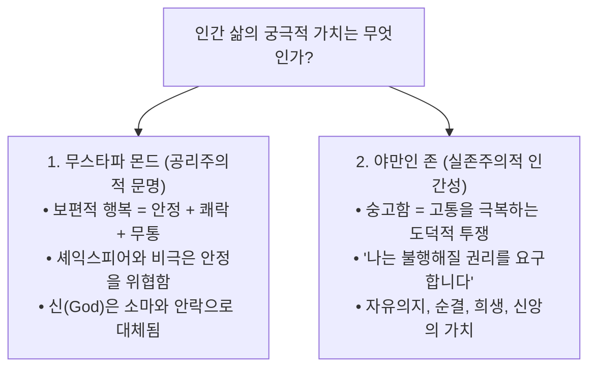

> [!abstract] 핵심 요약
> 무스타파 몬드 총독은 **"사회적 안정과 안락한 행복을 위해 예술, 과학, 종교, 진리를 희생시키는 것은 불가피하다"**고 주장한다.
> 이에 맞서 야만인 존은 **"고통, 노화, 질병, 슬픔, 그리고 신과 죄악을 포함하여 불행해질 권리(The right to be unhappy)"**를 요구하며 인간 실존의 본질이 무통(Pain-free) 안락사가 아니라 고통을 통한 의미 창출에 있음을 역설한다.

---

## 1. 몬드 총독 vs 야만인 존의 철학적 대립도



---

## 2. 셰익스피어의 비극 vs 신세계의 촉각 영화(Feelies)

| 비교 항목 | 셰익스피어 비극 (예술) | 신세계 촉각 영화 (Feelies) |
| :-- | :-- | :-- |
| **목적** | 인간 고뇌의 숭고함과 도덕적 성찰 | 감각적 말초 신경 자극 및 도파민 분비 |
| **전제 조건** | 불안정, 억압된 감정, 비극적 충돌 | 완벽한 만족, 정서적 무균 상태 |
| **사회적 영향** | 개인의 내면적 각성과 체제 의문 | 완벽한 체제 순응과 소비 촉진 |

---

## 3. 실시간 몬드 vs 존 가치관 선택기

```html preview
<div style="font-family:system-ui,-apple-system,sans-serif;padding:20px;background:var(--card);color:var(--card-foreground);border:1px solid var(--border);border-radius:var(--radius)">
  <div style="font-size:16px;font-weight:700;margin-bottom:14px;color:var(--primary);display:flex;align-items:center;gap:8px">
    <span>⚖️ 행복의 조건: 무스타파 몬드 vs 야만인 존 선택기</span>
  </div>

  <div style="margin-bottom:14px">
    <label style="font-size:11px;color:var(--muted-foreground)">당신이 지향하는 삶의 모델:</label>
    <select id="selPhilChoice" style="width:100%;padding:6px;background:var(--background);color:var(--foreground);border:1px solid var(--border);border-radius:var(--radius);font-weight:700">
      <option value="mond">1. 무스타파 몬드: 고통 없는 완벽한 안락과 사회적 안정 (소마 복용)</option>
      <option value="john">2. 야만인 존: 비극과 고통을 수반하더라도 자유의지와 숭고함 선택</option>
    </select>
  </div>

  <div style="padding:12px;background:var(--background);border:1px solid var(--border);border-radius:var(--radius)">
    <div style="font-size:11px;font-weight:700;color:var(--muted-foreground);margin-bottom:4px">철학적 함의 및 결과</div>
    <div id="philDescOut" style="font-size:13px;line-height:1.6;color:var(--primary)">
      <strong style="color:var(--primary)">몬드의 공리주의 유토피아:</strong> 질병과 노화, 슬픔이 0에 수렴하지만, 개성과 영혼의 깊이는 소멸됩니다.
    </div>
  </div>

  <script>
    document.getElementById('selPhilChoice').onchange = function() {
      var val = this.value;
      var out = document.getElementById('philDescOut');
      if (val === 'mond') {
        out.innerHTML = "<strong style='color:var(--primary)'>몬드의 공리주의 문명:</strong><br/>• 질병과 노화, 슬픔이 0에 수렴<br/>• 대가: 순수 과학, 고전 문학, 종교적 신앙의 완전한 포기";
      } else {
        out.innerHTML = "<strong style='color:var(--destructive,#ef4444)'>존의 실존주의적 권리:</strong><br/>• '나는 늙어갈 권리, 추해질 권리, 매독과 암에 걸릴 권리, 슬퍼할 권리를 요구한다'<br/>• 대가: 고통과 비극에 직면할 용기 필요";
      }
    };
  </script>
</div>
```
