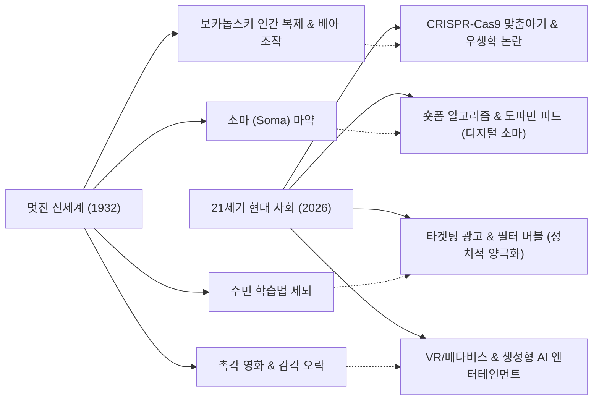

> [!abstract] 핵심 요약
> 현대 인류는 강압적인 빅브라더의 감시가 아니라, 스마트폰의 **알고리즘 추천 피드**와 **인스턴트 도파민 자극(디지털 소마)**에 의해 자발적으로 사고력을 반납하고 있다.
> 생명공학(CRISPR)과 생성형 AI 시대에 인간의 주체성과 비판적 사유를 지켜내기 위한 인문학적 성찰을 확립한다.

---

## 1. <멋진 신세계>와 현대 테크놀로지 사회의 정확한 대응



---

## 2. 디지털 소마(Digital Soma)의 3단계 중독 메커니즘

1. **무한 스크롤과 가변 보상 (Variable Reward Schedule)**:
   - 슬롯머신과 동일한 심리 기제로 도파민 분비를 자극하여 사용자가 화면을 벗어나지 못하도록 구속.
2. **비판적 사고와 깊은 독서의 거세**:
   - 15초 이내의 단기 자극에 뇌신경망이 적응함으로써 긴 호흡의 논리적 글쓰기와 복잡한 사회 문제에 대한 사유 능력 퇴화.
3. **자발적 복종과 관심 자본주의 (Attention Capitalism)**:
   - 사용자의 행동 데이터와 주의력을 플랫폼에 헌납하고, 그 대가로 일시적인 쾌락을 구매.

---

## 3. 실시간 디지털 도파민 노출도 자가 진단기

```html preview
<div style="font-family:system-ui,-apple-system,sans-serif;padding:20px;background:var(--card);color:var(--card-foreground);border:1px solid var(--border);border-radius:var(--radius)">
  <div style="font-size:16px;font-weight:700;margin-bottom:12px;color:var(--primary)">
    ⚡ 나의 하루 '디지털 소마(Digital Soma)' 의존도 측정기
  </div>

  <div style="margin-bottom:12px">
    <label style="font-size:11px;color:var(--muted-foreground)">하루 평균 숏폼/SNS 이용 시간 (시간):</label>
    <input id="inSomaHours" type="range" min="0" max="10" step="0.5" value="3.5" style="width:100%" />
    <div style="display:flex;justify-content:space-between;font-size:12px;font-weight:700;margin-top:2px">
      <span>0시간</span>
      <span id="outSomaHoursVal" style="color:var(--primary);font-size:15px">3.5 시간</span>
      <span>10시간</span>
    </div>
  </div>

  <div style="padding:12px;background:var(--background);border:1px solid var(--border);border-radius:var(--radius)">
    <div style="font-size:11px;color:var(--muted-foreground)">멋진 신세계 계급 환산 진단:</div>
    <div id="outSomaClass" style="font-size:16px;font-weight:800;color:var(--primary);margin-top:2px">델타-감마 계급 수준의 도파민 의존</div>
    <div id="outSomaDesc" style="font-size:12px;color:var(--muted-foreground);margin-top:4px">하루 3.5그램 분량의 소마를 흡입하는 상태입니다. 깊은 사유와 독서 시간이 침식당하고 있습니다.</div>
  </div>

  <script>
    function calcSoma() {
      var h = parseFloat(document.getElementById('inSomaHours').value);
      document.getElementById('outSomaHoursVal').textContent = h.toFixed(1) + " 시간";

      var cls = "", desc = "";
      if (h <= 1.0) {
        cls = "자유인 존 (John the Savage) 단계";
        desc = "디지털 소마에 지배당하지 않고 주체적 비판 사고력을 유지하고 있습니다.";
      } else if (h <= 3.0) {
        cls = "베타 (Beta) 계급 수준의 통제";
        desc = "적당한 오락과 일상을 유지하나, 점진적으로 디지털 자극에 적응 중입니다.";
      } else if (h <= 6.0) {
        cls = "감마-델타 (Gamma-Delta) 수준의 고착";
        desc = "하루 상당 시간을 숏폼 소마에 의존하고 있어 긴 호흡의 사유가 어렵습니다.";
      } else {
        cls = "엡실론 (Epsilon) 수준의 완전 중독";
        desc = "알고리즘이 주는 쾌락에 자아를 완전히 위탁한 상태입니다.";
      }

      document.getElementById('outSomaClass').textContent = cls;
      document.getElementById('outSomaDesc').textContent = desc;
    }

    document.getElementById('inSomaHours').addEventListener('input', calcSoma);
    calcSoma();
  </script>
</div>
