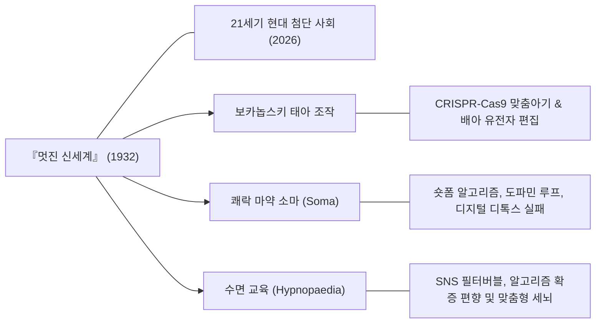

> [!abstract] 핵심 요약
> 헉슬리의 경고는 현대에 이르러 **CRISPR 유전자 교정을 통한 생물학적 계급화 위험**, 숏폼 알고리즘을 통한 **디지털 소마(Digital Soma)의 도파민 중독**, 그리고 AI 기반 **행동 조건화(Behavioral Conditioning)**로 현실화되고 있다.
> 미래 기술 사회의 진정한 위협은 조지 오웰 식의 폭력적 감시(1984)보다, 우리가 **자발적으로 탐닉하는 안락과 쾌락 속에서 비판적 사고를 포기하는 것**이다.

---

## 1. 『멋진 신세계』 vs 21세기 현대 기술 사회 매핑



---

## 2. 실시간 일일 디지털 소마(Digital Soma) 중독 지수 계산기

```html preview
<div style="font-family:system-ui,-apple-system,sans-serif;padding:20px;background:var(--card);color:var(--card-foreground);border:1px solid var(--border);border-radius:var(--radius)">
  <div style="font-size:16px;font-weight:700;margin-bottom:14px;color:var(--primary);display:flex;align-items:center;gap:8px">
    <span>📱 나의 현대판 '디지털 소마(Digital Soma)' 의존도 측정기</span>
  </div>

  <div style="display:grid;grid-template-columns:1fr 1fr;gap:12px;margin-bottom:14px">
    <div>
      <label style="font-size:11px;color:var(--muted-foreground)">일일 숏폼/SNS 이용 시간 (시간):</label>
      <input id="inSnsHours" type="number" value="3.5" step="0.5" min="0" max="15" style="width:100%;padding:4px;background:var(--background);color:var(--foreground);border:1px solid var(--border);border-radius:var(--radius);font-weight:700" />
    </div>
    <div>
      <label style="font-size:11px;color:var(--muted-foreground)">알림 확인 주기 (분):</label>
      <input id="inNotiMin" type="number" value="15" step="5" min="1" max="120" style="width:100%;padding:4px;background:var(--background);color:var(--foreground);border:1px solid var(--border);border-radius:var(--radius);font-weight:700" />
    </div>
  </div>

  <div style="padding:12px;background:var(--background);border:1px solid var(--border);border-radius:var(--radius)">
    <div style="font-size:11px;font-weight:700;color:var(--muted-foreground);margin-bottom:4px">신세계 문명 순응도 분석 결과</div>
    <div id="somaIndexOut" style="font-size:13px;line-height:1.6;color:var(--primary)">
      ⚠️ 소마 중독 위험군: 하루 소마 3.5정 복용 상태에 해당하며, 알고리즘 조건화에 강하게 노출되어 있습니다.
    </div>
  </div>

  <script>
    function updateSoma() {
      var h = parseFloat(document.getElementById('inSnsHours').value) || 0;
      var n = parseFloat(document.getElementById('inNotiMin').value) || 60;
      var out = document.getElementById('somaIndexOut');
      if (h >= 4 || n <= 10) {
        out.innerHTML = "<strong style='color:var(--destructive,#ef4444)'>🚨 중증 신세계 시민 상태:</strong><br/>• 하루 4시간 이상의 디지털 소마 흡입<br/>• 즉각적 도파민 충족으로 깊은 사유와 비판적 저항 능력 마비 위험";
      } else if (h >= 2) {
        out.innerHTML = "<strong style='color:var(--primary)'>⚠️ 경미한 조건화 상태:</strong><br/>• 하루 " + h + "시간 이용<br/>• 알고리즘의 감정 조절 메커니즘에 부분 의존 중";
      } else {
        out.innerHTML = "<strong style='color:var(--chart-1)'>⭐ 야만인(Savage) 자율성 유지:</strong><br/>• 디지털 소마에 지배되지 않는 독립적 사유 공간 확보";
      }
    }
    document.getElementById('inSnsHours').addEventListener('input', updateSoma);
    document.getElementById('inNotiMin').addEventListener('input', updateSoma);
  </script>
</div>
```
