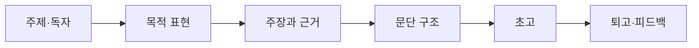

> [!abstract] 한 줄 요약
> 글쓰기의 목적을 express로 분명히 하고, 주장과 근거를 배열한 뒤 독자 피드백으로 문장을 고친다.

## 강의 흐름 지도



---

## 개념을 연결하는 순서

강의 자료는 글을 잘 쓰기 위한 **다독·다작·다상량**을 제시하면서, 감동을 만드는 글짓기(impress)와 정보를 전달하는 글쓰기(express)를 구분한다.

- 쓰기 전 주제·독자·목적을 정한다.
- 본론의 주장마다 근거와 예시를 붙이고 문단의 기능을 구분한다.
- 서론·본론·결론의 배열과 미괄식 전개를 목적에 맞게 선택한다.
- 초고 이후 문장 명료성·근거 연결·독자 반응을 기준으로 퇴고한다.

<Tabs>
  <Tab label="설계">주제·독자·목적과 글의 기능을 정한다.</Tab>
  <Tab label="구성">주장·근거·예시를 문단 구조로 배열한다.</Tab>
  <Tab label="퇴고">표현·근거·독자 반응을 기준으로 반복 수정한다.</Tab>
</Tabs>

---

## 원본에서 읽는 적용 장면

| 점검 층위 | 확인 질문 | 결과 |
| :-- | :-- | :-- |
| 목적 | 독자에게 무엇을 하게 할 것인가 | express 중심 문장 |
| 구조 | 주장과 근거가 연결되는가 | 문단 개요 |
| 표현 | 추상어·중복어가 줄었는가 | 구체 문장 |
| 퇴고 | 독자가 오해할 부분은 무엇인가 | 수정 이력 |

퀴즈 자료의 AI 데이터센터 주장은 why–본론–시각자료–결론 순서로 제시된다. 이때 시각자료가 주장보다 앞서지 않도록 캡션과 근거를 분리해 적는다.

```html preview
<div style="font-family:system-ui,sans-serif;padding:20px;color:var(--foreground)">
  <label for="flow406751" style="font-size:14px;font-weight:600">원본 강의 단계</label>
  <div id="flow406751-out" style="font-size:30px;font-weight:700;color:var(--chart-1);margin:6px 0">주제·독자·목적 설정</div>
  <input id="flow406751" type="range" min="1" max="3" step="1" value="1"
    style="width:100%;accent-color:var(--primary)" />
  <p style="font-size:13px;color:var(--muted-foreground)">슬라이더로 PDF에서 정리한 강의 단계를 순서대로 확인합니다.</p>
  <script>
    var flow406751 = document.getElementById('flow406751');
    var flow406751Out = document.getElementById('flow406751-out');
    var flow406751Steps = ["주제·독자·목적 설정","주장·근거·구조 만들기","표현·퇴고·피드백"];
    flow406751.addEventListener('input', function () {
      flow406751Out.textContent = flow406751Steps[Number(flow406751.value) - 1] || '';
    });
  </script>
</div>
```

---

## 점검과 경계

<details>
<summary>작성 전 점검</summary>

1. impress와 express의 목적을 구분한다.
2. 한 문단의 주장·근거·예시를 각각 표시한다.
3. 퇴고할 때 맞춤법만이 아니라 독자·구조·근거를 함께 확인한다.

</details>

> [!tip] 실행 규칙
> 첫 문장에 문제와 방향을 밝히고, 각 단락의 역할을 한 문장으로 요약한 뒤 세부 표현을 다듬는다.

> [!warning] 출처 경계
> 이 노트는 현재 폴더의 `sources/*.pdf`에서 추출·대조한 강의 내용을 묶었습니다. 동일 장의 '2'·'update' 파일은 별도 새 이론으로 세지 않고 보충·개정 관계로 확인합니다. 원본 PDF 전체나 원본 슬라이드 이미지는 삽입하지 않습니다.
