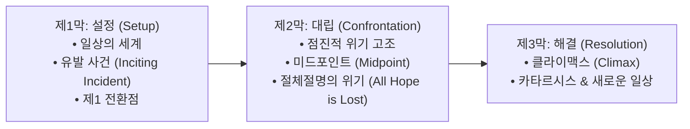

> [!abstract] 핵심 요약
> 흡인력 있는 서사의 핵심은 독자에게 사실을 직접 설명(Telling)하는 것이 아니라, **오감을 자극하는 감각적 디테일과 구체적 행동을 통해 장면을 생생하게 보여주는 것(Showing)**이다.
> 주인공의 내적 결핍과 외적 욕망이 충돌하는 **3막 구조(Three-Act Structure)**는 서사의 추진력을 형성하는 뼈대가 된다.

---

## 1. 고전적 서사 3막 구조 (Three-Act Structure)



---

## 2. 텔링(Telling) vs 쇼잉(Showing) 비교

| 기법 | 특성 | 예시 문장 | 효과 |
| :-- | :-- | :-- | :-- |
| **텔링 (Telling)** | 감정이나 성격을 추상적으로 서술 | "민수는 매우 긴장하고 화가 나 있었다." | 빠른 정보 전달, 낮은 정서적 몰입 |
| **쇼잉 (Showing)** | 신체 반응, 시선, 호흡, 환경 묘사 | "민수는 떨리는 손으로 넥타이를 헐겁게 풀며 마른침을 삼켰다." | 독자가 직접 감정을 유추하고 공감 |

---

## 3. 실시간 텔링 $	o$ 쇼잉 문장 변환기

```html preview
<div style="font-family:system-ui,-apple-system,sans-serif;padding:20px;background:var(--card);color:var(--card-foreground);border:1px solid var(--border);border-radius:var(--radius)">
  <div style="font-size:16px;font-weight:700;margin-bottom:14px;color:var(--primary);display:flex;align-items:center;gap:8px">
    <span>✍️ 추상적 설명(Telling) $	o$ 감각적 묘사(Showing) 전환기</span>
  </div>

  <div style="margin-bottom:14px">
    <label style="font-size:11px;color:var(--muted-foreground)">묘사할 감정 상황 선택:</label>
    <select id="selShowEmotion" style="width:100%;padding:6px;background:var(--background);color:var(--foreground);border:1px solid var(--border);border-radius:var(--radius);font-weight:700">
      <option value="cold">상황 1: 날씨가 몹시 춥다 (Cold)</option>
      <option value="angry">상황 2: 극도로 분노했다 (Anger)</option>
      <option value="fear">상황 3: 시험 결과를 앞두고 두렵다 (Fear)</option>
    </select>
  </div>

  <div style="padding:12px;background:var(--background);border:1px solid var(--border);border-radius:var(--radius)">
    <div style="font-size:11px;font-weight:700;color:var(--muted-foreground);margin-bottom:4px">쇼잉(Showing) 기법 적용 문장</div>
    <div id="showResultOut" style="font-size:13px;line-height:1.6;color:var(--primary)">
      "입을 열 때마다 하얀 입김이 흩어졌고, 주머니에 찔러 넣은 손가락 끝은 감각 없이 딱딱하게 굳어 있었다."
    </div>
  </div>

  <script>
    document.getElementById('selShowEmotion').onchange = function() {
      var val = this.value;
      var out = document.getElementById('showResultOut');
      if (val === 'cold') {
        out.innerHTML = "<strong>❄️ 추위의 쇼잉:</strong><br/>'입을 열 때마다 하얀 입김이 흩어졌고, 코트 주머니 속 손가락 끝은 감각 없이 딱딱하게 굳어 있었다.'";
      } else if (val === 'angry') {
        out.innerHTML = "<strong>🔥 분노의 쇼잉:</strong><br/>'그의 턱관절이 굳어지며 볼 안쪽 근육이 씰룩거렸고, 쥐어쥔 주먹의 손톱이 손바닥을 깊게 파고들었다.'";
      } else {
        out.innerHTML = "<strong>⚡ 두려움의 쇼잉:</strong><br/>'화면의 [결과 확인] 버튼 위에서 마우스 커서를 쥔 손이 잘게 떨렸고, 목구멍으로 넘어가는 침 소리가 방 안을 가득 채웠다.'";
      }
    };
  </script>
</div>
```
