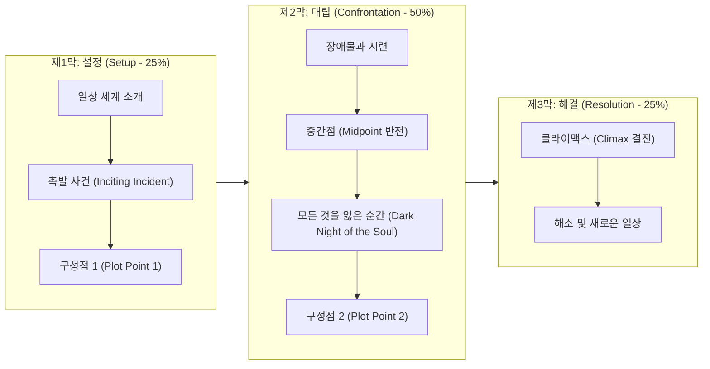

> [!abstract] 핵심 요약
> **창의적 글쓰기(Creative Writing)**는 단순한 정보의 전달을 넘어, 독자의 감각과 정서를 자극하여 가상 체험을 유도하는 예술적 커뮤니케이션이다.
> 독자를 몰입시키는 **3막 8시퀀스 서사 구조**와 추상적 감정을 구체적 행동 및 감각으로 치환하는 **Showing(보여주기)** 기법을 체득한다.

---

## 1. 고전 서사 3막 구조 (Three-Act Structure)



---

## 2. '설명하지 말고 보여주라 (Show, Don't Tell)'

독자에게 감정이나 성격을 직접 단어로 **말해주는(Telling)** 대신, 인물의 신체 반응, 미세 표정, 행동, 대사, 배경 묘사를 통해 독자 스스로 그 감정을 느끼도록 **보여주는(Showing)** 기법이다.

| 추상적 설명 (Telling) | 구체적 묘사 (Showing) |
| :-- | :-- |
| "철수는 매우 화가 났다." | "철수는 이를 악물었다. 쥐어쥔 주먹의 손톱이 손바닥을 파고들며 하얗게 질려 있었다." |
| "영희는 슬펐다." | "영희는 말없이 식은 찻잔을 만지작거렸다. 찻잔 위로 떨어진 눈물이 파문을 그리며 번졌다." |
| "그 방은 매우 지저분했다." | "바닥에는 며칠째 방치된 배달 피자 상자 위로 날파리가 꼬여 있었고, 구겨진 옷가지가 발에 채였다." |

---

## 3. 실시간 Telling → Showing 문장 변환 시뮬레이터

```html preview
<div style="font-family:system-ui,-apple-system,sans-serif;padding:20px;background:var(--card);color:var(--card-foreground);border:1px solid var(--border);border-radius:var(--radius)">
  <div style="font-size:16px;font-weight:700;margin-bottom:12px;color:var(--primary)">
    ⚡ 감정 설명(Telling) → 감각 묘사(Showing) 인터랙티브 비교기
  </div>

  <div style="margin-bottom:12px">
    <label style="font-size:11px;color:var(--muted-foreground)">표현하고자 하는 감정 선택:</label>
    <select id="selShowTell" style="width:100%;padding:6px;background:var(--background);color:var(--foreground);border:1px solid var(--border);border-radius:var(--radius);font-weight:700">
      <option value="fear">극심한 공포 (Fear)</option>
      <option value="relief">안도감과 피로 (Relief)</option>
      <option value="guilt">죄책감 (Guilt)</option>
      <option value="excitement">흥분과 기대 (Excitement)</option>
    </select>
  </div>

  <div style="display:grid;grid-template-columns:1fr 1fr;gap:10px">
    <div style="padding:10px;background:var(--background);border:1px solid var(--border);border-radius:var(--radius)">
      <div style="font-size:11px;color:var(--muted-foreground);font-weight:700">Telling (추상적 설명)</div>
      <div id="outTellText" style="font-size:13px;color:var(--destructive,#ef4444);margin-top:4px">그는 공포에 질려 어쩔 줄을 몰랐다.</div>
    </div>
    <div style="padding:10px;background:var(--background);border:1px solid var(--border);border-radius:var(--radius)">
      <div style="font-size:11px;color:var(--muted-foreground);font-weight:700">Showing (감각적 묘사)</div>
      <div id="outShowText" style="font-size:13px;color:var(--primary);margin-top:4px;font-style:italic">등골을 타고 차가운 식은땀이 흘러내렸다. 목구멍이 바짝 말라 침조차 삼킬 수 없었고, 심장 소리가 귓가를 쿵쿵 울렸다.</div>
    </div>
  </div>

  <script>
    var stDB = {
      fear: { tell: "그는 극심한 공포에 질려 떨었다.", show: "등골을 타고 차가운 식은땀이 흘러내렸다. 목구멍이 바짝 말라 침조차 삼킬 수 없었고, 심장 소리가 귓가를 쿵쿵 울렸다." },
      relief: { tell: "영희는 시험이 끝나서 안도했다.", show: "영희는 쥐고 있던 연필을 탁자 위에 떨어뜨리며 등받이에 깊숙이 몸을 묻었다. 참았던 숨이 긴 한숨이 되어 터져 나왔다." },
      guilt: { tell: "민수는 거짓말을 해서 죄책감을 느꼈다.", show: "민수는 차마 어머니의 눈을 마주치지 못하고 시선을 발끝으로 떨어뜨렸다. 주머니 속의 차가운 열쇠를 쥔 손끝이 가늘게 떨렸다." },
      excitement: { tell: "수진이는 합격 소식에 매우 흥분했다.", show: "수진이는 스마트폰 화면을 든 채 자리에서 벌떡 일어났다. 입술을 틀어막은 손 틈으로 새어 나오는 탄성을 감추지 못했다." }
    };

    function updateShowTell() {
      var k = document.getElementById('selShowTell').value;
      document.getElementById('outTellText').textContent = stDB[k].tell;
      document.getElementById('outShowText').textContent = stDB[k].show;
    }

    document.getElementById('selShowTell').addEventListener('change', updateShowTell);
    updateShowTell();
  </script>
</div>
