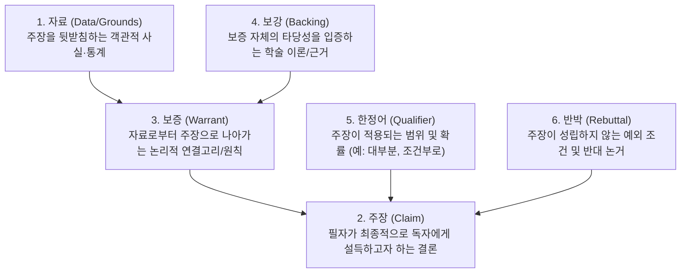

> [!abstract] 핵심 요약
> **논증(Argument)**은 단순한 감정적 주장의 나열이 아니라, 검증된 사실(Data)과 타당한 추론 규칙(Warrant)을 바탕으로 독자를 논리적으로 설득하는 지적 행위이다.
> 현대 철학의 표준인 **툴민 논증 모델**을 적용하여 자신의 주장을 빈틈없이 구조화하고, 예상되는 반론(Rebuttal)을 선제적으로 방어하는 비판적 글쓰기 역량을 완성한다.

---

## 1. 툴민(Toulmin)의 6요소 논증 모델



---

## 2. 흔히 범하는 5대 비형식적 오류 (Logical Fallacies)

1. **허수아비 공격의 오류 (Straw Man)**: 상대방의 실제 주장을 왜곡하거나 극단화하여 쉽게 반박할 수 있는 가짜 허수아비로 만들어 공격.
2. **인신공격의 오류 (Ad Hominem)**: 논점의 타당성이 아니라 발언자의 성품, 학벌, 사생활을 비난하여 논증을 무력화하려는 시도.
3. **거짓 딜레마 (False Dilemma)**: 수많은 대안이 존재함에도 불구하고 "A가 아니면 B뿐이다"라며 양자택일을 강요.
4. **성급한 일반화 (Hasty Generalization)**: 극소수의 특수한 사례만을 근거로 전체 집단에 대한 결론을 도출.
5. **순환 논증 (Begging the Question)**: 증명해야 할 결론을 전제로 삼아 동일한 말을 반복하는 오류.

---

## 3. 실시간 툴민(Toulmin) 6요소 논증 분석기

```html preview
<div style="font-family:system-ui,-apple-system,sans-serif;padding:20px;background:var(--card);color:var(--card-foreground);border:1px solid var(--border);border-radius:var(--radius)">
  <div style="font-size:16px;font-weight:700;margin-bottom:12px;color:var(--primary)">
    ⚡ 툴민(Toulmin) 6요소 논증 구조 분석기
  </div>

  <div style="padding:12px;background:var(--background);border:1px solid var(--border);border-radius:var(--radius);font-size:13px;line-height:1.6;margin-bottom:12px">
    <strong>주제:</strong> "고등학교 교육과정에 AI 리터러시 교육을 필수화해야 한다."
  </div>

  <div style="display:grid;grid-template-columns:1fr 1fr;gap:8px;font-size:12px">
    <div style="padding:8px;background:var(--card);border:1px solid var(--border);border-radius:var(--radius)">
      <strong style="color:var(--primary)">1. 주장 (Claim):</strong><br/>고교 AI 교육을 공교육 필수 과목으로 지정해야 한다.
    </div>
    <div style="padding:8px;background:var(--card);border:1px solid var(--border);border-radius:var(--radius)">
      <strong style="color:var(--primary)">2. 자료 (Data):</strong><br/>미래 일자리의 70%가 AI 활용 역량을 요구한다는 통계.
    </div>
    <div style="padding:8px;background:var(--card);border:1px solid var(--border);border-radius:var(--radius)">
      <strong style="color:var(--primary)">3. 보증 (Warrant):</strong><br/>공교육의 목표는 학생들을 미래 사회에 대비시키는 것이다.
    </div>
    <div style="padding:8px;background:var(--card);border:1px solid var(--border);border-radius:var(--radius)">
      <strong style="color:var(--primary)">4. 반박 (Rebuttal):</strong><br/>단, 기존 교과목의 과도한 학습 부담을 주지 않는 선에서.
    </div>
  </div>
</div>
