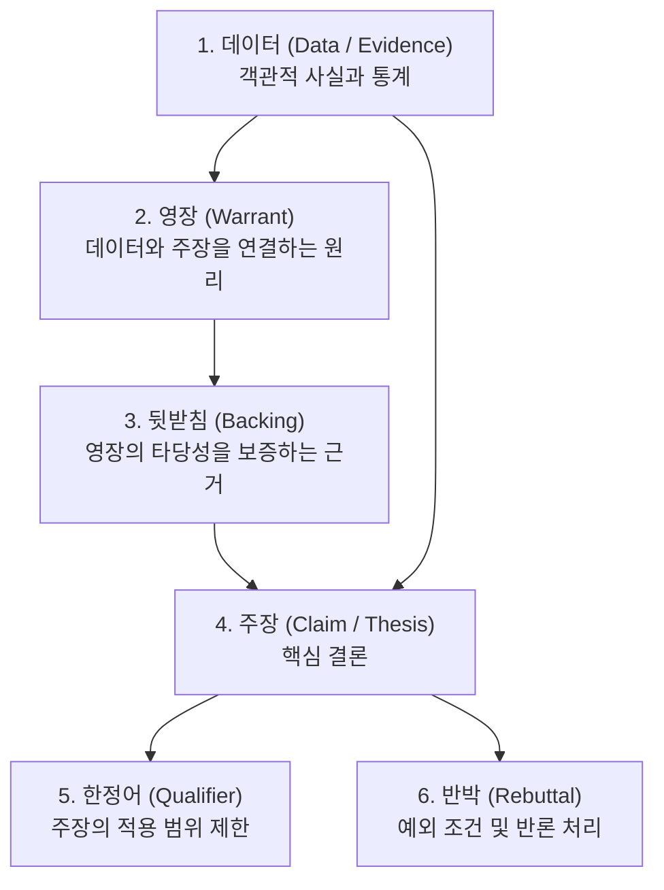

> [!abstract] 핵심 요약
> 강력한 논증 에세이는 주장에 대한 단순 나열이 아니라, **반박 가능한 구체적 논제(Thesis)**와 이를 뒷받침하는 **검증된 데이터**, 그리고 반대 입장의 타당성을 인정한 뒤 극복하는 **반론 수용(Rebuttal)**으로 완성된다.

---

## 1. 툴민(Toulmin) 논증 6요소 모델



---

## 2. 대표적인 논리적 오류 4대 유형

| 오류 유형 | 특징 | 발생 예시 |
| :-- | :-- | :-- |
| **성급한 일반화** | 극소수 표본으로 전체 집단을 단정 | "내가 만난 개발자 2명이 내향적이었으므로 모든 개발자는 내향적이다." |
| **흑백 논리의 오류** | 다양한 중간 지대를 무시하고 양극단만 제시 | "AI 규제에 찬성하지 않는다면 당신은 기술 파괴주의자다." |
| **허수아비 공격** | 상대방 주장을 극단적으로 왜곡하여 공격 | "원격근무 확대를 주장하는 것은 결국 회사를 망하게 하자는 것이다." |
| **인신공격의 오류** | 논지 자체가 아니라 발화자의 인격/배경 공격 | "저 논문 저자가 젊은 연구자이므로 결론을 신뢰할 수 없다." |

---

## 3. 실시간 논증 구조 및 반론 강화 분석기

```html preview
<div style="font-family:system-ui,-apple-system,sans-serif;padding:20px;background:var(--card);color:var(--card-foreground);border:1px solid var(--border);border-radius:var(--radius)">
  <div style="font-size:16px;font-weight:700;margin-bottom:14px;color:var(--primary);display:flex;align-items:center;gap:8px">
    <span>⚖️ 툴민 논증 모델 기반 설득력 강화 분석기</span>
  </div>

  <div style="margin-bottom:14px">
    <label style="font-size:11px;color:var(--muted-foreground)">에세이 논제 (Thesis):</label>
    <select id="selEssayTopic" style="width:100%;padding:6px;background:var(--background);color:var(--foreground);border:1px solid var(--border);border-radius:var(--radius);font-weight:700">
      <option value="ai">"소프트웨어 교육에 생성형 AI 도구 활용을 공식 허용해야 한다."</option>
      <option value="remote">"주 4일제 근무는 생산성을 오히려 향상시킨다."</option>
    </select>
  </div>

  <div style="padding:12px;background:var(--background);border:1px solid var(--border);border-radius:var(--radius)">
    <div style="font-size:11px;font-weight:700;color:var(--muted-foreground);margin-bottom:4px">예상 반론 및 선제적 방어 논거</div>
    <div id="argDefenseOut" style="font-size:13px;line-height:1.6;color:var(--primary)">
      <strong>반론:</strong> "학생들의 기초 코딩 사고력이 저하될 수 있다."<br/>
      <strong>방어:</strong> "단순 문법 암기 대신 아키텍처 설계 및 코드 리뷰 역량 평가로 교육 목표를 전환함으로써 더 높은 차원의 문제 해결력을 기를 수 있다."
    </div>
  </div>
</div>
```
