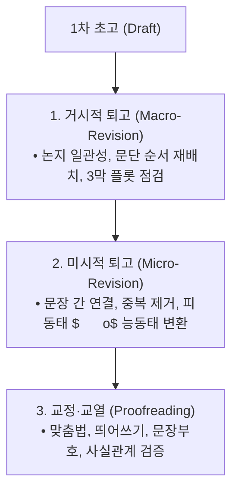

> [!abstract] 핵심 요약
> **"글쓰기는 곧 다시 쓰기(Writing is rewriting)"**이다.
> 좋은 문장은 화려한 미사여구가 아니라 **불필요한 단어를 걷어내는 간결성(Conciseness)**, 생동감 넘치는 **능동태**, 그리고 문장과 문장을 인과적으로 연결하는 **응집성(Cohesion)**에서 나온다.

---

## 1. 퇴고의 3단계 파이프라인



---

## 2. 악문(Bad Writing) 교정 3대 원칙

| 문제 유형 | 교정 전 (Before) | 교정 후 (After) | 원칙 |
| :-- | :-- | :-- | :-- |
| **이중 피동 남용** | "이 문제는 해결되어져야만 한다고 생각되어집니다." | "이 문제는 반드시 해결해야 합니다." | 능동태 전환 및 간결화 |
| **명사형 남발** | "그는 시스템의 개선에 대한 수행을 완료하였다." | "그는 시스템을 개선했다." | 구체적 동사 활용 |
| **불필요한 완곡어** | "~에 대하여", "~의 경우에 있어서" | "~는", "~할 때" | 조사 및 접사 단순화 |

---

## 3. 실시간 문장 다이어트 및 능동문 교정기

```html preview
<div style="font-family:system-ui,-apple-system,sans-serif;padding:20px;background:var(--card);color:var(--card-foreground);border:1px solid var(--border);border-radius:var(--radius)">
  <div style="font-size:16px;font-weight:700;margin-bottom:14px;color:var(--primary);display:flex;align-items:center;gap:8px">
    <span>✂️ 문장 간결화 및 능동문 퇴고 분석기</span>
  </div>

  <div style="margin-bottom:14px">
    <label style="font-size:11px;color:var(--muted-foreground)">교정할 문장 선택:</label>
    <select id="selBadSentence" style="width:100%;padding:6px;background:var(--background);color:var(--foreground);border:1px solid var(--border);border-radius:var(--radius);font-weight:700">
      <option value="pass">"이 코드는 김 연구원에 의해 작성되어진 것입니다."</option>
      <option value="noun">"우리는 알고리즘의 최적화에 대한 진행을 실시하기로 결정하였다."</option>
    </select>
  </div>

  <div style="padding:12px;background:var(--background);border:1px solid var(--border);border-radius:var(--radius)">
    <div style="font-size:11px;font-weight:700;color:var(--muted-foreground);margin-bottom:4px">퇴고 후 명료한 문장</div>
    <div id="cleanSentenceOut" style="font-size:13px;line-height:1.6;color:var(--primary)">
      <strong>교정 후:</strong> "김 연구원이 이 코드를 작성했습니다." (글자수 32% 절감)
    </div>
  </div>

  <script>
    document.getElementById('selBadSentence').onchange = function() {
      var val = this.value;
      var out = document.getElementById('cleanSentenceOut');
      if (val === 'pass') {
        out.innerHTML = "<strong>교정 후:</strong> '김 연구원이 이 코드를 작성했습니다.'<br/>• 피동형('작성되어진')을 제거하고 행위자('김 연구원')를 주어로 능동화";
      } else {
        out.innerHTML = "<strong>교정 후:</strong> '우리는 알고리즘을 최적화하기로 했다.'<br/>• 명사 나열('최적화에 대한 진행을 실시')을 단일 동사('최적화하기로')로 압축";
      }
    };
  </script>
</div>
```
