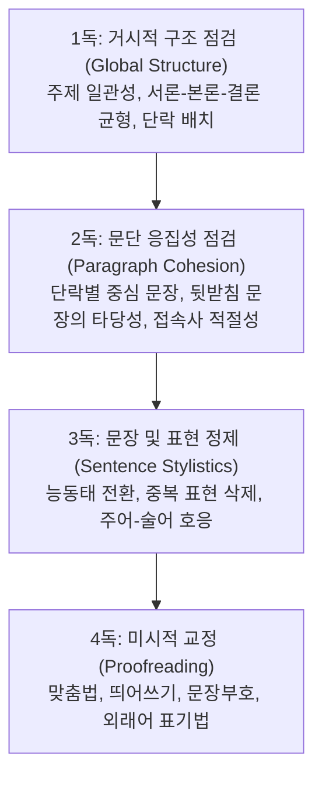

> [!abstract] 핵심 요약
> "좋은 글은 쓰는 것이 아니라 **고쳐 쓰는 것(Revision)**이다."
> 불명확한 피동 표현과 복문, 불필요한 번역투('~에 대하여', '~을 통해')를 걷어내고, 힘차고 명료한 능동태 문장으로 독자의 이해 속도를 2배 이상 높이는 퇴고의 법칙을 마스터한다.

---

## 1. 문장 정제의 3대 원칙

1. **군더더기 제거 (Conciseness)**:
   - "그는 회의에 참석하는 것을 수행하였다" $\implies$ "그는 회의에 **참석했다**."
2. **피동형 및 명사구 억제 (Active Voice)**:
   - "계획의 수립이 위원회에 의해 이루어졌다" $\implies$ "위원회가 **계획을 세웠다**."
3. **주어-서술어 호응 (Subject-Predicate Agreement)**:
   - "내가 말하고 싶은 것은 우리는 반드시 성공해야 한다." (불일치) $\implies$ "우리는 반드시 성공해야 한다."

---

## 2. 4독(Four-Pass) 정밀 퇴고 프레임워크



---

## 3. 실시간 번역투/피동문 교정 시뮬레이터

```html preview
<div style="font-family:system-ui,-apple-system,sans-serif;padding:20px;background:var(--card);color:var(--card-foreground);border:1px solid var(--border);border-radius:var(--radius)">
  <div style="font-size:16px;font-weight:700;margin-bottom:12px;color:var(--primary)">
    ⚡ 문장 클리닉: 피동문/명사화 → 명료한 능동태 교정기
  </div>

  <div style="margin-bottom:12px">
    <label style="font-size:11px;color:var(--muted-foreground)">수정할 문제 문장 선택:</label>
    <select id="selFixSentence" style="width:100%;padding:6px;background:var(--background);color:var(--foreground);border:1px solid var(--border);border-radius:var(--radius);font-weight:700">
      <option value="1">피동 오용: "이 연구는 교수님에 의해 수행되어졌다."</option>
      <option value="2">명사화 남발: "문제의 해결에 대한 논의의 진행이 필요하다."</option>
      <option value="3">번역투 남발: "우리는 환경 문제에 있어서의 해결책을 모색해야 한다."</option>
    </select>
  </div>

  <div style="padding:12px;background:var(--background);border:1px solid var(--border);border-radius:var(--radius)">
    <div style="font-size:11px;color:var(--muted-foreground)">모범 교정 문장:</div>
    <div id="outFixedText" style="font-size:15px;font-weight:800;color:var(--primary);margin-top:4px">"교수님이 이 연구를 수행했다."</div>
  </div>

  <script>
    var fixDB = {
      "1": "교수님이 이 연구를 수행했다. (이중 피동 '되어졌다' 삭제 및 주어-목적어 복원)",
      "2": "문제를 해결하기 위해 논의해야 한다. (명사 4개 나열을 동사구로 전환)",
      "3": "우리는 환경 문제 해결책을 찾아야 한다. (일본어투 '에 있어서의', 한자어 '모색' 정제)"
    };

    function updateFix() {
      var v = document.getElementById('selFixSentence').value;
      document.getElementById('outFixedText').textContent = fixDB[v];
    }

    document.getElementById('selFixSentence').addEventListener('change', updateFix);
    updateFix();
  </script>
</div>
