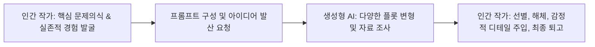

> [!abstract] 핵심 요약
> 생성형 AI가 유려한 문장을 무한히 생성하는 시대에, 글쓰기의 가치는 단순한 문법적 정교함이 아니라 **작가의 고유한 실존적 경험**, **도덕적 고뇌**, 그리고 **세상을 낯설게 바라보는 비판적 시선(Defamiliarization)**에 있다.
> AI는 초고의 비계(Scaffolding)를 세우는 도구일 뿐, 글에 영혼을 불어넣는 것은 인간의 결핍과 취약성이다.

---

## 1. AI 시대의 창작 협업 모델



---

## 2. 실시간 AI 글쓰기 vs 인간 창작의 고유 영역 판별기

```html preview
<div style="font-family:system-ui,-apple-system,sans-serif;padding:20px;background:var(--card);color:var(--card-foreground);border:1px solid var(--border);border-radius:var(--radius)">
  <div style="font-size:16px;font-weight:700;margin-bottom:14px;color:var(--primary);display:flex;align-items:center;gap:8px">
    <span>🤖 생성형 AI vs 인간 작가의 역할 분담 매트릭스</span>
  </div>

  <div style="margin-bottom:14px">
    <label style="font-size:11px;color:var(--muted-foreground)">글쓰기 작업 단계:</label>
    <select id="selAiTask" style="width:100%;padding:6px;background:var(--background);color:var(--foreground);border:1px solid var(--border);border-radius:var(--radius);font-weight:700">
      <option value="brainstorm">1. 주제 관련 아이디어 브레인스토밍 및 개요 작성</option>
      <option value="lived">2. 개인적 상실의 슬픔과 도덕적 죄책감의 묘사</option>
      <option value="fact">3. 역사적 통계 및 참고문헌 초안 수집</option>
    </select>
  </div>

  <div style="padding:12px;background:var(--background);border:1px solid var(--border);border-radius:var(--radius)">
    <div style="font-size:11px;font-weight:700;color:var(--muted-foreground);margin-bottom:4px">최적 주체 및 역할 평가</div>
    <div id="aiRoleDescOut" style="font-size:13px;line-height:1.6;color:var(--primary)">
      <strong style="color:var(--primary)">AI 추천 영역:</strong> 방대한 조합을 빠르게 생성하여 작가의 사고 폭을 넓히는 데 최적입니다.
    </div>
  </div>

  <script>
    document.getElementById('selAiTask').onchange = function() {
      var val = this.value;
      var out = document.getElementById('aiRoleDescOut');
      if (val === 'brainstorm') {
        out.innerHTML = "<strong style='color:var(--primary)'>🤖 AI 강점 영역:</strong><br/>• 다양한 각도의 플롯 전개와 개요 후보군을 수초 내 생성<br/>• 작가의 창작 블록(Writer's block) 해소에 효과적";
      } else if (val === 'lived') {
        out.innerHTML = "<strong style='color:var(--chart-1)'>⭐ 인간 고유 영역 (Human Core):</strong><br/>• 기계는 결코 경험할 수 없는 신체적 고통, 상실의 눈물, 주관적 진정성 반영<br/>• 독자의 영혼을 울리는 핵심 문장 완성";
      } else {
        out.innerHTML = "<strong style='color:var(--primary)'>🤖 AI 보조 영역:</strong><br/>• 빠른 자료 수집이 가능하나 환각(Hallucination) 검증을 위해 인간의 팩트체크 필수";
      }
    };
  </script>
</div>
```
