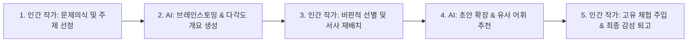

> [!abstract] 핵심 요약
> 생성형 AI는 문법적으로 완벽한 문장을 초당 수십 페이지씩 생산할 수 있지만, 그 안에는 삶의 고통에서 우러나오는 **실존적 진정성(Authenticity)**이 결여되어 있다.
> AI를 지적 비서이자 공동 창작 파트너로 활용하되, **글의 방향성과 철학적 통찰, 인간적 감수성의 결정권**을 인간 작가가 확고히 쥐는 미래형 글쓰기 모델을 확립한다.

---

## 1. AI 생성 글 vs 인간 고유 창작의 차원 비교

| 구분 | 생성형 AI (LLM) | 인간 작가 (Human Author) |
| :-- | :-- | :-- |
| **창작 동기** | 통계적 확률에 따른 다음 토큰 예측 | **실존적 고뇌, 상처의 치유, 타자와의 공감** |
| **문체 특성** | 균질하고 평균화된 매끄러운 문장 | **불완전하지만 독창적인 개성과 목소리(Voice)** |
| **아이디어** | 기존 학습 데이터의 조합 및 재구성 | 기존 통념을 깨뜨리는 직관적 통찰과 반역 |
| **책임과 윤리** | 결과물에 대한 도덕적 책임 없음 | **자신의 문장에 대한 온전한 윤리적 책임** |

---

## 2. 실시간 AI 협업 글쓰기 워크플로우



---

## 3. 실시간 AI 협업 프롬프트 템플릿 뷰어

```html preview
<div style="font-family:system-ui,-apple-system,sans-serif;padding:20px;background:var(--card);color:var(--card-foreground);border:1px solid var(--border);border-radius:var(--radius)">
  <div style="font-size:16px;font-weight:700;margin-bottom:12px;color:var(--primary)">
    ⚡ 창의적 글쓰기를 위한 AI 협업 프롬프트 가이드
  </div>

  <div style="padding:12px;background:var(--background);border:1px solid var(--border);border-radius:var(--radius);font-family:monospace;font-size:12px;line-height:1.6">
    <span style="color:var(--muted-foreground)"># 역할 지정:</span> "너는 20년 경력의 날카로운 문학 편집자야."<br/>
    <span style="color:var(--muted-foreground)"># 요청 사항:</span> "내가 쓴 다음 에세이 초안에서 '추상적인 설명(Telling)'으로 흐르는 3개 문장을 찾아내고, 이를 오감을 자극하는 '구체적 묘사(Showing)'로 바꿀 수 있는 3가지 대안을 제시해줘."<br/>
    <span style="color:var(--muted-foreground)"># 제약 조건:</span> "진부한 비유(Cliché)는 피하고 독창적인 감각 표현을 사용해."
  </div>
</div>
