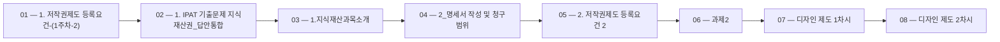

> [!abstract] 사용법
> 이 지도는 현재 폴더의 원본 PDF를 파일 순서대로 묶어 강의 진행 → 핵심 단서 → 점검 포인트를 연결합니다. 세부 개념은 같은 폴더의 주제 노트와 함께 대조하세요.

## 강의 흐름



<Tabs>
  <Tab label="파일 순서">파일명에 포함된 주차·장·버전 표기를 먼저 읽어 강의의 큰 흐름을 잡습니다.</Tab>
  <Tab label="중복 자료">같은 접두사나 버전이 겹치면 앞 자료를 기준으로 뒤 자료의 보충·실습 여부를 비교합니다.</Tab>
  <Tab label="검증">파일명과 쪽수는 탐색용 단서입니다. 정의·식·코드·도식은 각 원본 PDF에서 다시 확인합니다.</Tab>
</Tabs>

## 원본 PDF 목록

| 파일 | 쪽수 | 확인 메모 |
| :-- | --: | :-- |
| 1. 저작권제도 등록요건-(1주차-2).pdf | 17 | 원본 첫 페이지·본문 대조 |
| 1. IPAT 기출문제 지식재산권_답안통합.pdf | 122 | 원본 첫 페이지·본문 대조 |
| 1.지식재산과목소개.pdf | 22 | 원본 첫 페이지·본문 대조 |
| 2_명세서 작성 및 청구범위.pdf | 22 | 원본 첫 페이지·본문 대조 |
| 2. 저작권제도 등록요건 2.pdf | 23 | 원본 첫 페이지·본문 대조 |
| 과제2.pdf | 3 | 원본 첫 페이지·본문 대조 |
| 디자인 제도 1차시.pdf | 28 | 원본 첫 페이지·본문 대조 |
| 디자인 제도 2차시.pdf | 27 | 원본 첫 페이지·본문 대조 |
| 명세서 작성 및 청구범위 해석_강의자료(2022개론 9-1).pdf | 23 | 원본 첫 페이지·본문 대조 |
| 명세서 작성 및 청구범위 해석(22.11.8).pdf | 20 | 원본 첫 페이지·본문 대조 |
| 발명의성립성신규성(4주차-2차시강의자료).pdf | 23 | 원본 첫 페이지·본문 대조 |
| 발명의성립성신규성(5주차-1차시강의자료).pdf | 18 | 원본 첫 페이지·본문 대조 |
| 상표제도 등록요건(1차시).pdf | 27 | 원본 첫 페이지·본문 대조 |
| 상표제도 등록요건(2차시).pdf | 28 | 원본 첫 페이지·본문 대조 |
| 오후 1 35 네이버 MYBOX.pdf | 1 | 원본 첫 페이지·본문 대조 |
| 특허명세서 작성법.pdf | 24 | 원본 첫 페이지·본문 대조 |
| 특허일반(직무발명).pdf | 14 | 원본 첫 페이지·본문 대조 |
| 특허출원절차와보정-1.pdf | 19 | 원본 첫 페이지·본문 대조 |
| 특허출원절차와보정-2.pdf | 21 | 원본 첫 페이지·본문 대조 |

## 원본 단계 인터랙티브

```html preview
<div style="font-family:system-ui,sans-serif;padding:20px;color:var(--foreground)">
  <label for="flow1885753126" style="font-size:14px;font-weight:600">원본 자료 단계</label>
  <div id="flow1885753126-out" style="font-size:24px;font-weight:700;color:var(--chart-1);margin:6px 0">1. 저작권제도 등록요건-(1주차-2)</div>
  <input id="flow1885753126" type="range" min="1" max="19" step="1" value="1" style="width:100%;accent-color:var(--primary)" />
  <p style="font-size:13px;color:var(--muted-foreground)">슬라이더를 움직이면 파일명 순서대로 자료의 위치를 확인합니다.</p>
  <script>
    var flow1885753126 = document.getElementById('flow1885753126');
    var flow1885753126Out = document.getElementById('flow1885753126-out');
    var flow1885753126Steps = ["1. 저작권제도 등록요건-(1주차-2)","1. IPAT 기출문제 지식재산권_답안통합","1.지식재산과목소개","2_명세서 작성 및 청구범위","2. 저작권제도 등록요건 2","과제2","디자인 제도 1차시","디자인 제도 2차시","명세서 작성 및 청구범위 해석_강의자료(2022개론 9-1)","명세서 작성 및 청구범위 해석(22.11.8)","발명의성립성신규성(4주차-2차시강의자료)","발명의성립성신규성(5주차-1차시강의자료)","상표제도 등록요건(1차시)","상표제도 등록요건(2차시)","오후 1 35 네이버 MYBOX","특허명세서 작성법","특허일반(직무발명)","특허출원절차와보정-1","특허출원절차와보정-2"];
    flow1885753126.addEventListener('input', function () {
      flow1885753126Out.textContent = flow1885753126Steps[Number(flow1885753126.value) - 1] || '';
    });
  </script>
</div>
```

## 점검 포인트

- **범위:** 19개 PDF, 총 482쪽.
- **근거:** 쪽수와 파일명은 현재 sources/ 디렉터리에서 직접 수집했습니다.
- **학습 순서:** 흐름도와 슬라이더를 먼저 훑은 뒤, 주제 노트의 정의·절차·실습 결과를 순서대로 대조합니다.

> [!warning] 과해석 방지
> 이 지도에는 파일명·쪽수·확인 메모만 기록했습니다. PDF에 없는 구현 세부, 성능 수치, 권장 설정은 추가하지 않습니다.

<details>
<summary>다음 읽기</summary>

현재 단계의 원본을 열어 제목·절차·도식을 확인한 뒤, 같은 폴더의 주제 노트에 해당 근거가 반영되었는지 점검하세요.

</details>
