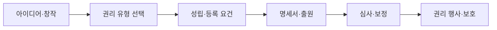

> [!abstract] 한 줄 요약
> 창작·발명·디자인·표지를 구분하고 각 권리의 성립 요건과 출원·심사·보호 단계를 비교한다.

## 강의 흐름 지도



---

## 개념을 연결하는 순서

원본 강의는 권리 대상을 먼저 나누고, 각 제도의 등록·보호 요건을 이어 붙인다.

- 저작권 자료는 저작물의 목적·사례·침해를 중심으로 권리의 성립과 보호를 구분한다.
- 특허 자료는 발명의 성립성·산업상 이용가능성·신규성·진보성을 살피고 명세서와 청구범위를 작성한다.
- 디자인 자료는 디자인의 목적, 등록요건, 출원·심사, 특유제도를 단계로 나눈다.
- 상표 자료는 식별력·기능·동일·유사 판단과 출원 절차를 연결한다.
- 직무발명·IPAT 기출·과제 자료는 권리 범위와 사례 판단을 반복 연습하는 평가 자료다.

<Tabs>
  <Tab label="저작권">창작물의 성립·이용·침해 사례를 구분한다.</Tab>
  <Tab label="산업재산">특허·디자인·상표의 대상과 등록요건을 비교한다.</Tab>
  <Tab label="절차">명세서·출원·심사·보정·권리 보호 흐름을 따라간다.</Tab>
</Tabs>

---

## 원본에서 읽는 적용 장면

| 권리 | 원본에서 보는 핵심 문서/질문 | 다음 단계 |
| :-- | :-- | :-- |
| 저작권 | 저작물·침해 사례 | 이용·보호 판단 |
| 특허 | 명세서·청구항·IPC | 출원·보정 |
| 디자인 | 형상·모양·등록요건 | 심사·특유제도 |
| 상표 | 기능·식별력·동일·유사 | 출원·보호 |
| 공통 | 기출·과제의 사실관계 | 요건 대입 |

특허 자료에서 명세서는 제품 이름만 적는 문서가 아니라 기술적 사상을 청구범위와 실시예로 연결하는 문서로 설명된다. 상표·디자인 자료는 각각 보호 대상과 판단 기준이 다르므로 하나의 체크리스트로 뭉개지 않는다.

```html preview
<div style="font-family:system-ui,sans-serif;padding:20px;color:var(--foreground)">
  <label for="flow638321" style="font-size:14px;font-weight:600">원본 강의 단계</label>
  <div id="flow638321-out" style="font-size:30px;font-weight:700;color:var(--chart-1);margin:6px 0">권리 유형과 보호 목적</div>
  <input id="flow638321" type="range" min="1" max="3" step="1" value="1"
    style="width:100%;accent-color:var(--primary)" />
  <p style="font-size:13px;color:var(--muted-foreground)">슬라이더로 PDF에서 정리한 강의 단계를 순서대로 확인합니다.</p>
  <script>
    var flow638321 = document.getElementById('flow638321');
    var flow638321Out = document.getElementById('flow638321-out');
    var flow638321Steps = ["권리 유형과 보호 목적","성립·등록 요건","출원·심사·보호·기출 점검"];
    flow638321.addEventListener('input', function () {
      flow638321Out.textContent = flow638321Steps[Number(flow638321.value) - 1] || '';
    });
  </script>
</div>
```

---

## 점검과 경계

<details>
<summary>사례 점검</summary>

1. 보호 대상이 창작물·기술·디자인·표지 중 무엇인지 먼저 분류한다.
2. 등록 요건과 권리 행사 단계를 섞지 않는다.
3. 기출 문제를 풀 때 원본 자료가 제시한 사실과 내가 추가한 해석을 분리한다.

</details>

> [!warning] 법률 정보 경계
> 이 노트는 제공된 강의자료의 교육용 구조를 정리한 것이며, 현재 법률 자문이나 최신 법령 확인을 대신하지 않는다.
>
> [!warning] 출처 경계
> 이 노트는 현재 폴더의 `sources/*.pdf`에서 추출·대조한 강의 내용을 묶었습니다. 동일 장의 '2'·'update' 파일은 별도 새 이론으로 세지 않고 보충·개정 관계로 확인합니다. 원본 PDF 전체나 원본 슬라이드 이미지는 삽입하지 않습니다.
