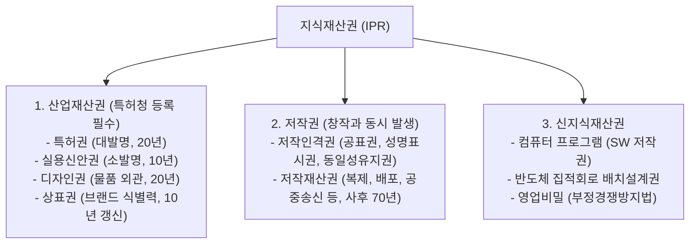

> [!abstract] 핵심 요약
> **지식재산권(Intellectual Property Rights)**은 기술, 디자인, 브랜드, 문화 콘텐츠 등 무형의 아이디어와 창작물에 독점 배타적 권리를 부여하는 법적 자산이다.
> **산업재산권(특허청 등록주의)**과 **저작권(무방식주의)**의 본질적 차이를 명확히 구분하고, 기업 경쟁력의 핵심인 **직무발명 보상제도**와 **글로벌 IP 포트폴리오 전략**을 확립한다.

---

## 1. 지식재산권의 3대 분류 체계



---

## 2. 직무발명 (Employee Invention) 제도의 핵심 법률 관계

종업원 등이 직무와 관련하여 완성한 발명:
1. **발명자의 원시 취득**: 직무발명이라도 권리는 처음에 **발명자인 종업원에게 원시적으로 귀속**된다.
2. **사용자의 예약 승계**: 취업규칙이나 사전 계약을 통해 기업이 특허를 받을 권리를 승계.
3. **정당한 보상금 청구권**: 기업이 권리를 승계할 경우, 종업원은 발명으로 얻을 기업의 이익에 비례하는 **정당한 금전적 보상을 받을 법적 권리**를 가진다 (특허법 제15조).

---

## 3. 실시간 지식재산권 권리 성격 판별기

```html preview
<div style="font-family:system-ui,-apple-system,sans-serif;padding:20px;background:var(--card);color:var(--card-foreground);border:1px solid var(--border);border-radius:var(--radius)">
  <div style="font-size:16px;font-weight:700;margin-bottom:12px;color:var(--primary)">
    ⚡ 창작물 유형별 지식재산권(IP) 보호 체계 분석기
  </div>

  <div style="margin-bottom:12px">
    <label style="font-size:11px;color:var(--muted-foreground)">창작 대상 선택:</label>
    <select id="selIpType" style="width:100%;padding:6px;background:var(--background);color:var(--foreground);border:1px solid var(--border);border-radius:var(--radius);font-weight:700">
      <option value="patent">획기적인 AI 이미지 생성 알고리즘 원천 기술</option>
      <option value="copyright">AI 기술을 설명하는 전공 교재 및 소스코드 텍스트</option>
      <option value="design">스마트폰의 독창적인 라운드 외관 및 GUI 아이콘</option>
      <option value="trademark">서비스 앱의 독창적인 브랜드 로고 및 상호명</option>
      <option value="trade_secret">학습용 데이터셋 정제 가이드라인 및 고객 리스트</option>
    </select>
  </div>

  <div id="outIpResult" style="padding:12px;background:var(--background);border:1px solid var(--border);border-radius:var(--radius);font-size:13px;line-height:1.6"></div>

  <script>
    var ipDB = {
      patent: { law: "특허법 (Patent Act)", term: "출원일로부터 20년", req: "신규성, 진보성, 산업상 이용가능성 (특허청 심사 등록 필수)" },
      copyright: { law: "저작권법 (Copyright Act)", term: "저작자 사후 70년", req: "인간의 사상 또는 감정을 표현한 창작물 (무방식주의: 등록 없이 발생)" },
      design: { law: "디자인보호법 (Design Act)", term: "설정등록일로부터 20년", req: "물품성, 형태성, 시각성, 심미감 (특허청 등록 필수)" },
      trademark: { law: "상표법 (Trademark Act)", term: "10년 (10년마다 영구 갱신 가능)", req: "자타상품 식별력, 선출원주의 (특허청 등록 필수)" },
      trade_secret: { law: "부정경쟁방지법 (영업비밀)", term: "비밀 유지 기간 동안 영구", req: "비공지성, 경제적 유용성, 비밀관리성" }
    };

    function updateIp() {
      var k = document.getElementById('selIpType').value;
      var it = ipDB[k];
      document.getElementById('outIpResult').innerHTML =
        "<strong>적용 법률:</strong> <span style='color:var(--primary);font-weight:800'>" + it.law + "</span><br/>" +
        "<strong>존속 기간:</strong> <span style='font-family:monospace;color:var(--foreground)'>" + it.term + "</span><br/>" +
        "<strong>핵심 요건:</strong> " + it.req;
    }

    document.getElementById('selIpType').addEventListener('change', updateIp);
    updateIp();
  </script>
</div>
