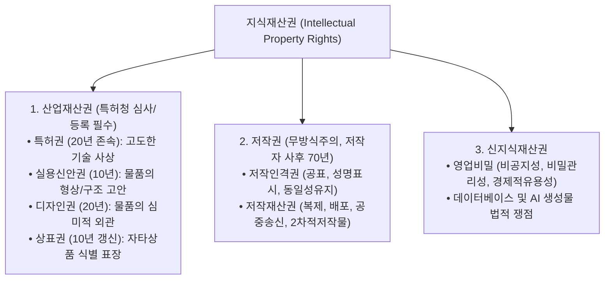

> [!abstract] 핵심 요약
> **지식재산권(IPR)**은 크게 **산업재산권(특허·실용신안·디자인·상표)**, **저작권(문학·학술·예술 창작물)**, 그리고 **신지식재산권(영업비밀·소프트웨어·반도체배치설계)**으로 3분된다.
> 산업재산권은 **특허청 심사 및 등록(방식/실체심사)**을 통해 권리가 발생하는 반면, 저작권은 별도의 등록 절차 없이 창작과 동시에 권리가 발생하는 **무방식주의(No Formalities)**를 따른다.

---

## 1. 지식재산권 3대 분류 체계



---

## 2. 실시간 지식재산권 유형 분류 및 존속기간 판별기

```html preview
<div style="font-family:system-ui,-apple-system,sans-serif;padding:20px;background:var(--card);color:var(--card-foreground);border:1px solid var(--border);border-radius:var(--radius)">
  <div style="font-size:16px;font-weight:700;margin-bottom:14px;color:var(--primary);display:flex;align-items:center;gap:8px">
    <span>🛡️ 발명 및 창작물에 대한 최적 지식재산권 판별기</span>
  </div>

  <div style="margin-bottom:14px">
    <label style="font-size:11px;color:var(--muted-foreground)">보호 대상 창작물 선택:</label>
    <select id="selIpTarget" style="width:100%;padding:6px;background:var(--background);color:var(--foreground);border:1px solid var(--border);border-radius:var(--radius);font-weight:700">
      <option value="algo">1. AI 신약 후보물질 탐색 알고리즘 (기술 사상)</option>
      <option value="novel">2. SF 소설 원고 및 시나리오 (사상/감정 표현)</option>
      <option value="brand">3. 스타트업 신규 로고 및 브랜드 네이밍</option>
      <option value="recipe">4. 코카콜라 농축 원액 제조 비법</option>
    </select>
  </div>

  <div style="padding:12px;background:var(--background);border:1px solid var(--border);border-radius:var(--radius)">
    <div style="font-size:11px;font-weight:700;color:var(--muted-foreground);margin-bottom:4px">해당 권리 및 보호 요건</div>
    <div id="ipTargetDescOut" style="font-size:13px;line-height:1.6;color:var(--primary)">
      <strong style="color:var(--primary)">특허권 (Patent):</strong> 출원일로부터 20년 보호, 자연법칙 이용성/신규성/진보성 충족 시 독점 배타권 확보.
    </div>
  </div>

  <script>
    document.getElementById('selIpTarget').onchange = function() {
      var val = this.value;
      var out = document.getElementById('ipTargetDescOut');
      if (val === 'algo') {
        out.innerHTML = "<strong style='color:var(--primary)'>특허권 (Patent):</strong><br/>• 출원일로부터 20년 독점<br/>• 요건: 발명의 성립성(자연법칙 이용), 신규성, 진보성 심사 통과 필요";
      } else if (val === 'novel') {
        out.innerHTML = "<strong style='color:var(--primary)'>저작권 (Copyright):</strong><br/>• 저작자 사후 70년 보호<br/>• 요건: 무방식주의 (창작 즉시 발생), 인간의 사상·감정의 독창적 표현";
      } else if (val === 'brand') {
        out.innerHTML = "<strong style='color:var(--primary)'>상표권 (Trademark):</strong><br/>• 10년 존속 (10년마다 영구 갱신 가능)<br/>• 요건: 자타상품 식별력, 부등록 사유 미해당";
      } else {
        out.innerHTML = "<strong style='color:var(--chart-1)'>영업비밀 (Trade Secret):</strong><br/>• 기한 없는 영구 보호 (공개되지 않는 한)<br/>• 요건: 비공지성, 경제적 유용성, 합리적 비밀관리 노력 유지";
      }
    };
  </script>
</div>
```
