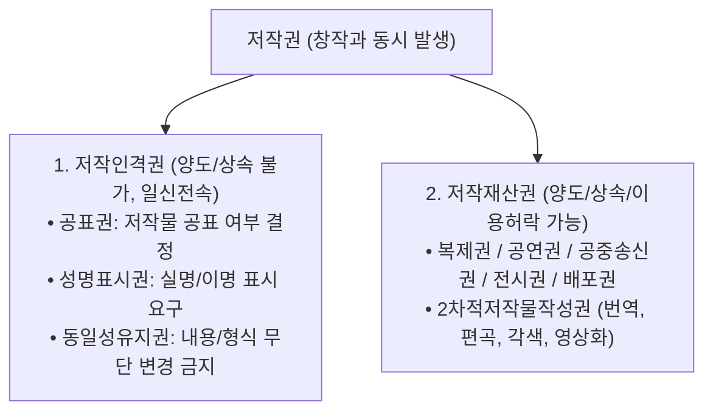

> [!abstract] 핵심 요약
> 저작권법의 대원칙은 **"아이디어(Idea)는 자유롭게 공유되되, 독창적인 구체적 표현(Expression)만을 독점 보호한다"**는 **아이디어-표현 이분법**이다.
> 저작재산권 침해가 성립하기 위해서는 피고가 원고의 저작물에 접근(Access)하였고, 양자 사이에 **실질적 유사성(Substantial Similarity)**이 존재해야 한다.

---

## 1. 저작권 권리 체계 분해



---

## 2. 공정이용(Fair Use) 판단 4대 기준

1. **이용의 목적 및 성격**: 상업적인가, 비영리 교육적/변형적(Transformative)인가?
2. **저작물의 성격**: 사실적 저작물인가, 고도의 창의적 저작물인가?
3. **사용된 부분의 분량과 실질성**: 핵심적인 부분을 다량 이용하였는가?
4. **해당 저작물의 잠재적 시장/가치에 미치는 영향**: 원저작물의 시장 수요를 대체하는가?

---

## 3. 실시간 공정이용(Fair Use) 적법성 판정기

```html preview
<div style="font-family:system-ui,-apple-system,sans-serif;padding:20px;background:var(--card);color:var(--card-foreground);border:1px solid var(--border);border-radius:var(--radius)">
  <div style="font-size:16px;font-weight:700;margin-bottom:14px;color:var(--primary);display:flex;align-items:center;gap:8px">
    <span>⚖️ 저작권 침해 vs 공정이용(Fair Use) 판정 분석기</span>
  </div>

  <div style="margin-bottom:14px">
    <label style="font-size:11px;color:var(--muted-foreground)">이용 사례 선택:</label>
    <select id="selFairCase" style="width:100%;padding:6px;background:var(--background);color:var(--foreground);border:1px solid var(--border);border-radius:var(--radius);font-weight:700">
      <option value="review">사례 1: 유튜브 영화 리뷰에서 비평을 위해 영화 클립 30초 인용</option>
      <option value="stream">사례 2: 최신 개봉 영화 전편을 무단 스트리밍 사이트에 업로드</option>
    </select>
  </div>

  <div style="padding:12px;background:var(--background);border:1px solid var(--border);border-radius:var(--radius)">
    <div style="font-size:11px;font-weight:700;color:var(--muted-foreground);margin-bottom:4px">판정 결과 및 법적 근거</div>
    <div id="fairResultOut" style="font-size:13px;line-height:1.6;color:var(--primary)">
      <strong style="color:var(--primary)">✅ 공정이용(Fair Use) 성립 가능성 높음:</strong> 비평 및 교육 목적의 변형적 이용이며, 원작 영화의 수요를 대체하지 않음.
    </div>
  </div>

  <script>
    document.getElementById('selFairCase').onchange = function() {
      var val = this.value;
      var out = document.getElementById('fairResultOut');
      if (val === 'review') {
        out.innerHTML = "<strong style='color:var(--primary)'>✅ 공정이용 (Fair Use) 성립:</strong><br/>• 변형적 비평 목적 인정, 소량 인용, 원작의 본질적 시장을 잠식하지 않음";
      } else {
        out.innerHTML = "<strong style='color:var(--destructive,#ef4444)'>🚨 명백한 저작재산권 침해 (복제권 및 공중송신권 침해):</strong><br/>• 상업적 광고 수익 목적, 전편 무단 복제, 원작의 영화관/OTT 시장을 전면 파괴";
      }
    };
  </script>
</div>
```
