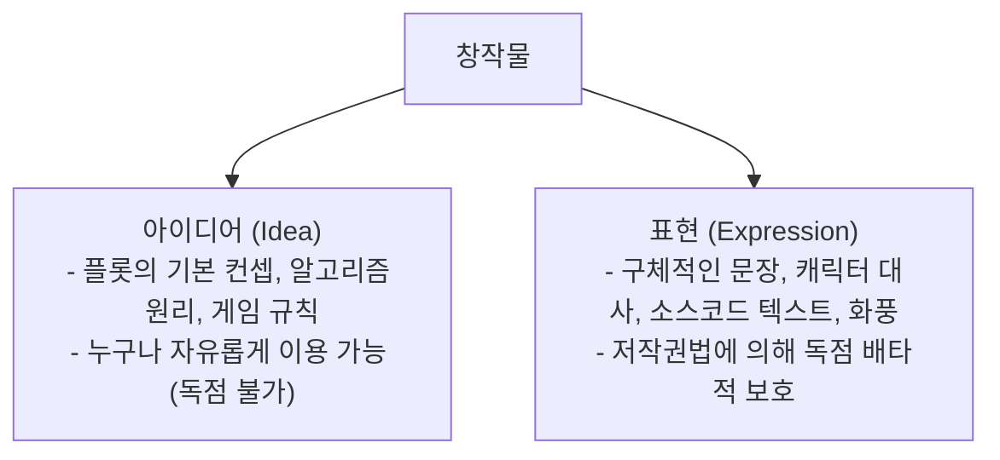

> [!abstract] 핵심 요약
> 저작권법은 **"아이디어는 모든 인류의 공유재이며, 오직 구체화된 독창적 표현(Expression)만을 독점 보호한다"**는 아이디어-표현 이분법을 절대적 대전제로 삼는다.
> 저작권 침해 성립 요건(**의거성 + 실질적 유사성**)과 저작재산권 제한 사유인 **공정이용(Fair Use)** 판단 4대 기준을 마스터한다.

---

## 1. 아이디어-표현 이분법 (Idea-Expression Dichotomy)



---

## 2. 저작권 침해 판정의 2대 요건

1. **의거성 (Access)**: 침해 혐의자가 원 저작물에 접근하여 이를 보거나 들었을 개연성이 존재해야 함 (우연의 일치는 침해 아님).
2. **실질적 유사성 (Substantial Similarity)**: 두 저작물 간에 '창작적 표현' 부분이 질적·양적으로 실질적으로 동일하거나 유사해야 함.

---

## 3. 공정이용 (Fair Use) 4대 판단 기준 (저작권법 제35조의5)

1. **이용의 목적 및 성격**: 비영리 교육용인가? 혹은 새로운 가치를 창출하는 **변형적 이용(Transformative Use)**인가?
2. **저작물의 종류 및 용도**: 사실적 저작물인가, 고도의 창작적 저작물인가?
3. **이용된 부분이 저작물 전체에서 차지하는 양과 중요성**: 핵심적인 부분을 대량 사용했는가?
4. **저작물의 현재 및 잠재적 시장 수요에 미치는 영향**: 원저작물의 시장 판매를 직접 대체하는가?

---

## 4. 실시간 공정이용(Fair Use) 자가 진단기

```html preview
<div style="font-family:system-ui,-apple-system,sans-serif;padding:20px;background:var(--card);color:var(--card-foreground);border:1px solid var(--border);border-radius:var(--radius)">
  <div style="font-size:16px;font-weight:700;margin-bottom:12px;color:var(--primary)">
    ⚡ 저작물 이용 시 공정이용(Fair Use) 성립 가능성 진단기
  </div>

  <div style="display:grid;grid-template-columns:1fr 1fr;gap:10px;margin-bottom:12px">
    <div>
      <label style="font-size:11px;color:var(--muted-foreground)">이용 목적:</label>
      <select id="selFairPurp" style="width:100%;padding:6px;background:var(--background);color:var(--foreground);border:1px solid var(--border);border-radius:var(--radius);font-weight:700">
        <option value="edu">비영리 교육 및 학술 연구 (+3)</option>
        <option value="critique">도서 비평 및 패러디 (+2)</option>
        <option value="comm">상업적 유튜브/블로그 수익 창출 (-3)</option>
      </select>
    </div>
    <div>
      <label style="font-size:11px;color:var(--muted-foreground)">원저작물 시장 대체 효과:</label>
      <select id="selFairMarket" style="width:100%;padding:6px;background:var(--background);color:var(--foreground);border:1px solid var(--border);border-radius:var(--radius);font-weight:700">
        <option value="none">원작 판매에 영향 전혀 없음 (+3)</option>
        <option value="sub">원작 도서 구매를 직접 대체함 (-4)</option>
      </select>
    </div>
  </div>

  <div style="padding:12px;background:var(--background);border:1px solid var(--border);border-radius:var(--radius)">
    <div style="font-size:11px;color:var(--muted-foreground)">공정이용 성립 판정:</div>
    <div id="outFairVerdict" style="font-size:16px;font-weight:800;color:var(--primary);margin-top:2px">공정이용 인정 가능성 높음 (Safe)</div>
  </div>

  <script>
    function calcFair() {
      var p = document.getElementById('selFairPurp').value;
      var m = document.getElementById('selFairMarket').value;

      var score = 0;
      if (p === 'edu') score += 3;
      else if (p === 'critique') score += 2;
      else score -= 3;

      if (m === 'none') score += 3;
      else score -= 4;

      var v = document.getElementById('outFairVerdict');
      if (score >= 2) {
        v.textContent = "공정이용 인정 가능성 높음 (합법적 인용 가능)";
        v.style.color = "var(--primary)";
      } else if (score >= 0) {
        v.textContent = "조건부 허용 (출처 명시 및 일부 인용 필수)";
        v.style.color = "var(--warning,#f59e0b)";
      } else {
        v.textContent = "저작권 침해 위험 극히 높음 (라이선스 계약 필수)";
        v.style.color = "var(--destructive,#ef4444)";
      }
    }

    document.getElementById('selFairPurp').addEventListener('change', calcFair);
    document.getElementById('selFairMarket').addEventListener('change', calcFair);
    calcFair();
  </script>
</div>
