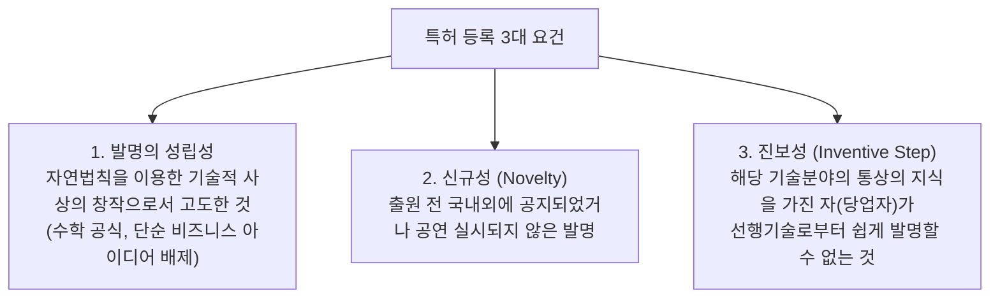

> [!abstract] 핵심 요약
> 특허권의 권리 범위는 발명의 상세한 설명이 아니라 오직 **'특허청구범위(Claims)'**에 기재된 문언에 의해 확정된다.
> 침해 판단의 기본인 **구성요소 완비의 법칙(All Elements Rule)**과 권리 침해 회피 설계를 방어하는 **균등론(Doctrine of Equivalents)**의 엄밀한 법리를 체득한다.

---

## 1. 특허 등록의 3대 실체적 요건



---

## 2. 특허 침해 판단 원칙

### 2.1. 구성요소 완비의 법칙 (All Elements Rule)
특허 독립항이 $A + B + C$의 3개 구성요소로 이루어져 있을 때:
- 상대방 제품이 $A + B + C$를 모두 포함하는 경우 $\implies$ **문언 침해 성립!**
- 상대방 제품이 $A + B + C + D$를 포함하는 경우 $\implies$ **침해 성립!** (더 많은 구성요소 추가는 침해를 면하지 못함)
- 상대방 제품이 $A + B$만 포함하는 경우 ($C$ 결여) $\implies$ **침해 불성립!**

### 2.2. 균등론 (Doctrine of Equivalents) 3대 요건
상대방이 구성요소 $C$를 $C'$로 치환했더라도:
1. **과제 해결 원리의 동일성**: 발명의 본질적 아이디어가 동일한가?
2. **작용 효과의 동일성**: 실질적으로 동일한 작용 효과를 나타내는가?
3. **치환의 용이성**: 당업자가 출원 당시에 $C \to C'$ 치환을 쉽게 생각해낼 수 있었는가?
$\implies$ 3가지 요건 모두 만족 시 **균등 침해 성립!**

---

## 3. 실시간 특허 침해 판정 시뮬레이터

```html preview
<div style="font-family:system-ui,-apple-system,sans-serif;padding:20px;background:var(--card);color:var(--card-foreground);border:1px solid var(--border);border-radius:var(--radius)">
  <div style="font-size:16px;font-weight:700;margin-bottom:12px;color:var(--primary)">
    ⚡ 특허 청구항 침해(All Elements Rule) 판정기
  </div>

  <div style="font-size:12px;color:var(--muted-foreground);margin-bottom:10px">
    [특허권자 청구항 제1항]: <strong>A(바퀴) + B(프레임) + C(유압 브레이크)</strong>
  </div>

  <div style="margin-bottom:12px">
    <label style="font-size:11px;color:var(--muted-foreground)">경쟁사 제품 구성 선택:</label>
    <select id="selInfringe" style="width:100%;padding:6px;background:var(--background);color:var(--foreground);border:1px solid var(--border);border-radius:var(--radius);font-weight:700">
      <option value="1">제품 1: A(바퀴) + B(프레임) + C(유압 브레이크) + D(바구니)</option>
      <option value="2">제품 2: A(바퀴) + B(프레임) [C 브레이크 누락]</option>
      <option value="3">제품 3: A(바퀴) + B(프레임) + C'(전자식 디스크 브레이크: 균등 치환)</option>
    </select>
  </div>

  <div id="outInfringeLog" style="padding:12px;background:var(--background);border:1px solid var(--border);border-radius:var(--radius);font-size:13px;line-height:1.6"></div>

  <script>
    var infDB = {
      "1": { res: "문언 침해 성립 (Literal Infringement)", color: "var(--destructive,#ef4444)", desc: "청구항 A, B, C를 모두 충족하였으므로 부가 요소 D가 있더라도 특허 침해에 해당합니다." },
      "2": { res: "침해 불성립 (Non-Infringement)", color: "var(--primary)", desc: "청구항의 필수 구성요소 C가 결여되어 있으므로 All Elements Rule에 의해 침해가 성립하지 않습니다." },
      "3": { res: "균등론(DOE) 침해 성립 가능성 높음", color: "var(--warning,#f59e0b)", desc: "과제 해결 원리와 작용 효과가 동일하며 치환이 용이하므로 균등 침해로 인정될 수 있습니다." }
    };

    function updateInf() {
      var v = document.getElementById('selInfringe').value;
      var it = infDB[v];
      document.getElementById('outInfringeLog').innerHTML =
        "<strong>판정 결과:</strong> <span style='font-weight:800;color:" + it.color + "'>" + it.res + "</span><br/>" +
        "<strong>법리 해설:</strong> " + it.desc;
    }

    document.getElementById('selInfringe').addEventListener('change', updateInf);
    updateInf();
  </script>
</div>
