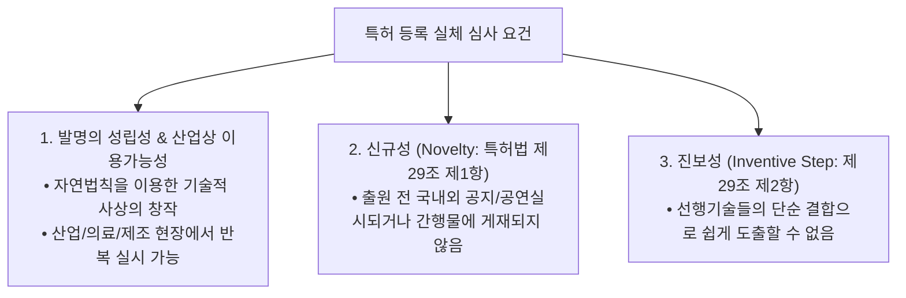

> [!abstract] 핵심 요약
> 특허를 획득하기 위해서는 출원 전 공지되지 않은 **신규성(Novelty)**과 통상의 기술자가 선행기술로부터 쉽게 발명할 수 없는 **진보성(Inventive Step)**을 입증해야 한다.
> 특허권의 보호 범위는 오직 **특허청구범위(Claims)**의 문언에 의해 확정되며, 청구항의 구성요소 중 하나라도 결여되면 침해가 성립하지 않는 **구성요소 완비의 원칙(All Elements Rule)**이 적용된다.

---

## 1. 특허 등록 3대 실체 요건



---

## 2. 청구항 해석 및 침해 판정 원칙

1. **구성요소 완비의 원칙 (All Elements Rule)**: 특허 청구항의 구성요소가 $[A + B + C]$일 때, 침해 제품이 $[A + B + C + D]$를 모두 포함해야 침해 성립 ($[A + B]$만 사용 시 비침해).
2. **균등론 (Doctrine of Equivalents)**: 구성요소의 일부가 치환되었더라도 (1) 과제 해결 원리가 동일하고, (2) 실질적으로 동일한 작용 효과를 나타내며, (3) 치환이 자명한 경우 침해 인정.

---

## 3. 실시간 특허 침해(구성요소 완비 법칙) 판정기

```html preview
<div style="font-family:system-ui,-apple-system,sans-serif;padding:20px;background:var(--card);color:var(--card-foreground);border:1px solid var(--border);border-radius:var(--radius)">
  <div style="font-size:16px;font-weight:700;margin-bottom:14px;color:var(--primary);display:flex;align-items:center;gap:8px">
    <span>🔍 All Elements Rule 기반 특허 침해 판정기</span>
  </div>

  <div style="margin-bottom:14px">
    <div style="font-size:11px;color:var(--muted-foreground)">등록 특허 청구항: [A: 스마트폰 센서] + [B: GPS 위치수집] + [C: 칼로리 계산 알고리즘]</div>
  </div>

  <div style="margin-bottom:14px">
    <label style="font-size:11px;color:var(--muted-foreground)">경쟁사 침해 의심 제품 구성:</label>
    <select id="selInfringeCase" style="width:100%;padding:6px;background:var(--background);color:var(--foreground);border:1px solid var(--border);border-radius:var(--radius);font-weight:700">
      <option value="all">제품 1: 센서(A) + GPS(B) + 칼로리계산(C) + 심박수측정(D) 포함</option>
      <option value="miss">제품 2: 센서(A) + GPS(B)만 포함 (칼로리 계산 기능 없음)</option>
    </select>
  </div>

  <div style="padding:12px;background:var(--background);border:1px solid var(--border);border-radius:var(--radius)">
    <div style="font-size:11px;font-weight:700;color:var(--muted-foreground);margin-bottom:4px">침해 성립 여부 판정</div>
    <div id="infringeResultOut" style="font-size:13px;line-height:1.6;color:var(--primary)">
      <strong style="color:var(--destructive,#ef4444)">🚨 문언 침해 성립 (Literal Infringement):</strong> 특허의 필수 구성 [A, B, C]를 전부 포함하고 있으므로(D 추가는 무관) 특허권 침해입니다.
    </div>
  </div>

  <script>
    document.getElementById('selInfringeCase').onchange = function() {
      var val = this.value;
      var out = document.getElementById('infringeResultOut');
      if (val === 'all') {
        out.innerHTML = "<strong style='color:var(--destructive,#ef4444)'>🚨 문언 침해 성립:</strong><br/>• 특허의 모든 구성요소 [A+B+C]를 구현함<br/>• 추가 기능(D)이 있더라도 침해 책임 면제 불가";
      } else {
        out.innerHTML = "<strong style='color:var(--primary)'>✅ 비침해 (Non-infringement):</strong><br/>• 필수 구성요소 중 [C]가 결여됨<br/>• All Elements Rule에 따라 특허 침해 불성립";
      }
    };
  </script>
</div>
```
