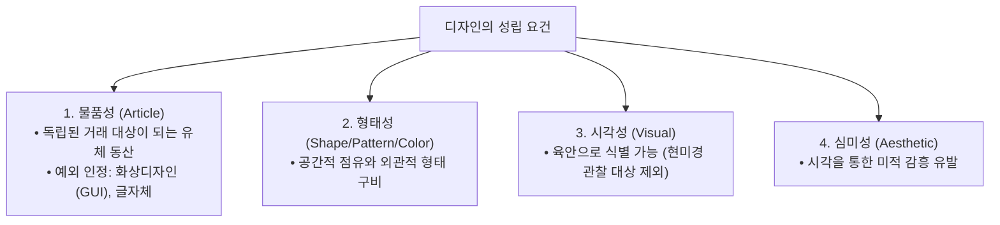

> [!abstract] 핵심 요약
> **디자인(Design)**은 **물품성(Article)**, **형태성(Shape/Pattern/Color)**, **시각성(Visual perception)**, **심미감(Aesthetic sense)**의 4대 요건을 갖추어야 등록될 수 있다.
> 현대 디지털 환경에서는 스마트폰 화면이나 기기 디스플레이에 표시되는 **화상디자인(GUI)** 또한 독립된 물품/화상으로 등록되어 보호된다.

---

## 1. 디자인의 4대 성립 요건



---

## 2. 디자인 유사 여부 판단 기준

디자인의 유사는 **일반 수요자의 시각을 기준으로 전체적인 지배적 인상(Dominant Impression)**을 종합 관찰하여 판단하며, 부분적인 미세한 차이에 얽매이지 않는다.

---

## 3. 실시간 디자인 유사성 및 물품성 판별기

```html preview
<div style="font-family:system-ui,-apple-system,sans-serif;padding:20px;background:var(--card);color:var(--card-foreground);border:1px solid var(--border);border-radius:var(--radius)">
  <div style="font-size:16px;font-weight:700;margin-bottom:14px;color:var(--primary);display:flex;align-items:center;gap:8px">
    <span>🎨 디자인보호법 성립 요건 및 등록 가능성 판별기</span>
  </div>

  <div style="margin-bottom:14px">
    <label style="font-size:11px;color:var(--muted-foreground)">출원 대상 선택:</label>
    <select id="selDesignTarget" style="width:100%;padding:6px;background:var(--background);color:var(--foreground);border:1px solid var(--border);border-radius:var(--radius);font-weight:700">
      <option value="gui">1. 스마트워치 OS의 원형 애플리케이션 전환 UI 아이콘 (화상디자인)</option>
      <option value="sugar">2. 설탕 한 알의 결정 형태 (극미세 형상)</option>
      <option value="chair">3. 독창적인 곡선형 인체공학 사무용 의자</option>
    </select>
  </div>

  <div style="padding:12px;background:var(--background);border:1px solid var(--border);border-radius:var(--radius)">
    <div style="font-size:11px;font-weight:700;color:var(--muted-foreground);margin-bottom:4px">성립 요건 판정 결과</div>
    <div id="designDescOut" style="font-size:13px;line-height:1.6;color:var(--primary)">
      <strong style="color:var(--primary)">✅ 등록 가능 (화상디자인):</strong> 기기 화면에 표시되는 그래픽 사용자 인터페이스(GUI)로 화상디자인 등록 요건 충족.
    </div>
  </div>

  <script>
    document.getElementById('selDesignTarget').onchange = function() {
      var val = this.value;
      var out = document.getElementById('designDescOut');
      if (val === 'gui') {
        out.innerHTML = "<strong style='color:var(--primary)'>✅ 화상디자인 등록 가능:</strong><br/>• 기기 조작 및 기능 발휘를 위한 화면 디스플레이 UI로 물품성 인정";
      } else if (val === 'sugar') {
        out.innerHTML = "<strong style='color:var(--destructive,#ef4444)'>❌ 등록 불가 (시각성 흠결):</strong><br/>• 육안으로 직접 관찰할 수 없으며 현미경으로만 식별되는 미세 결정은 디자인 성립성 불인정";
      } else {
        out.innerHTML = "<strong style='color:var(--primary)'>✅ 물품 디자인 등록 가능:</strong><br/>• 물품성, 형태성, 시각성, 심미감 4대 요건 완비";
      }
    };
  </script>
</div>
```
