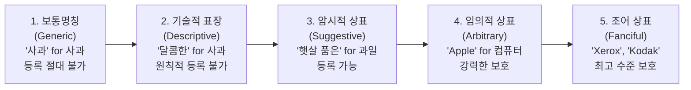

> [!abstract] 핵심 요약
> **상표(Trademark)**는 상품의 **출처표시 기능과 신용(Goodwill)**을 보호하는 법적 표지이다.
> 상품의 성질을 직접 설명하는 '기술적 표장'은 등록이 거절되며, **암시적·임의적·조어 상표**처럼 식별력이 높을수록 강력한 법적 독점권을 부여받는다.

---

## 1. 상표의 식별력 5단계 스펙트럼 (Abercrombie Spectrum)



---

## 2. 상표권 침해와 부정경쟁방지법의 보충적 관계

- **상표법**: 특허청에 등록된 상표에 대해 동일·유사한 지정상품 범위 내에서 무과실 책임에 준하는 강력한 배타권 행사.
- **부정경쟁방지법**: 비록 특허청에 상표 등록을 하지 않았더라도, 국내에 널리 알려진(주지·유명) 타인의 상호·표지를 무단 사용하여 상품 출처의 혼동을 일으키는 부정경쟁 행위를 금지 및 손해배상 청구.

---

## 3. 실시간 상표 등록 가능성 식별력 판별기

```html preview
<div style="font-family:system-ui,-apple-system,sans-serif;padding:20px;background:var(--card);color:var(--card-foreground);border:1px solid var(--border);border-radius:var(--radius)">
  <div style="font-size:16px;font-weight:700;margin-bottom:12px;color:var(--primary)">
    ⚡ 상표명 식별력(Distinctiveness) 등급 판정기
  </div>

  <div style="margin-bottom:12px">
    <label style="font-size:11px;color:var(--muted-foreground)">출원할 상표 및 지정상품 조합 선택:</label>
    <select id="selMark" style="width:100%;padding:6px;background:var(--background);color:var(--foreground);border:1px solid var(--border);border-radius:var(--radius);font-weight:700">
      <option value="1">"컴퓨터" (지정상품: 노트북 PC) - 보통명칭</option>
      <option value="2">"초고속 (Speedy)" (지정상품: 인터넷 통신) - 기술적 표장</option>
      <option value="3">"북극곰 (Polar Bear)" (지정상품: 에어컨) - 암시적 상표</option>
      <option value="4">"사과 (Apple)" (지정상품: 스마트폰/전자기기) - 임의적 상표</option>
      <option value="5">"자일로그 (Zilog)" (지정상품: 반도체 칩) - 조어 상표</option>
    </select>
  </div>

  <div id="outMarkResult" style="padding:12px;background:var(--background);border:1px solid var(--border);border-radius:var(--radius);font-size:13px;line-height:1.6"></div>

  <script>
    var markDB = {
      "1": { grade: "1등급 (Generic 보통명칭)", status: "등록 절대 불가 (거절)", desc: "누구나 자유롭게 써야 하는 상품의 명칭 자체이므로 특정인에게 독점권을 줄 수 없음." },
      "2": { grade: "2등급 (Descriptive 기술적 표장)", status: "등록 원칙적 불가 (거절)", desc: "상품의 효능, 품질, 성질을 직접 설명하는 단어는 식별력이 없음 (단, 사용에 의한 식별력 취득 시 예외)." },
      "3": { grade: "3등급 (Suggestive 암시적 표장)", status: "등록 가능 (식별력 인정)", desc: "상품의 시원한 성질을 한 단계 상상력을 거쳐 암시하므로 상표로 등록 가능." },
      "4": { grade: "4등급 (Arbitrary 임의적 표장)", status: "등록 가능 (강력한 식별력)", desc: "기존에 존재하는 단어이나 해당 전자기기 상품과 아무런 연관이 없으므로 강력한 보호를 받음." },
      "5": { grade: "5등급 (Fanciful 조어 상표)", status: "등록 가능 (최고 수준 보호)", desc: "사전에 없는 완전히 새로 창작된 단어로 독점 배타적 효력의 범위가 가장 넓음." }
    };

    function updateMark() {
      var v = document.getElementById('selMark').value;
      var it = markDB[v];
      document.getElementById('outMarkResult').innerHTML =
        "<strong>식별력 등급:</strong> <span style='color:var(--primary);font-weight:800'>" + it.grade + "</span><br/>" +
        "<strong>등록 가능 여부:</strong> <span style='font-weight:700'>" + it.status + "</span><br/>" +
        "<strong>해설:</strong> " + it.desc;
    }

    document.getElementById('selMark').addEventListener('change', updateMark);
    updateMark();
  </script>
</div>
