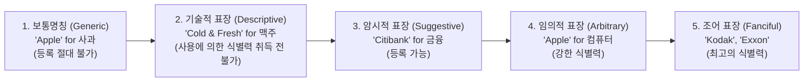

> [!abstract] 핵심 요약
> **상표(Trademark)**는 상품의 출처를 식별시키는 기호, 문자, 도형, 소리, 냄새 등의 표장이다.
> 상표 등록을 위해서는 **자타상품 식별력(Distinctiveness)**이 필수적이며, 상품의 성질을 직접 설명하는 기술적 표장(Descriptive mark: 예: 사과 판매에 '맛있는 사과')은 등록이 거절된다.

---

## 1. 상표의 식별력 스펙트럼 (Abercrombie Spectrum)



---

## 2. 상표 유사성 3대 판단 기준

상표의 유사 여부는 **외관(Sight)**, **칭호/호칭(Sound)**, **관념(Meaning)**의 3대 요소를 종합적으로 고려하여 일반 수요자가 출처에 대해 오인·혼동을 일으킬 우려가 있는지를 기준으로 판단한다.

---

## 3. 실시간 상표 식별력 및 등록 가능성 판정기

```html preview
<div style="font-family:system-ui,-apple-system,sans-serif;padding:20px;background:var(--card);color:var(--card-foreground);border:1px solid var(--border);border-radius:var(--radius)">
  <div style="font-size:16px;font-weight:700;margin-bottom:14px;color:var(--primary);display:flex;align-items:center;gap:8px">
    <span>🏷️ 상표 자타상품 식별력 스펙트럼 판정기</span>
  </div>

  <div style="margin-bottom:14px">
    <label style="font-size:11px;color:var(--muted-foreground)">상표 및 지정상품 조합 선택:</label>
    <select id="selTmCase" style="width:100%;padding:6px;background:var(--background);color:var(--foreground);border:1px solid var(--border);border-radius:var(--radius);font-weight:700">
      <option value="apple_fruit">1. "APPLE" 표장을 '신선한 사과 과일'에 출원</option>
      <option value="apple_phone">2. "APPLE" 표장을 '스마트폰 및 컴퓨터'에 출원</option>
      <option value="fast_delivery">3. "QUICK & FAST" 표장을 '택배 배송업'에 출원</option>
    </select>
  </div>

  <div style="padding:12px;background:var(--background);border:1px solid var(--border);border-radius:var(--radius)">
    <div style="font-size:11px;font-weight:700;color:var(--muted-foreground);margin-bottom:4px">식별력 및 등록 가능 여부</div>
    <div id="tmResultOut" style="font-size:13px;line-height:1.6;color:var(--primary)">
      <strong style="color:var(--destructive,#ef4444)">❌ 보통명칭 (Generic Mark):</strong> 사과 과일에 사과 명칭은 식별력이 전무하여 등록 불가.
    </div>
  </div>

  <script>
    document.getElementById('selTmCase').onchange = function() {
      var val = this.value;
      var out = document.getElementById('tmResultOut');
      if (val === 'apple_fruit') {
        out.innerHTML = "<strong style='color:var(--destructive,#ef4444)'>❌ 보통명칭 (Generic):</strong><br/>• 지정상품의 통상 명칭 자체이므로 누구나 사용해야 하며 등록 절대 불가";
      } else if (val === 'apple_phone') {
        out.innerHTML = "<strong style='color:var(--primary)'>✅ 임의적 상표 (Arbitrary):</strong><br/>• 컴퓨터 분야와 무관한 단어를 사용하여 극히 강력한 식별력 인정 및 등록 가능";
      } else {
        out.innerHTML = "<strong style='color:var(--destructive,#ef4444)'>❌ 기술적 표장 (Descriptive):</strong><br/>• 배송 서비스의 성질(신속성)을 직접 설명하므로 식별력 흠결로 거절";
      }
    };
  </script>
</div>
```
