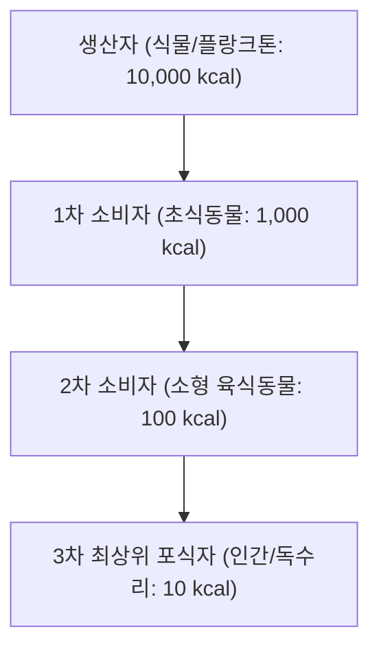

> [!abstract] 핵심 요약
> 생태계는 태양광 에너지를 받아 물질을 순환시키는 정교한 자기 조절 시스템이다.
> 인간의 산업 활동으로 배출된 미세 플라스틱과 중금속, POPs 물질이 먹이사슬의 상위 영양단계로 갈수록 수천~수백만 배로 증폭되는 **생물 농축(Biomagnification)**과 수계 파괴(부영양화)의 메커니즘을 규명한다.

---

## 1. 생태계 에너지 피라미드와 10% 효율 법칙



- 각 영양 단계를 거칠 때마다 에너지의 약 **90%가 호흡열과 대사활동으로 소실**되고 약 **10%만이 다음 단계로 전달**된다.

---

## 2. 생물 농축 (Biomagnification)의 메커니즘

- 에너지는 상위 단계로 갈수록 급격히 감소하지만, **지용성 난분해성 오염물질(DDT, 수은, 카드뮴, 미세플라스틱)**은 배출되지 않고 체내 지방 조직에 축적된다.
- 결과적으로 상위 포식자로 갈수록 체내 오염물질 농도가 기하급수적으로 폭증한다 (예: 미나마타병의 메틸수은 농축).

---

## 3. 실시간 먹이사슬 생물 농축(Biomagnification) 시뮬레이터

```html preview
<div style="font-family:system-ui,-apple-system,sans-serif;padding:20px;background:var(--card);color:var(--card-foreground);border:1px solid var(--border);border-radius:var(--radius)">
  <div style="font-size:16px;font-weight:700;margin-bottom:12px;color:var(--primary)">
    ⚡ 수생태계 중금속 생물 농축(Biomagnification) 계산기
  </div>

  <div style="margin-bottom:12px">
    <label style="font-size:11px;color:var(--muted-foreground)">수중 초기 오염 농도 (ppm):</label>
    <input id="inWaterPpm" type="range" min="0.001" max="0.05" step="0.001" value="0.005" style="width:100%" />
    <div id="outWaterPpmVal" style="font-weight:700;color:var(--primary);font-size:13px">물속 농도: 0.005 ppm</div>
  </div>

  <div style="display:grid;grid-template-columns:repeat(4, 1fr);gap:6px;text-align:center">
    <div style="padding:8px;background:var(--background);border:1px solid var(--border);border-radius:var(--radius)">
      <div style="font-size:10px;color:var(--muted-foreground)">식물 플랑크톤</div>
      <div id="outP1" style="font-family:monospace;font-size:13px;font-weight:800;color:var(--foreground);margin-top:2px">0.5 ppm</div>
    </div>
    <div style="padding:8px;background:var(--background);border:1px solid var(--border);border-radius:var(--radius)">
      <div style="font-size:10px;color:var(--muted-foreground)">동물 플랑크톤/소형어류</div>
      <div id="outP2" style="font-family:monospace;font-size:13px;font-weight:800;color:var(--foreground);margin-top:2px">5.0 ppm</div>
    </div>
    <div style="padding:8px;background:var(--background);border:1px solid var(--border);border-radius:var(--radius)">
      <div style="font-size:10px;color:var(--muted-foreground)">대형 어류(참치)</div>
      <div id="outP3" style="font-family:monospace;font-size:13px;font-weight:800;color:var(--warning,#f59e0b);margin-top:2px">50.0 ppm</div>
    </div>
    <div style="padding:8px;background:var(--background);border:1px solid var(--border);border-radius:var(--radius)">
      <div style="font-size:10px;color:var(--muted-foreground)">최상위 포식자(인간)</div>
      <div id="outP4" style="font-family:monospace;font-size:13px;font-weight:800;color:var(--destructive,#ef4444);margin-top:2px">500 ppm</div>
    </div>
  </div>

  <script>
    function calcBio() {
      var w = parseFloat(document.getElementById('inWaterPpm').value);
      document.getElementById('outWaterPpmVal').textContent = "물속 농도: " + w.toFixed(3) + " ppm";
      document.getElementById('outP1').textContent = (w * 100).toFixed(2) + " ppm";
      document.getElementById('outP2').textContent = (w * 1000).toFixed(1) + " ppm";
      document.getElementById('outP3').textContent = (w * 10000).toFixed(0) + " ppm";
      document.getElementById('outP4').textContent = (w * 100000).toFixed(0) + " ppm (10만 배 농축!)";
    }

    document.getElementById('inWaterPpm').addEventListener('input', calcBio);
    calcBio();
  </script>
</div>
