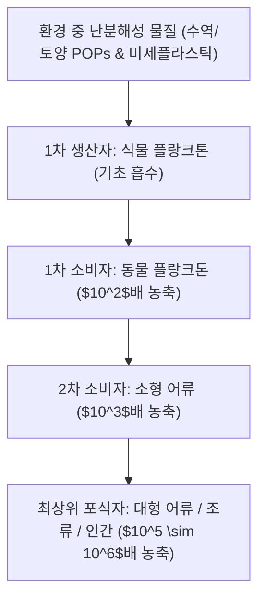

> [!abstract] 핵심 요약
> **생태계(Ecosystem)**는 생산자, 소비자, 분해자 간의 물질 순환과 일방향적인 에너지 흐름을 통해 동적 평형(Homeostasis)을 유지한다.
> 난분해성 화학물질 및 미세플라스틱은 먹이사슬을 따라 상위 포식자로 갈수록 농도가 기하급수적으로 증폭되는 **생물농축(Biomagnification)**을 유발하여 최종 소비자인 인간에게 치명적인 환경독성 위험을 초래한다.

---

## 1. 생태계 오염물질 순환 및 농축 구조



---

## 2. 부영양화(Eutrophication) 발생 단계

1. **질소(N)·인(P) 유입**: 생활하수, 농경지 화학비료 유출로 영양염류 급증.
2. **조류 대증식 (Algal Bloom)**: 녹조 및 적조 발생으로 수면 차광.
3. **용존산소(DO) 고갈**: 사멸한 조류를 호기성 미생물이 분해하며 산소 고갈 $\implies$ 어패류 집단 폐사.

---

## 3. 실시간 영양단계별 생물농축(Biomagnification) 계산기

```html preview
<div style="font-family:system-ui,-apple-system,sans-serif;padding:20px;background:var(--card);color:var(--card-foreground);border:1px solid var(--border);border-radius:var(--radius)">
  <div style="font-size:16px;font-weight:700;margin-bottom:14px;color:var(--primary);display:flex;align-items:center;gap:8px">
    <span>🐟 먹이사슬 상위 포식자 생물농축 계수 계산기</span>
  </div>

  <div style="margin-bottom:14px">
    <label style="font-size:11px;color:var(--muted-foreground)">수중 초기 오염물질 농도 (ppm):</label>
    <input id="inWaterPpm" type="number" value="0.00005" step="0.00001" style="width:100%;padding:4px;background:var(--background);color:var(--foreground);border:1px solid var(--border);border-radius:var(--radius);font-weight:700" />
  </div>

  <div style="display:grid;grid-template-columns:repeat(3, 1fr);gap:8px;margin-bottom:12px">
    <div style="padding:8px;background:var(--background);border:1px solid var(--border);border-radius:var(--radius);text-align:center">
      <div style="font-size:10px;color:var(--muted-foreground)">플랑크톤 ($10^3$)</div>
      <div id="outPlank" style="font-family:monospace;font-size:13px;font-weight:800;color:var(--primary)">0.05 ppm</div>
    </div>
    <div style="padding:8px;background:var(--background);border:1px solid var(--border);border-radius:var(--radius);text-align:center">
      <div style="font-size:10px;color:var(--muted-foreground)">소형 어류 ($10^4$)</div>
      <div id="outFish" style="font-family:monospace;font-size:13px;font-weight:800;color:var(--chart-1)">0.50 ppm</div>
    </div>
    <div style="padding:8px;background:var(--background);border:1px solid var(--border);border-radius:var(--radius);text-align:center">
      <div style="font-size:10px;color:var(--muted-foreground)">최상위 포식자 ($5	imes 10^5$)</div>
      <div id="outApex" style="font-family:monospace;font-size:13px;font-weight:800;color:var(--destructive,#ef4444)">25.00 ppm</div>
    </div>
  </div>

  <script>
    function updateBio() {
      var base = parseFloat(document.getElementById('inWaterPpm').value) || 0.00005;
      document.getElementById('outPlank').textContent = (base * 1000).toFixed(3) + " ppm";
      document.getElementById('outFish').textContent = (base * 10000).toFixed(3) + " ppm";
      document.getElementById('outApex').textContent = (base * 500000).toFixed(2) + " ppm";
    }
    document.getElementById('inWaterPpm').addEventListener('input', updateBio);
  </script>
</div>
```
