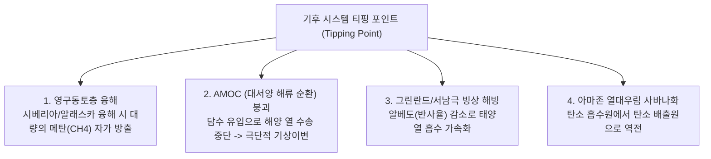

> [!abstract] 핵심 요약
> 지구 대기는 단파장의 태양 복사에너지를 통과시키고 장파장의 지구 복사열을 흡수하여 평균 $15^\circ\text{C}$의 생명 유지 온도를 형성한다.
> 산업혁명 이후 화석연료 연소로 급증한 온실가스가 복사 불균형을 야기하여 지구 기온을 $1.1^\circ\text{C}$ 이상 상승시켰으며, 임계점(**Tipping Point**)을 넘어서면 인간의 통제를 벗어난 폭주 온난화로 직결된다.

---

## 1. 6대 온실가스와 지구온난화지수 (GWP: Global Warming Potential)

$$\text{GWP} = \frac{\int_0^{TH} RF_i(t) \, dt}{\int_0^{TH} RF_{\text{CO}_2}(t) \, dt}$$

| 온실가스 | 주요 배출원 | 대기 체류 수명 | GWP (100년 기준) |
| :-- | :-- | :--: | :--: |
| **이산화탄소 ($\text{CO}_2$)** | 화석연료 연소, 삼림 벌채 | 100~300년 | **1 (기준)** |
| **메탄 ($\text{CH}_4$)** | 축산업(반추동물 트림), 천연가스 누출, 논농사 | 12년 | **28배** (단기 84배) |
| **아산화질소 ($\text{N}_2\text{O}$)** | 화학비료 남용, 농경지 토양 | 114년 | **265배** |
| **육불화황 ($\text{SF}_6$)** | 고압 전력 개폐기 절연 가스 | 3,200년 | **23,500배** |

---

## 2. 기후 시스템의 4대 티핑 포인트 (Tipping Points)



---

## 3. 실시간 온실가스 CO2 환산량(GWP) 계산기

```html preview
<div style="font-family:system-ui,-apple-system,sans-serif;padding:20px;background:var(--card);color:var(--card-foreground);border:1px solid var(--border);border-radius:var(--radius)">
  <div style="font-size:16px;font-weight:700;margin-bottom:12px;color:var(--primary)">
    ⚡ 온실가스 종류별 이산화탄소 환산량(CO2e) 계산기
  </div>

  <div style="display:grid;grid-template-columns:1fr 1fr;gap:10px;margin-bottom:12px">
    <div>
      <label style="font-size:11px;color:var(--muted-foreground)">온실가스 종류:</label>
      <select id="selGwpGas" style="width:100%;padding:6px;background:var(--background);color:var(--foreground);border:1px solid var(--border);border-radius:var(--radius);font-weight:700">
        <option value="1">이산화탄소 (CO2, GWP=1)</option>
        <option value="28">메탄 (CH4, GWP=28)</option>
        <option value="265">아산화질소 (N2O, GWP=265)</option>
        <option value="23500">육불화황 (SF6, GWP=23,500)</option>
      </select>
    </div>
    <div>
      <label style="font-size:11px;color:var(--muted-foreground)">배출량 (kg):</label>
      <input id="inGasKg" type="number" value="10" min="1" style="width:100%;padding:6px;background:var(--background);color:var(--foreground);border:1px solid var(--border);border-radius:var(--radius);font-weight:700" />
    </div>
  </div>

  <div style="padding:12px;background:var(--background);border:1px solid var(--border);border-radius:var(--radius)">
    <div style="font-size:11px;color:var(--muted-foreground)">이산화탄소 등가 환산량 (CO2e):</div>
    <div id="outCo2eVal" style="font-family:monospace;font-size:22px;font-weight:800;color:var(--primary);margin-top:2px">10.0 kg CO2e</div>
  </div>

  <script>
    function calcGwp() {
      var gwp = parseFloat(document.getElementById('selGwpGas').value);
      var kg = parseFloat(document.getElementById('inGasKg').value) || 0;
      var co2e = gwp * kg;
      document.getElementById('outCo2eVal').textContent = co2e.toLocaleString() + " kg CO2e (" + (co2e / 1000).toFixed(2) + " tCO2e)";
    }

    document.getElementById('selGwpGas').addEventListener('change', calcGwp);
    document.getElementById('inGasKg').addEventListener('input', calcGwp);
    calcGwp();
  </script>
</div>
