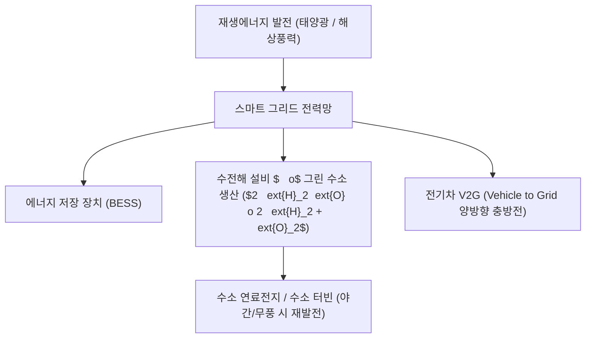

> [!abstract] 핵심 요약
> **지속가능한 발전(Sustainable Development)**은 "미래 세대의 필요를 충족시킬 능력을 저해하지 않으면서 현재 세대의 필요를 충족시키는 발전"이다.
> 탈탄소 사회로의 전환을 위해 **태양광/풍력 중심의 재생에너지 전력화**, **수소 기반의 섹터 커플링**, 그리고 글로벌 공급망의 **RE100 및 ESG 공시 의무화**가 산업의 새로운 표준으로 정착하고 있다.

---

## 1. 미래 청정에너지 그리드 아키텍처



---

## 2. 수소 생산 방식 3대 분류

| 수소 유형 | 제조 방식 | 탄소 배출 특성 |
| :-- | :-- | :-- |
| **그레이 수소 (Grey)** | 천연가스(LNG) 메탄 수증기 개질 ($	ext{CH}_4 + 2	ext{H}_2	ext{O} 	o 	ext{CO}_2 + 4	ext{H}_2$) | 대량의 $	ext{CO}_2$ 대기 배출 |
| **블루 수소 (Blue)** | 그레이 수소 생산 공정에 CCUS(탄소 포집·저장) 결합 | $	ext{CO}_2$ 90% 이상 포집 격리 |
| **그린 수소 (Green)** | **재생에너지 잉여 전력으로 물을 전기분해** | **$	ext{CO}_2$ 배출 제로 (완전 청정)** |

---

## 3. 실시간 기업 RE100 달성 포트폴리오 계산기

```html preview
<div style="font-family:system-ui,-apple-system,sans-serif;padding:20px;background:var(--card);color:var(--card-foreground);border:1px solid var(--border);border-radius:var(--radius)">
  <div style="font-size:16px;font-weight:700;margin-bottom:14px;color:var(--primary);display:flex;align-items:center;gap:8px">
    <span>⚡ 기업 연간 전력 소비량 RE100 이행 시뮬레이터</span>
  </div>

  <div style="display:grid;grid-template-columns:1fr 1fr;gap:12px;margin-bottom:14px">
    <div>
      <label style="font-size:11px;color:var(--muted-foreground)">자가 태양광 발전량 (GWh):</label>
      <input id="inSelfGen" type="number" value="35" min="0" max="100" style="width:100%;padding:4px;background:var(--background);color:var(--foreground);border:1px solid var(--border);border-radius:var(--radius);font-weight:700" />
    </div>
    <div>
      <label style="font-size:11px;color:var(--muted-foreground)">PPA 전력구매계약량 (GWh):</label>
      <input id="inPpa" type="number" value="45" min="0" max="100" style="width:100%;padding:4px;background:var(--background);color:var(--foreground);border:1px solid var(--border);border-radius:var(--radius);font-weight:700" />
    </div>
  </div>

  <div style="padding:12px;background:var(--background);border:1px solid var(--border);border-radius:var(--radius)">
    <div style="font-size:11px;font-weight:700;color:var(--muted-foreground);margin-bottom:4px">총 사용량 100 GWh 대비 RE100 달성률</div>
    <div id="re100Out" style="font-family:monospace;font-size:16px;font-weight:800;color:var(--primary)">
      RE100 달성률: 80.0% (남은 20 GWh는 REC 구매 필요)
    </div>
  </div>

  <script>
    function updateRe100() {
      var selfG = parseFloat(document.getElementById('inSelfGen').value) || 0;
      var ppa = parseFloat(document.getElementById('inPpa').value) || 0;
      var total = 100;
      var sum = Math.min(total, selfG + ppa);
      var pct = (sum / total) * 100;
      var out = document.getElementById('re100Out');
      if (pct >= 100) {
        out.innerHTML = "<span style='color:var(--primary)'>🎉 RE100 100% 완전 달성 성공! (탄소 국경세 면제)</span>";
      } else {
        out.innerHTML = "RE100 달성률: " + pct.toFixed(1) + "% (부족분 " + (total - sum).toFixed(1) + " GWh 녹색프리미엄/REC 조달 필요)";
      }
    }
    document.getElementById('inSelfGen').addEventListener('input', updateRe100);
    document.getElementById('inPpa').addEventListener('input', updateRe100);
  </script>
</div>
```
