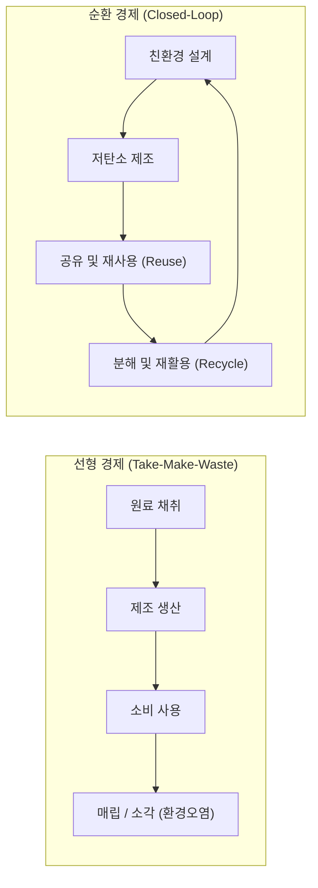

> [!abstract] 핵심 요약
> **순환 경제(Circular Economy)**는 폐기물을 쓰레기가 아니라 새로운 자원으로 환원시켜 천연자원의 투입과 오염물질 배출을 최소화하는 지속가능 경제 모델이다.
> 제품의 진정한 친환경성은 제조 단계뿐만 아니라 원료 채취, 물류, 사용, 최종 폐기 및 재활용에 이르는 전 과정을 분석하는 **전과정평가(LCA)**를 통해 검증된다.

---

## 1. 선형 경제 vs 순환 경제 물질 흐름 비교



---

## 2. 전과정평가(LCA) 4단계 ISO 표준 절차

1. **목적 및 범위 정의 (Goal and Scope Definition)**: 기능 단위(Functional Unit) 및 시스템 경계 설정.
2. **목록 분석 (LCI: Life Cycle Inventory)**: 투입 물질/에너지와 산출 배출물 데이터 정량화.
3. **영향 평가 (LCIA: Impact Assessment)**: 온실가스, 부영양화, 산성화 등 환경 영향 범주별 정량화.
4. **결과 해석 (Interpretation)**: 환경 부하 핫스팟 식별 및 개선 방안 도출.

---

## 3. 실시간 제품 전과정(LCA) 탄소발자국 계산기

```html preview
<div style="font-family:system-ui,-apple-system,sans-serif;padding:20px;background:var(--card);color:var(--card-foreground);border:1px solid var(--border);border-radius:var(--radius)">
  <div style="font-size:16px;font-weight:700;margin-bottom:14px;color:var(--primary);display:flex;align-items:center;gap:8px">
    <span>🔄 전과정평가(LCA) 단계별 탄소 배출량 분석기</span>
  </div>

  <div style="display:grid;grid-template-columns:1fr 1fr;gap:12px;margin-bottom:14px">
    <div>
      <label style="font-size:11px;color:var(--muted-foreground)">제조 방식:</label>
      <select id="selLcaMfg" style="width:100%;padding:4px;background:var(--background);color:var(--foreground);border:1px solid var(--border);border-radius:var(--radius);font-weight:700">
        <option value="virgin">1차 신생 원료 사용 (Virgin)</option>
        <option value="recycled">재활용 PCR 플라스틱 사용 (-60% 탄소)</option>
      </select>
    </div>
    <div>
      <label style="font-size:11px;color:var(--muted-foreground)">폐기 단계:</label>
      <select id="selLcaEol" style="width:100%;padding:4px;background:var(--background);color:var(--foreground);border:1px solid var(--border);border-radius:var(--radius);font-weight:700">
        <option value="landfill">단순 소각/매립</option>
        <option value="recycle">100% 폐루프 재활용 (Closed-loop)</option>
      </select>
    </div>
  </div>

  <div style="padding:12px;background:var(--background);border:1px solid var(--border);border-radius:var(--radius)">
    <div style="font-size:11px;font-weight:700;color:var(--muted-foreground);margin-bottom:4px">제품 1단위당 총 탄소발자국</div>
    <div id="lcaResultOut" style="font-family:monospace;font-size:15px;font-weight:800;color:var(--primary)">
      총 배출량: 12.4 kg CO2-eq (기본 선형 경제 모델)
    </div>
  </div>

  <script>
    function updateLca() {
      var mfg = document.getElementById('selLcaMfg').value;
      var eol = document.getElementById('selLcaEol').value;
      var base = (mfg === 'virgin' ? 10.0 : 4.0);
      var end = (eol === 'landfill' ? 2.4 : -1.5);
      var total = base + end;
      var out = document.getElementById('lcaResultOut');
      out.innerHTML = "총 배출량: <strong>" + total.toFixed(1) + " kg CO2-eq</strong> " + (total < 5 ? "<span style='color:var(--chart-1)'>(우수 순환 친환경 인증)</span>" : "");
    }
    document.getElementById('selLcaMfg').onchange = updateLca;
    document.getElementById('selLcaEol').onchange = updateLca;
  </script>
</div>
```
