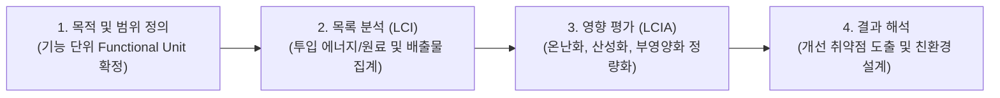

> [!abstract] 핵심 요약
> **순환 경제(Circular Economy)**는 폐기물 자체를 새로운 자원으로 재투입하여 천연자원 고갈을 막는 지속가능한 생산-소비 패러다임이다.
> 제품의 요람에서 무덤까지(Cradle-to-Grave) 전 생애주기를 평가하는 **LCA 기법**과 낭비되는 식량의 탄소발자국을 감축하는 방안을 학습한다.

---

## 1. ISO 14040 전과정평가(LCA) 4단계 절차



---

## 2. 음식물 쓰레기의 환경 영향과 탄소 배출

- 음식물 쓰레기가 매립지에 단순 매립될 경우, 공기가 차단된 상태에서 **혐기성 발효가 진행되어 이산화탄소보다 28배 강력한 온실가스인 메탄($\text{CH}_4$)을 대량 발생**시킨다.
- 전 세계 음식물 쓰레기로 인한 온실가스 배출량은 전 세계 총 배출량의 약 8~10%를 차지한다.
- **해법**: 1) 발생 원천 감량, 2) 혐기성 소화를 통한 바이오가스(Bio-gas/도시가스) 생산, 3) 곤충 사료화 및 퇴비화.

---

## 3. 실시간 음식물 쓰레기 온실가스 감축량 계산기

```html preview
<div style="font-family:system-ui,-apple-system,sans-serif;padding:20px;background:var(--card);color:var(--card-foreground);border:1px solid var(--border);border-radius:var(--radius)">
  <div style="font-size:16px;font-weight:700;margin-bottom:12px;color:var(--primary)">
    ⚡ 음식물 쓰레기 감축에 따른 탄소 저감 효과 계산기
  </div>

  <div style="margin-bottom:12px">
    <label style="font-size:11px;color:var(--muted-foreground)">주간 음식물 쓰레기 감축량 (kg):</label>
    <input id="inFoodKg" type="range" min="1" max="20" value="5" style="width:100%" />
    <div id="outFoodKgVal" style="font-weight:700;color:var(--primary);font-size:13px">주당 5 kg 감축</div>
  </div>

  <div style="padding:12px;background:var(--background);border:1px solid var(--border);border-radius:var(--radius)">
    <div style="font-size:11px;color:var(--muted-foreground)">연간 온실가스(CO2e) 감축량:</div>
    <div id="outFoodCo2" style="font-family:monospace;font-size:20px;font-weight:800;color:var(--primary);margin-top:2px">429 kg CO2e / 년</div>
    <div id="outTreeVal" style="font-size:12px;color:var(--muted-foreground);margin-top:4px">소나무 약 65그루를 심는 것과 동일한 효과입니다.</div>
  </div>

  <script>
    function calcFood() {
      var kg = parseFloat(document.getElementById('inFoodKg').value);
      document.getElementById('outFoodKgVal').textContent = "주당 " + kg + " kg 감축";

      var annualKg = kg * 52;
      var co2 = annualKg * 1.65; // 1kg food waste ~= 1.65 kg CO2e
      var trees = Math.round(co2 / 6.6); // 1 pine tree ~= 6.6 kg CO2/year

      document.getElementById('outFoodCo2').textContent = co2.toFixed(1) + " kg CO2e / 년";
      document.getElementById('outTreeVal').textContent = "소나무 약 " + trees + "그루를 심는 것과 동일한 효과입니다.";
    }

    document.getElementById('inFoodKg').addEventListener('input', calcFood);
    calcFood();
  </script>
</div>
