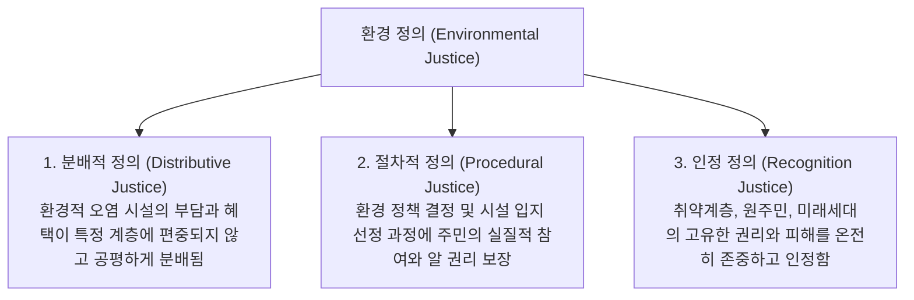

> [!abstract] 핵심 요약
> 온실가스를 가장 적게 배출한 최빈국과 사회적 약자가 해수면 상승과 폭염 등 기후 재난의 가장 가혹한 피해를 입는 것이 **기후 부정의(Climate Injustice)**의 비극이다.
> 환경적 혜택과 부담의 공정한 배분을 요구하는 **환경 정의 3원칙**과 탄소중립 이행 과정에서 아무도 소외되지 않도록 돕는 **정의로운 전환(Just Transition)**을 체득한다.

---

## 1. 환경 정의 (Environmental Justice)의 3대 차원



---

## 2. 바젤 협약과 유해 폐기물 이동 규제

- **바젤 협약 (Basel Convention)**: 선진국에서 발생한 유해 폐기물(전자 폐기물, 폐플라스틱)이 환경 규제가 느슨한 개발도상국으로 이동하여 불법 투기 및 처리되는 것을 원천 금지하는 국제 환경 조약.

---

## 3. 실시간 환경 정의 3차원 체크리스트

```html preview
<div style="font-family:system-ui,-apple-system,sans-serif;padding:20px;background:var(--card);color:var(--card-foreground);border:1px solid var(--border);border-radius:var(--radius)">
  <div style="font-size:16px;font-weight:700;margin-bottom:12px;color:var(--primary)">
    ⚡ 국책 환경 인프라 사업의 환경 정의 적합성 평가
  </div>

  <div style="display:grid;grid-template-columns:1fr 1fr 1fr;gap:8px;font-size:12px">
    <div style="padding:8px;background:var(--background);border:1px solid var(--border);border-radius:var(--radius)">
      <strong style="color:var(--primary)">분배적 정의</strong><br/>
      소외 지역에만 오염 시설이 집중되지 않았는가?
    </div>
    <div style="padding:8px;background:var(--background);border:1px solid var(--border);border-radius:var(--radius)">
      <strong style="color:var(--primary)">절차적 정의</strong><br/>
      주민 공청회와 정보 공개가 투명하게 보장되었는가?
    </div>
    <div style="padding:8px;background:var(--background);border:1px solid var(--border);border-radius:var(--radius)">
      <strong style="color:var(--primary)">정의로운 전환</strong><br/>
      폐쇄되는 석탄발전소 노동자의 재취업 지원이 있는가?
    </div>
  </div>
</div>
