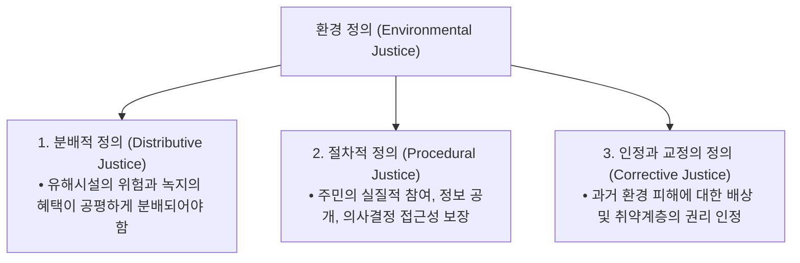

> [!abstract] 핵심 요약
> **환경 정의(Environmental Justice)**는 모든 사람이 인종, 소득, 국적에 관계없이 환경적 혜택을 공평하게 누리고 환경적 유해요소로부터 동등하게 보호받을 권리이다.
> 탄소 배출의 책임이 가장 적은 저소득 국가와 취약 계층이 기후 재난의 최대 피해자가 되는 **기후 부정의(Climate Injustice)**를 해결하기 위해 손실과 피해(Loss and Damage) 기금 및 **정의로운 전환(Just Transition)** 정책이 강력히 요구된다.

---

## 1. 환경 정의의 3대 핵심 차원



---

## 2. 지역 입지 갈등 현상 비교

| 용어 | 영문 명칭 | 주요 특징 | 발생 사례 |
| :-- | :-- | :-- | :-- |
| **NIMBY** | Not In My Back Yard | 시설의 필요성은 인정하되 내 집 근처는 결사 반대 | 쓰레기 소각장, 하수종말처리장, 교도소 |
| **BANANA** | Build Absolutely Nothing Anywhere Near Anyone | 모든 지역 어디에도 유해 시설 건설을 전면 거부 | 방사성 폐기물 처분장, 송전탑 |
| **PIMFY** | Please In My Front Yard | 지역 경제 활성화를 위해 유익 시설 유치 경쟁 | KTX 역사, 첨단 바이오 클러스터 |

---

## 3. 실시간 환경 정의(Environmental Justice) 취약성 지수 계산기

```html preview
<div style="font-family:system-ui,-apple-system,sans-serif;padding:20px;background:var(--card);color:var(--card-foreground);border:1px solid var(--border);border-radius:var(--radius)">
  <div style="font-size:16px;font-weight:700;margin-bottom:14px;color:var(--primary);display:flex;align-items:center;gap:8px">
    <span>⚖️ 지역별 환경 정의 취약성 지표(EJ Index) 평가기</span>
  </div>

  <div style="margin-bottom:14px">
    <label style="font-size:11px;color:var(--muted-foreground)">평가 지역 특성:</label>
    <select id="selEjRegion" style="width:100%;padding:6px;background:var(--background);color:var(--foreground);border:1px solid var(--border);border-radius:var(--radius);font-weight:700">
      <option value="ind">1. 공단 밀집 저소득 주거지역 (대기오염 고위험, 녹지 부족)</option>
      <option value="sub">2. 도심 외곽 고소득 친환경 생태 주거단지 (녹지율 40%)</option>
      <option value="island">3. 해수면 상승 및 태풍 취약 도서 어촌 지역</option>
    </select>
  </div>

  <div style="padding:12px;background:var(--background);border:1px solid var(--border);border-radius:var(--radius)">
    <div style="font-size:11px;font-weight:700;color:var(--muted-foreground);margin-bottom:4px">환경정의 평가 및 정책 제언</div>
    <div id="ejResultOut" style="font-size:13px;line-height:1.6;color:var(--primary)">
      <strong style="color:var(--destructive,#ef4444)">🚨 환경 불평등 고위험 지역 (EJ Priority Area):</strong> 오염 배출원 분산, 대기질 집중 정화 및 녹지 버퍼존 설치 시급.
    </div>
  </div>

  <script>
    document.getElementById('selEjRegion').onchange = function() {
      var val = this.value;
      var out = document.getElementById('ejResultOut');
      if (val === 'ind') {
        out.innerHTML = "<strong style='color:var(--destructive,#ef4444)'>🚨 환경정의 최우선 지원 지역:</strong><br/>• 복합 오염 노출도 최고, 저소득층 건강 피해 집중<br/>• 대기 모니터링 강화 및 특별 환경개선 특별회계 투입 필요";
      } else if (val === 'sub') {
        out.innerHTML = "<strong style='color:var(--primary)'>✅ 환경 혜택 향유 지역:</strong><br/>• 환경적 위해 요소 최저 수준, 우수한 생태 인프라 보유";
      } else {
        out.innerHTML = "<strong style='color:var(--chart-1)'>⚠️ 기후 재난 적응 취약 지역:</strong><br/>• 기후 위기로 인한 침수 및 어족자원 고갈 위험 직면<br/>• 방파제 보강 및 기후 난민 적응 기금 지원 필요";
      }
    };
  </script>
</div>
```
