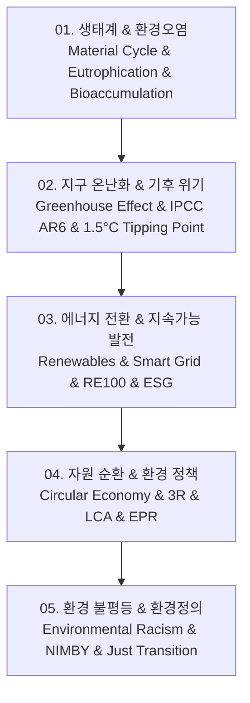

# 📚 인간환경과이해 (Human and Environment) 전체 로드맵

생태계의 물질 순환과 환경오염(부영양화, 미세플라스틱 생물농축), 온실효과와 IPCC 1.5°C 기후위기 티핑포인트, 신재생에너지(태양광, 풍력, 그린수소)와 RE100/ESG 경영, 순환 경제(Circular Economy)와 제품 전과정평가(LCA), 그리고 환경 불평등과 환경 정의(Environmental Justice)까지 체계적으로 다룹니다.

---

## 🗺️ 강의 목차 (Curriculum Overview)

---

## 📑 개별 정리 문서 목록

1. [01. 생태계 원리와 환경오염](file:///Users/um-yunsang/work/edu/ComputerScience/07_professional-humanities/%EC%9D%B8%EA%B0%84%ED%99%98%EA%B2%BD%EA%B3%BC%EC%9D%B4%ED%95%B4/notes/01.%20%EC%83%9D%ED%83%9C%EA%B3%84%20%EC%9B%90%EB%A6%AC%EC%99%80%20%ED%99%98%EA%B2%BD%EC%98%A4%EC%97%BC.md)
2. [02. 지구 온난화와 기후 위기](file:///Users/um-yunsang/work/edu/ComputerScience/07_professional-humanities/%EC%9D%B8%EA%B0%84%ED%99%98%EA%B2%BD%EA%B3%BC%EC%9D%B4%ED%95%B4/notes/02.%20%EC%A7%80%EA%B5%AC%20%EC%98%A8%EB%82%9C%ED%99%94%EC%99%80%20%EA%B8%B0%ED%98%84%20%EC%9C%84%EA%B8%B0.md)
3. [03. 에너지 전환과 지속가능한 발전](file:///Users/um-yunsang/work/edu/ComputerScience/07_professional-humanities/%EC%9D%B8%EA%B0%84%ED%99%98%EA%B2%BD%EA%B3%BC%EC%9D%B4%ED%95%B4/notes/03.%20%EC%97%90%EB%84%88%EC%A7%80%20%EC%A0%84%ED%99%98%EA%B3%BC%20%EC%A7%80%EC%86%8D%EA%B0%80%EB%8A%A5%ED%95%9C%20%EB%B0%9C%EC%A0%84.md)
4. [04. 자원 순환과 환경 정책](file:///Users/um-yunsang/work/edu/ComputerScience/07_professional-humanities/%EC%9D%B8%EA%B0%84%ED%99%98%EA%B2%BD%EA%B3%BC%EC%9D%B4%ED%95%B4/notes/04.%20%EC%9E%90%EC%9B%90%20%EC%88%9C%ED%99%98%EA%B3%BC%20%ED%99%98%EA%B2%BD%20%EC%A0%95%EC%B1%85.md)
5. [05. 환경 불평등과 환경정의](file:///Users/um-yunsang/work/edu/ComputerScience/07_professional-humanities/%EC%9D%B8%EA%B0%84%ED%99%98%EA%B2%BD%EA%B3%BC%EC%9D%B4%ED%95%B4/notes/05.%20%ED%99%98%EA%B2%BD%20%EB%B6%88%ED%8F%89%EB%93%B1%EA%B3%BC%20%ED%99%98%EA%B2%BD%EC%A0%95%EC%9D%98.md)
