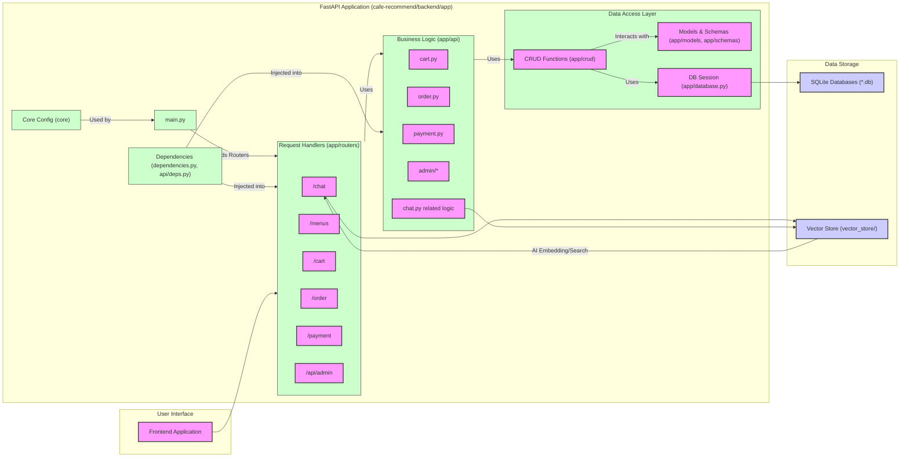

up:: [[ComputerScience/3-1_AI-system-design/ot/AI-system-design__ot__발표 스크립트|AI-system-design__ot__발표 스크립트]]
prerequisites:: [[ComputerScience/2-1_AI/3. Backpropagation/이론/Backpropagation|Backpropagation]], [[ComputerScience/2-2_database/7. 데이터베이스 언어 SQL/데이터 베이스 언어 SQL|데이터 베이스 언어 SQL]]
related:: [[ComputerScience/3-1_AI-system-design/주문 및 결제 AI 시스템 개발|주문 및 결제 AI 시스템 개발]], [[ComputerScience/3-1_AI-system-design/아키텍쳐/주요 데이터 흐름/AI 메뉴 추천|AI 메뉴 추천]], [[ComputerScience/3-1_AI-system-design/아키텍쳐/주요 데이터 흐름/주문 생성|주문 생성]]

---

