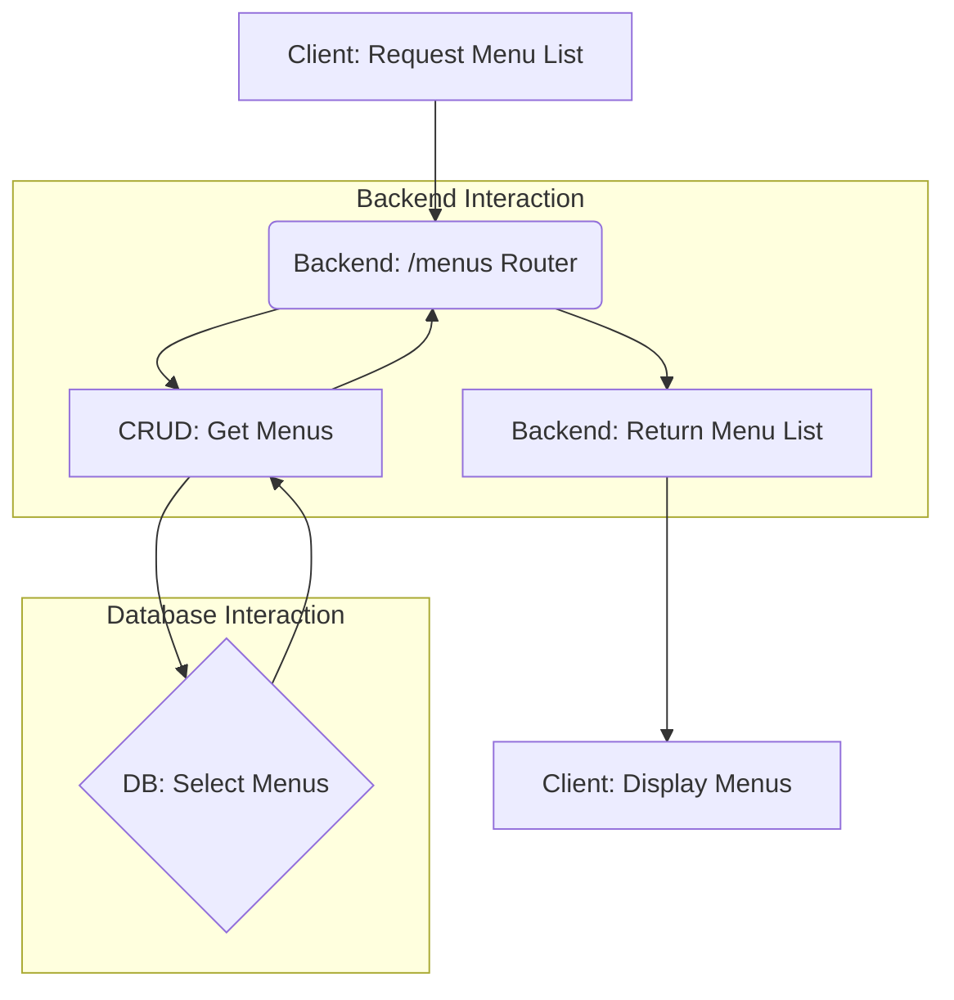

up:: [[커리큘럼 관계 정리|[3-1] AI시스템개발및설계]]

siblings:: [[ComputerScience/3-1_AI-system-design/아키텍쳐/주요 데이터 흐름/AI 메뉴 추천|AI 메뉴 추천]], [[ComputerScience/3-1_AI-system-design/아키텍쳐/주요 데이터 흐름/장바구니에 메뉴 추가|장바구니에 메뉴 추가]], [[ComputerScience/3-1_AI-system-design/아키텍쳐/주요 데이터 흐름/주문 생성|주문 생성]]
---

