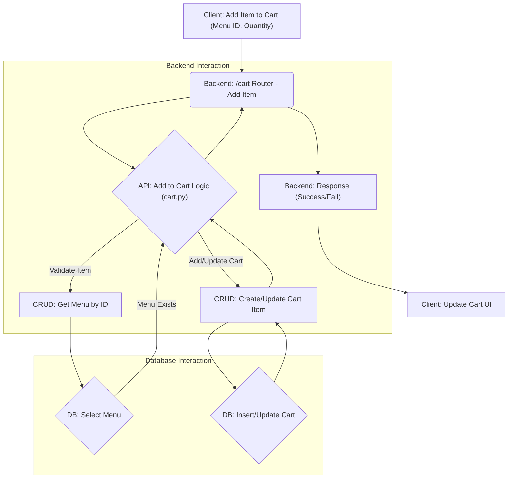

up:: [[AI Open Source MOC]]

---

```mermaid
graph TD
    A["Client: Add Item to Cart (Menu ID, Quantity)"] --> B("Backend: /cart Router - Add Item");
    B --> C{"API: Add to Cart Logic (cart.py)"};
    C -- "Validate Item" --> D["CRUD: Get Menu by ID"];
    D --> E{"DB: Select Menu"};
    E -- "Menu Exists" --> C;
    C -- "Add/Update Cart" --> F["CRUD: Create/Update Cart Item"];
    F --> G{"DB: Insert/Update Cart"};
    G --> F;
    F --> C;
    C --> B;
    B --> H["Backend: Response (Success/Fail)"];
    H --> I["Client: Update Cart UI"];

    subgraph "Backend Interaction"
        B; C; D; F; H;
    end
    subgraph "Database Interaction"
        E; G;
    end
```
