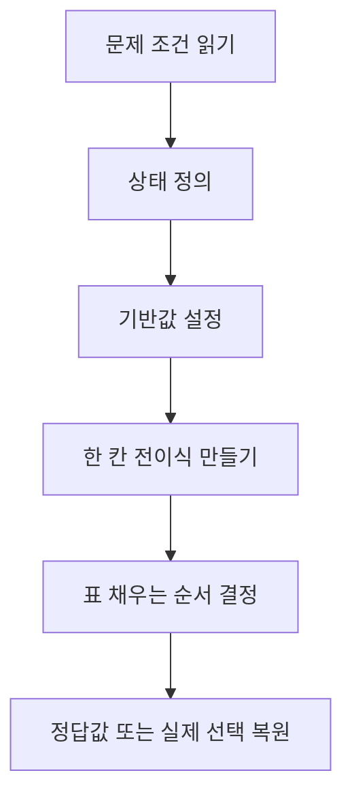

---
aliases:
  - 공간으로 시간벌기 동적계획법 정리
  - 알고리즘 6장 7장 문제풀이
course: algorithm
created: '2026-05-21'
date: '2026-05-21'
semester: 4-1
sources:
  - "[[pdf/06장-공간으로시간벌기-수정판.pdf]]"
  - "[[pdf/07장-동적계획법-수정판.pdf]]"
  - "[[pdf/07-동적계획법-보충-수정판.pdf]]"
status: evergreen
tags:
  - type/lecture
  - cs/algorithms
  - algorithm/space-time
  - algorithm/dynamic-programming
title: 06-07장 공간으로 시간벌기와 동적계획법 정밀 정리
type: lecture
updated: '2026-05-21'
---

up:: [[Algorithms MOC]]

siblings:: [[06장-공간으로시간벌기-수정판]], [[중간고사_알고리즘_정밀분석_정리]]

# 06-07장 공간으로 시간벌기와 동적계획법 정밀 정리

> [!abstract] 이 정리의 방향
> PDF를 텍스트로만 읽으면 수식과 판서, 표의 흐름을 놓치기 쉽다. 그래서 6장 37쪽, 7장 53쪽, 보충 63쪽을 이미지로 렌더링해 전체 흐름을 확인하고, 강의에서 실제 풀이로 이어지는 표·그림·전이식을 중심으로 다시 정리했다.

> [!warning] 제외 범위
> 이전 요청에 따라 **기수 정렬, 카운팅 정렬, Horspool 상세 풀이, OBST**는 최종 정리에서 제외했다.  
> 단, 6장 문자열 매칭의 전체 맥락을 잃지 않도록 Boyer-Moore 심화 슬라이드는 개념 수준으로만 포함했다.

![[4-1_algorithm__06-07_scope_map.svg|900]]

---

## 1. PDF 이미지 검토로 잡은 전체 범위

| 자료 | 이미지 검토 결과 | 이 노트의 반영 |
|---|---|---|
| 6장 p.1-p.15 | 기수 정렬, 카운팅 정렬 | 제외 |
| 6장 p.16-p.28 | 문자열 매칭, Horspool, Boyer-Moore | Horspool 제외, Boyer-Moore 핵심 아이디어만 정리 |
| 6장 p.29-p.35 | 해싱, 선형 조사, 삭제, 군집화 완화, 체이닝, 해시 함수, 성능 비교 | 포함 |
| 7장 p.3-p.9 | DP 개념, Fibonacci, memoization, tabulation, DP 패러다임 | 포함 |
| 7장 p.10-p.15 | 이항계수, top-down DP | 포함 |
| 7장 p.16-p.23 | 격자 경로 1, 2, 3 | 포함 |
| 7장 p.24-p.26 | Coin Changing | 포함 |
| 7장 p.28-p.32 | 0-1 Knapsack | 포함 |
| 7장 p.33-p.38 | LCS와 추적 | 포함 |
| 7장 p.39-p.46 | 인접행렬, 최단거리 종류, Floyd-Warshall | 포함 |
| 7장 p.47-p.50 | Edit distance | 포함 |
| 보충 p.1-p.22 | Matrix-chain multiplication | 포함 |
| 보충 p.23-p.44 | 그래프 용어, Floyd 세부 전개, 최적성 원리, 최장경로 반례 | 포함 |
| 보충 p.45-p.50 | Find a Longest Common Subsequence, 원숭이 키/IQ 문제 | 포함 |
| 보충 p.51-p.63 | OBST | 제외 |

> [!tip] 문제 추출 기준
> `Example`이라고 쓰인 슬라이드만 고르지 않았다. 표를 채워야 하거나, 상태를 확장해야 하거나, 실제 선택을 복원해야 하는 부분은 모두 문제로 추출했다.

---

## 2. 공간으로 시간 벌기: 미리 저장한 정보로 비교를 줄인다

6장의 공통 주제는 "공간을 더 쓰고, 시간을 줄인다"이다.

| 방법 | 저장하는 정보 | 줄어드는 일 |
|---|---|---|
| 문자열 매칭 전처리표 | 패턴을 얼마나 이동할지 | 텍스트를 한 칸씩만 미는 비교 |
| 해시 테이블 | 키가 들어갈 주소 | 처음부터 순차 탐색 |
| DP 테이블 | 부분 문제의 답 | 같은 부분 문제 재계산 |

### 2-1. 문자열 매칭: Boyer-Moore의 핵심만 잡기

![[4-1_algorithm__string_bm_overview.svg|850]]

![[4-1_algorithm__crop_boyer_moore_heuristics.png|720]]

문자열 매칭의 기본 문제는 다음이다.

```text
길이 n인 텍스트 T에서 길이 m인 패턴 P를 찾기
```

억지기법은 텍스트의 모든 위치에 패턴을 대고 비교한다. 최악에는:

$$
O(mn)
$$

PDF의 Boyer-Moore 심화 슬라이드는 두 가지 이동 근거를 보여 준다.

| 휴리스틱 | 질문 | 효과 |
|---|---|---|
| 나쁜 심벌 | 처음 틀린 문자가 패턴 안에 있는가? | 틀린 문자를 기준으로 패턴을 이동 |
| 좋은 접미어 | 이미 맞은 접미어가 패턴 안에 또 있는가? | 맞은 부분이 다시 맞도록 크게 이동 |

강의자료 예시는 `ANA`가 이미 맞았으므로 그 접미어가 다시 맞는 위치까지 건너뛴다. 핵심은 "비교 실패"도 버리는 정보가 아니라, 다음 위치를 계산하는 정보라는 점이다.

---

## 3. 해싱: 키를 주소로 바꾸되, 충돌 경로까지 이해해야 한다

![[4-1_algorithm__hash_collision_strategies.svg|900]]

해싱은 키 $k$를 해시 함수로 주소에 매핑한다.

$$
h(k)=k \bmod M
$$

이상적으로는 탐색이 $O(1)$이지만, 실제로는 충돌이 생긴다. 그래서 해싱 문제는 "주소 계산"보다 **충돌 후 탐색 경로**가 중요하다.

### 3-1. 선형 조사 예제

![[4-1_algorithm__crop_hash_linear_probe_example.png|760]]

문제 조건:

```text
key = 45, 27, 88, 9, 71, 60, 46, 38, 24
M = 13
h(k) = k % 13
```

각 키의 기본 주소:

| key | 45 | 27 | 88 | 9 | 71 | 60 | 46 | 38 | 24 |
|---:|---:|---:|---:|---:|---:|---:|---:|---:|---:|
| $h(key)$ | 6 | 1 | 10 | 9 | 6 | 8 | 7 | 12 | 11 |

삽입 과정을 실제 탐색 경로로 보면:

| 삽입 | 시작 주소 | 조사 과정 | 실제 위치 |
|---:|---:|---|---:|
| 45 | 6 | 6 비어 있음 | 6 |
| 27 | 1 | 1 비어 있음 | 1 |
| 88 | 10 | 10 비어 있음 | 10 |
| 9 | 9 | 9 비어 있음 | 9 |
| 71 | 6 | 6에는 45, 7 확인 | 7 |
| 60 | 8 | 8 비어 있음 | 8 |
| 46 | 7 | 7,8,9,10 차 있음 -> 11 | 11 |
| 38 | 12 | 12 비어 있음 | 12 |
| 24 | 11 | 11,12 차 있음 -> 0 | 0 |

최종 테이블:

| index | 0 | 1 | 2 | 3 | 4 | 5 | 6 | 7 | 8 | 9 | 10 | 11 | 12 |
|---|---:|---:|---:|---:|---:|---:|---:|---:|---:|---:|---:|---:|---:|
| value | 24 | 27 | - | - | - | - | 45 | 71 | 60 | 9 | 88 | 46 | 38 |

> [!important] 군집화
> 6번부터 12번까지 긴 연속 구간이 생겼다. 이후 이 구간으로 해싱되는 키는 빈 칸을 찾기 위해 오래 밀려난다. 이것이 선형 조사의 군집화다.

### 3-2. 삭제에서 `DELETED`가 필요한 이유

`60`을 삭제한 뒤 8번 칸을 그냥 빈 칸으로 만들면, `46`을 찾을 때 문제가 생긴다.

```text
h(46)=7
7에는 71이 있음 -> 다음 칸
8이 완전 빈 칸이면 탐색 중단
하지만 46은 11번에 있음
```

따라서 삭제된 칸은 "한 번도 사용된 적 없는 빈 칸"과 구분해야 한다.

```text
EMPTY    : 여기까지 와서 못 찾으면 탐색 실패
DELETED  : 과거에 경로였으므로 계속 탐색
```

### 3-3. 체이닝 예제

![[4-1_algorithm__crop_hash_chaining_example.png|720]]

체이닝은 같은 버킷에 여러 레코드를 리스트로 연결한다.

```text
key = 8, 1, 9, 6, 13
M = 7
H(k) = k % M
```

| key | $H(k)$ | 들어가는 버킷 |
|---:|---:|---|
| 8 | 1 | bucket 1 |
| 1 | 1 | bucket 1의 리스트 |
| 9 | 2 | bucket 2 |
| 6 | 6 | bucket 6 |
| 13 | 6 | bucket 6의 리스트 |

체이닝은 충돌을 없애는 것이 아니라, 충돌을 "버킷 내부 리스트 탐색" 문제로 바꾼다.

### 3-4. 해시 함수와 성능 비교

![[4-1_algorithm__crop_hash_performance_table.png|720]]

해시의 성능은 적재율에 크게 좌우된다.

$$
\alpha=\frac{n}{M}
$$

여기서 $n$은 저장된 항목 수, $M$은 해시 테이블의 버킷 수다.

| 항목 | 의미 |
|---|---|
| 좋은 해시 함수 | 충돌이 적고, 주소가 고르게 분포하고, 계산이 빠름 |
| 제산 함수 | $h(k)=k \bmod M$, 보통 $M$은 소수 사용 |
| 최선의 해싱 | 탐색, 삽입, 삭제가 $O(1)$에 가까움 |
| 최악의 해싱 | 많은 키가 같은 위치로 몰리면 $O(n)$ |

---

## 4. DP의 출발: Fibonacci는 중복 계산을 보여 주는 예시다

![[4-1_algorithm__dp_state_design.svg|900]]

![[4-1_algorithm__crop_fibonacci_dp_methods.png|720]]

피보나치 수열을 분할정복으로 계산하면 같은 값이 반복해서 계산된다.

$$
fib(n)=
\begin{cases}
n & n\le 1\\
fib(n-1)+fib(n-2) & n>1
\end{cases}
$$

예를 들어 $fib(5)$를 구할 때 $fib(3)$, $fib(2)$가 여러 경로에서 다시 등장한다. DP는 이 중복을 없앤다.

| 구현 방식 | 방향 | 뜻 |
|---|---|---|
| Memoization | top-down | 재귀로 내려가되, 계산한 값은 저장 |
| Tabulation | bottom-up | 작은 값부터 표를 채움 |

![[4-1_algorithm__crop_dp_paradigm.png|720]]

DP가 되려면 두 조건을 확인한다.

| 조건 | 뜻 |
|---|---|
| 겹치는 부분 문제 | 같은 작은 문제가 여러 번 등장한다. |
| 최적 부분 구조 | 작은 문제의 최적해로 큰 문제의 최적해를 만들 수 있다. |

---

## 5. 이항계수: 파스칼 삼각형을 표로 계산한다

![[4-1_algorithm__crop_binomial_c53_table.png|640]]

문제:

```text
C(5,3)을 DP로 계산하라.
```

상태:

$$
C(n,k)=\text{서로 다른 }n\text{개 중 }k\text{개를 고르는 경우의 수}
$$

기반 상황:

$$
C(n,0)=1,\qquad C(n,n)=1
$$

일반 상황은 마지막 원소를 고르는지로 나뉜다.

| 선택 | 남는 문제 |
|---|---|
| 마지막 원소를 고른다 | $C(n-1,k-1)$ |
| 마지막 원소를 고르지 않는다 | $C(n-1,k)$ |

따라서:

$$
C(n,k)=C(n-1,k-1)+C(n-1,k)
$$

손풀이:

$$
C(5,3)=C(4,2)+C(4,3)
$$

$$
C(4,2)=C(3,1)+C(3,2)=3+3=6
$$

$$
C(4,3)=C(3,2)+C(3,3)=3+1=4
$$

정답:

$$
C(5,3)=6+4=10
$$

---

## 6. 격자 경로: 상태를 늘려야 하는 순간을 배운다

![[4-1_algorithm__grid_path_state_expansion.svg|900]]

### 6-1. 격자 경로 1: 막힌 칸 없음

![[4-1_algorithm__crop_grid_path_basic_table.png|620]]

오른쪽 또는 아래쪽으로만 이동한다면, $(i,j)$에 도착하는 마지막 이동은 위쪽에서 내려오거나 왼쪽에서 오는 두 가지뿐이다.

상태:

$$
P(i,j)=S\text{에서 }(i,j)\text{까지 가는 최단 경로 수}
$$

전이:

$$
P(i,j)=P(i-1,j)+P(i,j-1)
$$

가장 위 행과 가장 왼쪽 열은 한 방향으로만 갈 수 있으므로 1이다. PDF 표의 도착점 값은 36이다.

```text
S에서 T까지의 경로 수 = 36
```

### 6-2. 격자 경로 2: 막힌 칸이 있음

![[4-1_algorithm__crop_grid_path_blocked_table.png|620]]

막힌 칸은 지나갈 수 없으므로 그 칸의 경로 수를 0으로 둔다.

$$
P(i,j)=0 \quad \text{if }(i,j)\text{ is blocked}
$$

나머지 칸은 그대로 위쪽과 왼쪽을 더한다.

$$
P(i,j)=P(i-1,j)+P(i,j-1)
$$

PDF 표의 도착점 값은 8이다.

```text
막힌 칸을 피해서 S에서 T까지의 경로 수 = 8
```

### 6-3. 격자 경로 3: 표시된 칸을 지나야 함

![[4-1_algorithm__crop_grid_path_marked_k1.png|620]]

이 문제는 단순한 $P(i,j)$만으로 풀 수 없다. 어떤 칸까지 도착한 경로가 표시된 칸을 이미 지났는지 아직 지나지 않았는지 구분해야 한다.

$k=1$이면 상태를 둘로 나눌 수 있다.

$$
P_0(i,j)=\text{표시된 칸을 아직 지나지 않고 }(i,j)\text{까지 온 경로 수}
$$

$$
P_1(i,j)=\text{표시된 칸을 한 번 이상 지나고 }(i,j)\text{까지 온 경로 수}
$$

일반적으로 정확히 $k$번 지나야 한다면:

$$
P(i,j,c)=\text{표시된 칸을 }c\text{번 지나고 }(i,j)\text{까지 온 경로 수}
$$

> [!important] 핵심
> 조건이 늘어나면 점화식을 억지로 고치기보다, 상태에 필요한 기억을 추가한다.

---

## 7. Coin Changing과 0-1 Knapsack: 같은 표처럼 보이지만 전이가 다르다

![[4-1_algorithm__coin_knapsack_transition_contrast.svg|900]]

### 7-1. Coin Changing

상태:

$$
c[i][j]=\text{앞의 }i\text{종류 동전으로 }j\text{원을 만드는 최소 동전 수}
$$

기반 상황:

$$
c[i][0]=0
$$

전이:

$$
c[i][j]=
\begin{cases}
c[i-1][j] & denom[i]>j\\
\min(c[i-1][j],\ 1+c[i][j-denom[i]]) & denom[i]\le j
\end{cases}
$$

> [!important] 같은 행을 보는 이유
> 동전은 같은 종류를 여러 번 쓸 수 있다. 그래서 동전을 하나 쓴 뒤 남은 금액은 여전히 $i$번째 동전을 다시 쓸 수 있는 상태, 즉 $c[i][j-denom[i]]$를 본다.

#### 문제 1: 12원을 1, 6, 10원으로 만들기

![[4-1_algorithm__crop_coin_change_12_table.png|760]]

```text
거스름돈 = 12
동전 = 1, 6, 10
```

6원 동전까지 고려하면:

$$
c[2][6]=\min(c[1][6],1+c[2][0])=\min(6,1)=1
$$

$$
c[2][12]=\min(c[1][12],1+c[2][6])=\min(12,2)=2
$$

10원 동전을 추가해도 12원은 더 좋아지지 않는다.

$$
c[3][12]=\min(c[2][12],1+c[3][2])=\min(2,3)=2
$$

정답:

```text
12 = 6 + 6
최소 동전 수 = 2
```

#### 문제 2: 25원을 1, 7, 15원으로 만들기

![[4-1_algorithm__crop_coin_change_25_table.png|760]]

```text
거스름돈 = 25
동전 = 1, 7, 15
```

표에서:

$$
c[2][25]=7,\qquad c[3][10]=4
$$

15원 동전을 쓰는 경우:

$$
1+c[3][10]=5
$$

따라서:

$$
c[3][25]=\min(7,5)=5
$$

정답 예:

```text
25 = 15 + 7 + 1 + 1 + 1
최소 동전 수 = 5
```

### 7-2. 0-1 Knapsack

상태:

$$
V(i,w)=\text{앞의 }i\text{개 물건만 고려하고 용량이 }w\text{일 때의 최대 가치}
$$

기반 상황:

$$
V(0,w)=0,\qquad V(i,0)=0
$$

전이:

$$
V(i,w)=
\begin{cases}
V(i-1,w) & w_i>w\\
\max(V(i-1,w),\ v_i+V(i-1,w-w_i)) & w_i\le w
\end{cases}
$$

> [!important] 이전 행을 보는 이유
> 0-1 Knapsack은 물건을 한 번만 쓸 수 있다. 이번 물건을 넣는 경우에도 다음 계산은 $i-1$개의 물건만 허용해야 한다.

![[4-1_algorithm__crop_knapsack_example_output.png|680]]

PDF 테스트 입력:

```text
value  = [60, 100, 190, 120, 200, 150]
weight = [2, 5, 8, 4, 7, 6]
W = 18
```

출력 480을 만드는 한 가지 최적 선택:

| 물건 | 무게 | 가치 |
|---:|---:|---:|
| 1 | 2 | 60 |
| 2 | 5 | 100 |
| 4 | 4 | 120 |
| 5 | 7 | 200 |

검산:

$$
2+5+4+7=18
$$

$$
60+100+120+200=480
$$

---

## 8. LCS: 마지막 원소 비교와 역추적

![[4-1_algorithm__lcs_floyd_mcm_patterns.svg|900]]

LCS는 두 수열의 공통 부분순서 중 가장 긴 것을 찾는다. 연속될 필요는 없지만 순서는 유지해야 한다.

상태:

$$
L(i,j)=X[1..i]\text{와 }Y[1..j]\text{의 LCS 길이}
$$

전이:

$$
L(i,j)=
\begin{cases}
L(i-1,j-1)+1 & X_i=Y_j\\
\max(L(i-1,j),L(i,j-1)) & X_i\ne Y_j
\end{cases}
$$

![[4-1_algorithm__crop_lcs_trace_table.png|720]]

표를 다 채운 뒤 실제 LCS 문자열을 얻으려면 역추적한다.

| 상황 | 이동 |
|---|---|
| $X_i=Y_j$ | 해당 문자를 답에 넣고 대각선으로 이동 |
| 위쪽 값이 더 큼 | 위로 이동 |
| 왼쪽 값이 더 큼 | 왼쪽으로 이동 |
| 위쪽과 왼쪽 값이 같음 | 둘 다 따라가면 서로 다른 LCS를 찾을 수 있음 |

### 8-1. 보충 문제: Find a Longest Common Subsequence

![[4-1_algorithm__find_lcs_backtracking.svg|900]]

![[4-1_algorithm__crop_find_lcs_table.png|760]]

보충자료 p.46-p.48은 단순히 LCS 길이를 구하는 표가 아니라, 표에서 실제 LCS를 찾아내는 문제다.

문제의 두 수열:

```text
A = G D V E G T A
B = G V C E K S T A G T
```

표의 마지막 값은 5이므로 LCS 길이는 5다.

$$
L(7,10)=5
$$

하지만 여기서 끝내면 부족하다. "Find a LCS"는 실제 공통 부분순서를 하나 이상 제시해야 한다.

역추적 규칙:

| 상황 | 처리 |
|---|---|
| 두 문자가 같음 | 그 문자를 답에 넣고 대각선으로 이동 |
| 다르고 위쪽 값이 큼 | 위로 이동 |
| 다르고 왼쪽 값이 큼 | 왼쪽으로 이동 |
| 위쪽과 왼쪽 값이 같음 | 둘 다 따라가면 서로 다른 LCS 가능 |

이 예제에서 가능한 서로 다른 LCS 문자열은 2개다.

```text
G V E T A
G V E G T
```

둘 다 길이 5이고, 두 수열에서 순서를 유지한다.

검산:

| LCS | A에서의 위치 | B에서의 위치 |
|---|---|---|
| `G V E T A` | 1, 3, 4, 6, 7 | 1, 2, 4, 7, 8 |
| `G V E G T` | 1, 3, 4, 5, 6 | 1, 2, 4, 9, 10 |

> [!important] 왜 이 부분이 빠지면 안 되는가?
> LCS 표의 최종값은 "길이"만 말한다. 강의자료의 `Find a Longest Common Subsequence`는 여기서 한 단계 더 나아가, 동률 분기를 따라가며 실제 문자열을 복원하는 문제다.

### 8-2. 보충 문제: 키는 증가, IQ는 감소하는 가장 긴 순서

![[4-1_algorithm__crop_lcs_monkey_table.png|760]]

문제는 "키는 증가하고 IQ는 감소하는 가장 긴 원숭이 순서"를 찾는 것이다.

풀이 아이디어:

1. 키가 증가하는 순서로 원숭이를 정렬한다.
2. IQ가 감소하는 순서로 원숭이를 정렬한다.
3. 두 순서의 LCS를 구한다.

표의 최종 길이는 5다. 한 가지 가능한 순서:

```text
D -> E -> I -> B -> A
```

검산:

| 이름 | 키 | IQ |
|---|---:|---:|
| D | 69 | 40 |
| E | 70 | 30 |
| I | 75 | 29 |
| B | 80 | 21 |
| A | 84 | 13 |

$$
69<70<75<80<84
$$

$$
40>30>29>21>13
$$

---

## 9. Floyd-Warshall: 중간 정점을 하나씩 허용한다

Floyd-Warshall은 모든 정점 쌍의 최단거리를 구하는 DP다.

상태:

$$
D^{(k)}[i][j]=\text{정점 }1..k\text{만 중간 정점으로 허용할 때 }i\to j\text{ 최단거리}
$$

전이:

$$
D^{(k)}[i][j]=
\min\left(D^{(k-1)}[i][j],\ D^{(k-1)}[i][k]+D^{(k-1)}[k][j]\right)
$$

![[4-1_algorithm__crop_floyd_table_update.png|720]]

해석:

| 후보 | 의미 |
|---|---|
| $D^{(k-1)}[i][j]$ | $k$를 거치지 않는 기존 최단거리 |
| $D^{(k-1)}[i][k]+D^{(k-1)}[k][j]$ | $k$를 거쳐 가는 새 경로 |

따라서 $k$를 바깥 루프로 두는 이유는, "허용하는 중간 정점 집합"을 단계적으로 늘리기 위해서다.

### 9-1. 경로 복원: `path(5,3)`

![[4-1_algorithm__crop_floyd_path_trace.png|720]]

거리 행렬 $D$만 있으면 최단거리 길이만 알 수 있다. 실제 경로를 출력하려면 중간 정점을 저장한 $P$가 필요하다.

보충자료의 경로 복원:

```text
path(5,3) = 4
  path(5,4) = 1
    path(5,1) = 0
    v1 출력
    path(1,4) = 0
  v4 출력
  path(4,3) = 0
```

중간 정점은:

```text
v1, v4
```

따라서 전체 경로:

```text
v5 -> v1 -> v4 -> v3
```

### 9-2. 최적성 원리와 최장경로 반례

![[4-1_algorithm__crop_longest_path_counterexample.png|720]]

최단경로가 DP로 풀리는 이유는 최적성 원리를 만족하기 때문이다.

```text
vi -> vj 최단경로가 vk를 지난다면,
vi -> vk 부분경로와 vk -> vj 부분경로도 각각 최단경로여야 한다.
```

반대로 최장 단순경로는 같은 방식으로 바로 DP를 적용하기 어렵다. 부분경로를 더 긴 경로로 바꾸면 이미 지나간 정점을 다시 지나게 되어 단순경로 조건이 깨질 수 있다.

---

## 10. 편집 거리: 마지막 문자를 어떻게 맞출 것인가

편집 거리는 문자열 $S$를 $T$로 바꾸기 위한 최소 편집 연산 수다. 강의자료는 삽입, 삭제, 대체를 사용한다.

상태:

$$
E(m,n)=S[1..m]\text{을 }T[1..n]\text{으로 바꾸는 최소 연산 수}
$$

![[4-1_algorithm__crop_edit_distance_recurrence.png|720]]

기반 상황:

$$
E(m,0)=m,\qquad E(0,n)=n
$$

전이:

$$
E(m,n)=
\begin{cases}
E(m-1,n-1) & S_m=T_n\\
\min
\begin{cases}
E(m-1,n-1)+1\\
E(m-1,n)+1\\
E(m,n-1)+1
\end{cases} & S_m\ne T_n
\end{cases}
$$

PDF 예시:

```text
TUESDAY -> THURSDAY
```

한 가지 최적 변환:

```text
TUESDAY
THUESDAY   # H 삽입
THURSDAY   # E를 R로 대체
```

따라서 편집 거리는 2다.

---

## 11. Matrix-chain Multiplication: 괄호 위치가 비용을 바꾼다

행렬곱은 결합법칙이 성립하므로 결과는 같지만, 계산 순서에 따라 곱셈 횟수가 크게 달라진다.

### 11-1. 작은 비교 예시

![[4-1_algorithm__crop_mcm_cost_compare.png|720]]

PDF 예시:

```text
A1: 100 x 2
A2: 2 x 50
A3: 50 x 3
A4: 3 x 10
```

비용 비교:

| 괄호 | 비용 |
|---|---:|
| $(((A_1A_2)A_3)A_4)$ | 14500 |
| $A_1(A_2(A_3A_4))$ | 3600 |
| $(A_1A_2)(A_3A_4)$ | 61500 |
| $(A_1(A_2A_3))A_4$ | 3900 |
| $A_1((A_2A_3)A_4)$ | 2360 |

최소:

```text
A1((A2A3)A4)
최소 비용 = 2360
```

### 11-2. DP 상태와 복원

상태:

$$
M[i][j]=A_iA_{i+1}\cdots A_j\text{를 계산하는 최소 곱셈 횟수}
$$

전이:

$$
M[i][j]=
\min_{i\le k<j}
\left(M[i][k]+M[k+1][j]+d_{i-1}d_kd_j\right)
$$

여기서 $k$는 마지막 곱셈 직전에 왼쪽 그룹과 오른쪽 그룹을 나누는 위치다.

![[4-1_algorithm__crop_mcm_goal_table.png|720]]

보충자료의 6개 행렬 예시는 표를 대각선 방향으로 채워 최종 $M[1][6]$을 구한다. 실제 괄호를 출력하려면 최소값을 준 $k$를 $P[i][j]$에 저장한다.

```text
M = 비용표
P = 어디서 쪼갰는지 저장한 복원표
```

---

## 12. 문제를 만났을 때의 풀이 순서



| 문제 | 상태 | 한 칸을 채우는 질문 |
|---|---|---|
| Boyer-Moore | 전처리 이동량 | 비교 실패 정보를 얼마나 크게 이동에 쓸 수 있나? |
| 해싱 | 계산 주소와 실제 위치 | 충돌하면 다음 어디를 볼까? |
| 이항계수 | $C(n,k)$ | 마지막 원소를 고를까, 안 고를까? |
| 격자 경로 | $P(i,j)$, $P(i,j,c)$ | 위에서 왔나, 왼쪽에서 왔나, 표시 조건이 바뀌었나? |
| Coin Changing | $c[i][j]$ | 이번 동전을 또 쓸 수 있나? |
| 0-1 Knapsack | $V(i,w)$ | 이번 물건을 넣을까 말까? |
| LCS | $L(i,j)$ | 마지막 원소가 같은가? |
| Floyd | $D^{(k)}[i][j]$ | 정점 $k$를 거치면 더 짧아지는가? |
| Edit Distance | $E(m,n)$ | 마지막 문자를 삽입, 삭제, 대체 중 무엇으로 맞출까? |
| MCM | $M[i][j]$ | 마지막 곱셈 직전에 어디서 쪼갤까? |

---

## 13. 캡처·SVG 인덱스

| 파일 | 원본/용도 |
|---|---|
| `4-1_algorithm__06-07_scope_map.svg` | 전체 범위 지도 |
| `4-1_algorithm__string_bm_overview.svg` | Boyer-Moore 개념 시각화 |
| `4-1_algorithm__hash_collision_strategies.svg` | 해싱 충돌 처리 시각화 |
| `4-1_algorithm__dp_state_design.svg` | DP 상태 설계 흐름 |
| `4-1_algorithm__grid_path_state_expansion.svg` | 격자 경로 상태 확장 |
| `4-1_algorithm__coin_knapsack_transition_contrast.svg` | Coin과 Knapsack 전이 비교 |
| `4-1_algorithm__lcs_floyd_mcm_patterns.svg` | LCS, Floyd, MCM 복원 패턴 |
| `4-1_algorithm__find_lcs_backtracking.svg` | Find a Longest Common Subsequence 역추적 |
| `4-1_algorithm__crop_boyer_moore_heuristics.png` | 6장 p.27 Boyer-Moore 휴리스틱 |
| `4-1_algorithm__crop_hash_linear_probe_example.png` | 6장 p.30 선형 조사 |
| `4-1_algorithm__crop_hash_chaining_example.png` | 6장 p.33 체이닝 |
| `4-1_algorithm__crop_hash_performance_table.png` | 6장 p.35 해싱 성능 비교 |
| `4-1_algorithm__crop_fibonacci_dp_methods.png` | 7장 p.4 Fibonacci와 DP |
| `4-1_algorithm__crop_dp_paradigm.png` | 7장 p.9 DP 패러다임 |
| `4-1_algorithm__crop_binomial_c53_table.png` | 7장 p.13 이항계수 |
| `4-1_algorithm__crop_grid_path_basic_table.png` | 7장 p.17 격자 경로 1 |
| `4-1_algorithm__crop_grid_path_blocked_table.png` | 7장 p.19 격자 경로 2 |
| `4-1_algorithm__crop_grid_path_marked_k1.png` | 7장 p.21 격자 경로 3 |
| `4-1_algorithm__crop_coin_change_12_table.png` | 7장 p.25 Coin Changing 12원 |
| `4-1_algorithm__crop_coin_change_25_table.png` | 7장 p.26 Coin Changing 25원 |
| `4-1_algorithm__crop_knapsack_example_output.png` | 7장 p.32 0-1 Knapsack 테스트 |
| `4-1_algorithm__crop_lcs_trace_table.png` | 7장 p.37 LCS 추적 |
| `4-1_algorithm__crop_find_lcs_table.png` | 보충 p.48 Find a Longest Common Subsequence |
| `4-1_algorithm__crop_lcs_monkey_table.png` | 보충 p.50 LCS 응용 |
| `4-1_algorithm__crop_floyd_table_update.png` | 보충 p.35 Floyd 표 갱신 |
| `4-1_algorithm__crop_floyd_path_trace.png` | 보충 p.41 Floyd 경로 복원 |
| `4-1_algorithm__crop_longest_path_counterexample.png` | 보충 p.44 최장경로 반례 |
| `4-1_algorithm__crop_edit_distance_recurrence.png` | 7장 p.48 편집 거리 |
| `4-1_algorithm__crop_mcm_cost_compare.png` | 보충 p.2 MCM 비용 비교 |
| `4-1_algorithm__crop_mcm_goal_table.png` | 보충 p.15 MCM 최종 표 |

## 14. 원본 PDF 바로가기

- [[pdf/06장-공간으로시간벌기-수정판.pdf]]
- [[pdf/07장-동적계획법-수정판.pdf]]
- [[pdf/07-동적계획법-보충-수정판.pdf]]
