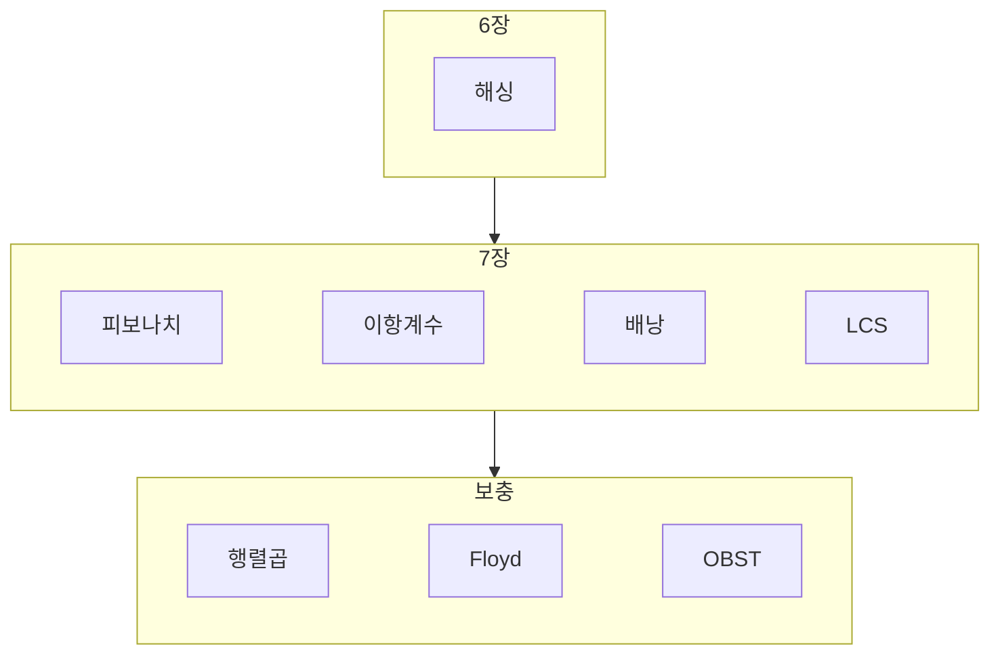

---
aliases:
  - 공간으로 시간벌기 동적계획법 정리
  - 알고리즘 6장 7장 정리
course: algorithm
created: '2026-05-21'
date: '2026-05-21'
semester: 4-1
sources:
  - "[[pdf/06장-공간으로시간벌기-수정판.pdf]]"
  - "[[pdf/07장-동적계획법-수정판.pdf]]"
  - "[[pdf/07-동적계획법-보충-수정판.pdf]]"
status: evergreen
tags:
  - type/lecture
  - cs/algorithms
  - algorithm/space-time
  - algorithm/dynamic-programming
title: 06-07장 공간으로 시간벌기와 동적계획법 정밀분석 정리
type: lecture
updated: '2026-05-21'
---

up:: [[Algorithms MOC]]

siblings:: [[06장-공간으로시간벌기-수정판]], [[중간고사_알고리즘_정밀분석_정리]]

# 06-07장 공간으로 시간벌기와 동적계획법 정밀분석 정리

> [!abstract] 한 줄 핵심
> 6장은 **전처리 테이블로 시간을 사는 전략**이고, 7장은 그 전략을 **부분문제 표와 점화식**으로 체계화한 장이다.  
> 즉, 6장의 해시 테이블 감각이 7장의 DP 테이블로 이어진다.

> [!info]- 이 노트에 적용한 Obsidian 작성 방식
> - 공식 Obsidian 문법 기준으로 **frontmatter properties**, **wikilink**, **image embed**, **callout**을 사용했다.
> - 원문 확인용으로 PDF 일부를 `../../image`가 아니라 vault 기준 `image/`에 저장하고 Obsidian 이미지 임베드 형식으로 붙였다.
> - 수식은 LaTeX로 다시 정리했고, PDF 텍스트 추출에서 깨진 기호는 슬라이드 맥락과 알고리즘 표준 점화식으로 복원했다.
> - `sources` 속성을 넣어 Obsidian Bases나 Properties view에서 강의자료 기반 노트로 필터링할 수 있게 했다.

## 0. 전체 흐름 지도



| 구간 | 핵심 질문 | 쓰는 표 | 대표 점화식 형태 | 복잡도 감각 |
|---|---|---|---|---|
| 6.4 해싱 | 키를 주소로 바꿔 바로 찾을 수 있는가? | hash table | $h(k)$, probe sequence | 평균 $O(1)$에 가까움 |
| 7장 DP | 부분문제를 다시 풀지 않을 수 있는가? | DP table | base + recurrence | 대개 다항시간 |
| 7장 보충 | 최적 순서를 어떻게 복원하는가? | cost table + root/path table | min/max over split | $O(n^2)$ 또는 $O(n^3)$ |

> [!important] 시험장 판별법
> - **전처리로 빠르게 점프/조회**하면 6장.
> - **작은 문제의 답을 표에 저장하고 큰 문제를 만든다**면 7장.
> - **최적값만이 아니라 선택 경로도 출력**해야 하면 보충 자료의 `P`, `R` 같은 추적 테이블을 함께 떠올린다.

---

## 1. 6장 공간으로 시간벌기

### 1-1. 공간으로 시간 벌기의 본질

PDF는 "모든 답을 미리 다 계산해 저장해 놓는다면 모든 알고리즘은 $O(1)$이 가능하지만, 문제는 공간"이라고 설명한다. 현실적인 알고리즘 설계에서는 **감당 가능한 추가 공간**만 써서 반복 계산, 반복 비교, 반복 탐색을 줄인다.

| 예 | 추가 공간 | 시간을 줄이는 방식 |
|---|---|---|
| 해싱 | hash table | 키 -> 주소 계산 |
| DP | memo/table | 같은 부분문제 재사용 |

> [!tip] 연결 기억법
> 6장: "표를 만들어 빨리 찾는다."  
> 7장: "표를 만들어 다시 풀지 않는다."

### 1-2. 해싱 Hashing

해싱은 공간으로 시간 벌기의 대표 사례다. 키 $k$를 해시 함수 $h(k)$에 넣어 테이블 주소를 계산한다.

$$
h(k)=k \bmod M
$$

PDF는 제산 함수에서 $M$은 소수(prime number)를 쓰는 것이 좋다고 정리한다.

![[4-1_algorithm__ch06_p30_linear-probing.png|700]]

#### 선형 조사 Linear Probing

충돌이 발생하면 다음 칸, 그 다음 칸을 순서대로 본다.

$$
h_i(k)=(h(k)+i)\bmod M
$$

장점은 단순함이고, 단점은 **군집화 clustering**이다. 연속으로 차 있는 구간이 커질수록 탐색과 삽입이 느려진다.

> [!warning] 삭제가 까다로운 이유
> 선형 조사에서 삭제한 칸을 그냥 빈 칸으로 만들면, 그 뒤에 충돌 때문에 밀려 들어간 원소를 찾지 못할 수 있다. 그래서 "비어 있음"과 "삭제됨"을 구분하는 tombstone 상태가 필요하다.

#### 이차 조사 Quadratic Probing

$$
h_i(k)=(h(k)+i^2)\bmod M
$$

일차 군집화를 완화하지만, 같은 초기 해시값을 가진 키들이 같은 조사 순서를 따라가는 secondary clustering은 남는다.

#### 이중 해싱 Double Hashing

$$
h_i(k)=(h_1(k)+i\cdot h_2(k))\bmod M
$$

두 번째 해시 함수가 조사 간격을 결정하므로 군집화가 더 줄어든다.

#### 체이닝 Chaining

각 버킷에 연결 리스트를 두고 충돌 원소를 이어 붙인다.

| 방식 | 충돌 처리 | 장점 | 주의 |
|---|---|---|---|
| 선형 조사 | 테이블 안에서 다음 칸 탐색 | 구현 단순 | 군집화, 삭제 처리 |
| 이차 조사 | $i^2$ 간격 탐색 | 일차 군집화 완화 | secondary clustering |
| 이중 해싱 | 두 번째 해시 함수로 간격 결정 | 군집화 완화 | $h_2(k)$ 설계 중요 |
| 체이닝 | 리스트로 연결 | 삽입 쉬움 | 포인터/리스트 공간 |

![[4-1_algorithm__ch06_p35_search-performance.png|700]]

적재율:

$$
\alpha=\frac{n}{m}
$$

$n$은 저장된 레코드 수, $m$은 테이블 크기다. $\alpha$가 커질수록 충돌 가능성이 커지고, 평균 탐색 비용이 증가한다.

---

## 2. 7장 동적 계획법

### 2-1. DP의 본질

동적 계획법은 같은 부분 문제를 반복해서 풀지 않기 위해 답을 저장한다. PDF는 이를 "공간으로 시간을 버는 전략의 일종"이라고 연결한다.

![[4-1_algorithm__ch07_p09_dp-paradigm.png|700]]

DP가 잘 맞는 문제의 두 조건:

| 조건 | 뜻 | 확인 질문 |
|---|---|---|
| 겹치는 부분 문제 | 같은 작은 문제가 여러 번 다시 등장 | 재귀 트리에 같은 노드가 반복되는가? |
| 최적 부분 구조 | 전체 최적해가 부분문제 최적해로 구성 | 작은 구간/작은 용량의 최적값으로 큰 답을 만들 수 있는가? |

구현 방식:

| 방식 | 방향 | 장점 | 대표 |
|---|---|---|---|
| 메모이제이션 | top-down | 필요한 부분만 계산 | Fibonacci, 편집 거리 |
| 테이블화 | bottom-up | 반복문으로 안정적 계산 | 이항계수, 배낭, Floyd |

> [!tip] DP 설계 4단계
> 1. 상태를 정한다. 예: $D[i][j]$, $V[i][w]$, $L[i][j]$  
> 2. 기반 상황을 정한다. 예: 0행/0열은 0  
> 3. 일반 점화식을 정한다. 예: 포함/불포함, 일치/불일치  
> 4. 표를 채우는 순서를 정한다. 예: 행 우선, 대각선, $k$ 바깥 루프

### 2-2. 피보나치 수열

분할정복 재귀로 피보나치를 구하면 같은 항을 계속 다시 계산한다.

$$
F(n)=F(n-1)+F(n-2), \qquad F(0)=0,\ F(1)=1
$$

재귀만 쓰면 계산 중복 때문에 지수 시간으로 커진다. DP는 이미 계산한 $F(i)$를 저장해 재사용한다.

| 구현 | 시간 | 공간 | 설명 |
|---|---:|---:|---|
| 순수 재귀 | $O(2^n)$ | 재귀 깊이 | 중복이 많음 |
| 메모이제이션 | $O(n)$ | $O(n)$ | 위에서 내려가며 저장 |
| 테이블화 | $O(n)$ | $O(n)$ | 아래에서 올라가며 저장 |

### 2-3. 이항계수 Binomial Coefficient

이항계수 $C(n,k)$는 $n$개 중 $k$개를 고르는 경우의 수다.

기반 상황:

$$
C(n,0)=1,\qquad C(n,n)=1
$$

일반 상황:

$$
C(n,k)=C(n-1,k-1)+C(n-1,k)
$$

의미:

| 항 | 의미 |
|---|---|
| $C(n-1,k-1)$ | $n$번째 원소를 포함하는 경우 |
| $C(n-1,k)$ | $n$번째 원소를 포함하지 않는 경우 |

2차원 테이블을 쓰면 시간과 공간은:

$$
T(n,k)=O(nk), \qquad S(n,k)=O(nk)
$$

### 2-4. 격자 경로

격자 경로 문제는 이항계수와 같은 형태의 DP다. 오른쪽 또는 아래쪽으로만 이동한다고 보면, 어떤 칸 $(i,j)$에 도달하는 방법 수는 위쪽과 왼쪽에서 오는 방법 수의 합이다.

기본형:

$$
P(i,j)=
\begin{cases}
1 & i=1 \text{ or } j=1\\
P(i-1,j)+P(i,j-1) & \text{otherwise}
\end{cases}
$$

장애물이 있으면 해당 칸을 0으로 둔다.

$$
P(i,j)=0 \qquad \text{if }(i,j)\text{ is blocked}
$$

표시된 칸을 최소 $k$번 지나야 하는 변형은 상태에 "지금까지 표시 칸을 몇 번 지났는가"를 추가해야 한다.

$$
P(i,j,c)
$$

여기서 $c$는 지나간 표시 칸의 개수다. 즉, 문제 조건이 추가되면 DP 상태 차원도 늘어난다.

### 2-5. Coin Changing

PDF의 coin changing은 동전 종류가 충분히 많고, 거스름돈을 최소 동전 수로 만드는 문제다.

![[4-1_algorithm__ch07_p25_coin-change-table.png|700]]

동전 종류를 $d_1,\dots,d_n$, 목표 금액을 $j$라고 하자. $C[i][j]$를 **앞의 $i$종류 동전만 사용해서 금액 $j$를 만드는 최소 동전 수**라고 두면:

$$
C[i][j]=
\begin{cases}
j & i=1,\ d_1=1\\
C[i-1][j] & d_i>j\\
\min(C[i-1][j],\ 1+C[i][j-d_i]) & d_i\le j
\end{cases}
$$

> [!important] 배낭과 다른 점
> coin changing은 동전을 같은 종류로 여러 번 쓸 수 있다. 그래서 동전 $d_i$를 쓰는 경우가 $1+C[i][j-d_i]$처럼 **같은 행 $i$**를 참조한다.  
> 0-1 knapsack은 물건을 한 번만 쓸 수 있으므로 포함하는 경우가 이전 행을 참조한다.

복잡도:

$$
T(n,M)=O(nM), \qquad S(n,M)=O(nM)
$$

여기서 $M$은 목표 금액이다.

### 2-6. 0-1 Knapsack

0-1 배낭 문제는 각 물건을 넣거나 넣지 않는다. 같은 물건을 여러 번 넣을 수 없다.

상태:

$$
V(i,w)=\text{앞의 }i\text{개 물건, 용량 }w\text{에서 얻을 수 있는 최대 가치}
$$

기반 상황:

$$
V(0,w)=0,\qquad V(i,0)=0
$$

일반 상황:

$$
V(i,w)=
\begin{cases}
V(i-1,w) & w_i>w\\
\max(V(i-1,w),\ v_i+V(i-1,w-w_i)) & w_i\le w
\end{cases}
$$

![[4-1_algorithm__ch07_p32_knapsack-algorithm.png|700]]

복잡도:

$$
T(n,W)=O(nW), \qquad S(n,W)=O(nW)
$$

> [!warning] pseudo-polynomial
> $O(nW)$는 입력 비트 수 기준으로는 완전한 다항시간이라고 보기 어렵다. PDF도 무게 단위를 정수로 제한해야 DP 적용이 가능하다고 둔다.

### 2-7. LCS 최장 공통 부분순서

LCS는 두 문자열의 공통 부분순서 중 가장 긴 것을 찾는 문제다. 부분순서는 연속될 필요는 없지만 순서는 유지해야 한다.

상태:

$$
L(i,j)=\text{첫 문자열 앞 }i\text{개와 둘째 문자열 앞 }j\text{개의 LCS 길이}
$$

기반 상황:

$$
L(0,j)=0,\qquad L(i,0)=0
$$

일반 상황:

$$
L(i,j)=
\begin{cases}
L(i-1,j-1)+1 & X_i=Y_j\\
\max(L(i-1,j),L(i,j-1)) & X_i\ne Y_j
\end{cases}
$$

![[4-1_algorithm__ch07_p37_lcs-tracing.png|700]]

복잡도:

$$
T(m,n)=O(mn), \qquad S(m,n)=O(mn)
$$

> [!tip] LCS 추적법
> - 문자가 같으면 대각선으로 이동하며 그 문자를 답에 넣는다.
> - 다르면 위쪽 값과 왼쪽 값 중 큰 쪽으로 이동한다.
> - 같은 값이 여러 방향에 있으면 LCS가 여러 개 존재할 수 있다.

### 2-8. 최단 경로와 Floyd-Warshall

Floyd-Warshall은 모든 정점 쌍의 최단 거리를 구하는 DP다. 인접 행렬 $W$에서 시작해 중간 정점으로 허용하는 집합을 점점 넓힌다.

상태:

$$
D^{(k)}[i][j]=\text{정점 }1..k\text{만 중간 정점으로 허용할 때 }i\to j\text{ 최단거리}
$$

기반 상황:

$$
D^{(0)}=W
$$

점화식:

$$
D^{(k)}[i][j]=\min\left(D^{(k-1)}[i][j],\ D^{(k-1)}[i][k]+D^{(k-1)}[k][j]\right)
$$

![[4-1_algorithm__ch07_p45_floyd-algorithm.png|700]]

구현에서 $k$가 가장 바깥 루프여야 하는 이유는, $D^{(k-1)}$로부터 $D^{(k)}$를 만드는 단계적 의미를 유지하기 위해서다.

```text
for k <- 1 to n:
  for i <- 1 to n:
    for j <- 1 to n:
      D[i][j] <- min(D[i][j], D[i][k] + D[k][j])
```

복잡도:

$$
T(n)=O(n^3), \qquad S(n)=O(n^2)
$$

### 2-9. 편집 거리 Edit Distance

편집 거리는 문자열 $S$를 $T$로 바꾸기 위한 최소 편집 연산 수다. PDF는 삽입, 삭제, 대체 연산만 허용한다.

![[4-1_algorithm__ch07_p49_edit-distance-recurrence.png|700]]

상태:

$$
E_{S,T}(m,n)=\text{S의 앞 }m\text{글자를 T의 앞 }n\text{글자로 바꾸는 최소 비용}
$$

기반 상황:

$$
E_{S,T}(m,0)=m,\qquad E_{S,T}(0,n)=n
$$

일반 상황:

$$
E_{S,T}(m,n)=
\begin{cases}
E_{S,T}(m-1,n-1) & S[m]=T[n]\\
\min
\begin{cases}
E_{S,T}(m-1,n-1)+1\\
E_{S,T}(m-1,n)+1\\
E_{S,T}(m,n-1)+1
\end{cases} & S[m]\ne T[n]
\end{cases}
$$

세 연산의 의미:

| 식 | 연산 | 의미 |
|---|---|---|
| $E(m-1,n-1)+1$ | 대체 | $S[m]$을 $T[n]$으로 바꿈 |
| $E(m-1,n)+1$ | 삭제 | $S[m]$을 삭제 |
| $E(m,n-1)+1$ | 삽입 | $T[n]$을 $S$ 쪽에 삽입 |

복잡도:

$$
T(m,n)=O(mn), \qquad S(m,n)=O(mn)
$$

---

## 3. 7장 보충 자료

### 3-1. 연쇄 행렬곱셈 Matrix-Chain Multiplication

연쇄 행렬곱셈은 행렬 곱의 순서에 따라 곱셈 횟수가 크게 달라지는 문제다. 예를 들어 PDF는 같은 네 행렬에서도 순서에 따라 14,500회, 3,600회, 61,500회, 3,900회, 2,360회처럼 비용이 달라짐을 보인다.

행렬 $A_i$의 크기를 $d_{i-1}\times d_i$라고 두자.

상태:

$$
M[i][j]=A_iA_{i+1}\cdots A_j\text{를 곱하는 최소 곱셈 횟수}
$$

기반 상황:

$$
M[i][i]=0
$$

점화식:

$$
M[i][j]=\min_{i\le k<j}\left(M[i][k]+M[k+1][j]+d_{i-1}d_kd_j\right)
$$

분할점 저장:

$$
P[i][j]=\operatorname*{argmin}_{i\le k<j}\left(M[i][k]+M[k+1][j]+d_{i-1}d_kd_j\right)
$$

![[4-1_algorithm__ch07supp_p15_mcm-goal-table.png|700]]

표 채우기 순서:

1. 길이 1 구간은 $M[i][i]=0$.
2. 길이 2 구간을 채운다.
3. 길이 3, 4, ... 순서로 대각선 방향으로 채운다.
4. 마지막에 $M[1][n]$이 전체 최소 비용이다.

복잡도:

$$
T(n)=O(n^3), \qquad S(n)=O(n^2)
$$

> [!tip] 최적 괄호 출력
> `P[i][j]`에 저장된 분할점 $k$를 기준으로 왼쪽 `order(i,k)`와 오른쪽 `order(k+1,j)`를 재귀적으로 출력한다.

### 3-2. Floyd-Warshall 경로 복원

보충 자료의 Floyd II는 거리 행렬 $D$만이 아니라 경로 복원을 위한 $P$도 만든다.

$$
P[i][j]=
\begin{cases}
k & i\to j\text{ 최단경로가 중간 정점 }k\text{를 통해 개선될 때}\\
0 & 중간 정점이 없을 때
\end{cases}
$$

업데이트:

```text
if D[i][k] + D[k][j] < D[i][j]:
  P[i][j] <- k
  D[i][j] <- D[i][k] + D[k][j]
```

![[4-1_algorithm__ch07supp_p41_floyd-path-output.png|700]]

경로 출력은 중간 정점이 없을 때 멈추고, 있으면 왼쪽 부분 경로와 오른쪽 부분 경로를 재귀적으로 출력한다.

```text
path(q,r)
  if P[q][r] != 0:
    path(q, P[q][r])
    print P[q][r]
    path(P[q][r], r)
```

PDF 예시에서는 `path(5,3)`의 중간 정점 출력이 `v1 v4`가 되어, 최단경로가 다음처럼 복원된다.

```text
v5 -> v1 -> v4 -> v3
```

### 3-3. 최적의 원칙 Principle of Optimality

DP가 되려면 전체 최적해 안에 부분문제의 최적해가 들어 있어야 한다. 최단경로는 이 조건을 만족한다. $v_i$에서 $v_j$로 가는 최단경로가 $v_k$를 지난다면, $v_i$에서 $v_k$까지의 부분경로와 $v_k$에서 $v_j$까지의 부분경로도 최단이어야 한다.

반대로 보충 자료는 최장경로 문제를 예로 들어, 단순경로 조건에서 최적의 원칙이 항상 적용되지 않음을 보인다.

> [!warning] DP 가능성 검증
> "큰 답의 일부가 작은 문제에서도 최적인가?"가 아니면 DP 표를 만들어도 정답을 보장하지 못한다.

### 3-4. 2차원 조건 문제와 LCS식 사고

보충 자료의 "키가 클수록 머리가 좋다?" 예시는 키는 증가하고 IQ는 감소하는 가장 긴 순서를 찾는 문제다. 이는 단순한 1차원 정렬 문제가 아니라 두 조건을 동시에 만족해야 한다.

![[4-1_algorithm__ch07supp_p50_lcs-2d-example.png|700]]

핵심은 다음과 같다.

1. 한 축을 기준으로 정렬한다.
2. 다른 축에서 조건을 만족하는 가장 긴 순서를 찾는다.
3. 표를 만들 때 "현재 원소를 포함할 수 있는가"를 조건으로 둔다.

이 예시는 LCS와 LIS 사이에 있는 사고 훈련이다. 공통점은 **길이 최적화**이고, 차이는 비교 조건이 문자 일치가 아니라 두 수치의 순서 조건이라는 점이다.

### 3-5. 최적 이진 검색 트리 OBST

OBST는 각 키의 검색 확률이 다를 때 평균 검색 비용이 최소가 되는 이진 검색 트리를 만드는 문제다.

상태:

$$
A[i][j]=key_i,\dots,key_j\text{로 만들 수 있는 최적 BST의 평균 검색 비용}
$$

기반 상황:

$$
A[i][i]=p_i
$$

점화식:

$$
A[i][j]=\min_{i\le k\le j}\left(A[i][k-1]+A[k+1][j]+\sum_{m=i}^{j}p_m\right)
$$

분할점 저장:

$$
R[i][j]=\text{구간 }[i,j]\text{에서 루트가 되는 }k
$$

![[4-1_algorithm__ch07supp_p63_obst-final.png|700]]

PDF의 4개 키 예시:

```text
Key: Don, Isaac, Ralph, Wally
p1=3/8, p2=3/8, p3=1/8, p4=1/8
```

최종 표에서 $A[1][4]=14/8$이고, 루트 테이블 $R$은 $R[1][4]=2$를 준다. 따라서 최상위 루트는 $K_2$이고, 그림처럼 $K_1$이 왼쪽, $K_3$와 $K_4$가 오른쪽에 놓인다.

복잡도:

$$
T(n)=O(n^3), \qquad S(n)=O(n^2)
$$

---

## 4. 헷갈리는 점화식 비교표

| 문제 | 상태 | 선택/분기 | 점화식 핵심 |
|---|---|---|---|
| 이항계수 | $C(n,k)$ | 포함/불포함 | $C(n-1,k-1)+C(n-1,k)$ |
| 격자 경로 | $P(i,j)$ | 위/왼쪽 | $P(i-1,j)+P(i,j-1)$ |
| Coin change | $C[i][j]$ | 동전 안 씀/씀 | $\min(C[i-1][j],1+C[i][j-d_i])$ |
| 0-1 Knapsack | $V(i,w)$ | 물건 안 넣음/넣음 | $\max(V(i-1,w),v_i+V(i-1,w-w_i))$ |
| LCS | $L(i,j)$ | 문자 일치/불일치 | $1+L(i-1,j-1)$ or max |
| Floyd | $D^{(k)}[i][j]$ | $k$ 경유/비경유 | $\min(D[i][j],D[i][k]+D[k][j])$ |
| Edit distance | $E(m,n)$ | 대체/삭제/삽입 | three-way min |
| MCM | $M[i][j]$ | 분할점 $k$ | min over split |
| OBST | $A[i][j]$ | 루트 $k$ | min over root + probability sum |

> [!important] coin change와 0-1 knapsack 구분
> - Coin change: 같은 동전을 또 쓸 수 있으므로 포함 시 `같은 행`을 본다.
> - 0-1 Knapsack: 같은 물건은 한 번만 쓰므로 포함 시 `이전 행`을 본다.

---

## 5. 시험 직전 체크리스트

> [!todo] 6장
> - [ ] 해시 함수 $h(k)=k\bmod M$에서 $M$은 보통 소수.
> - [ ] 선형 조사 삭제에는 tombstone 개념이 필요하다.

> [!todo] 7장
> - [ ] DP 조건은 겹치는 부분문제와 최적 부분 구조.
> - [ ] 상태 정의를 먼저 쓰고, 기반 상황을 다음에 쓴다.
> - [ ] Floyd는 $k$ 루프가 가장 바깥이다.
> - [ ] LCS는 부분문자열이 아니라 부분순서다.
> - [ ] 편집 거리는 대체, 삭제, 삽입 세 연산의 최소다.
> - [ ] MCM과 OBST는 최적값 표 외에 선택 복원 표가 필요하다.

---

## 6. PDF 캡처 인덱스

| 캡처 | 원본 | 쓰인 위치 |
|---|---|---|
| `4-1_algorithm__ch06_p30_linear-probing.png` | `06장-공간으로시간벌기-수정판.pdf`, p.30 | 선형 조사 |
| `4-1_algorithm__ch06_p35_search-performance.png` | `06장-공간으로시간벌기-수정판.pdf`, p.35 | 해싱 성능 |
| `4-1_algorithm__ch07_p09_dp-paradigm.png` | `07장-동적계획법-수정판.pdf`, p.9 | DP 패러다임 |
| `4-1_algorithm__ch07_p25_coin-change-table.png` | `07장-동적계획법-수정판.pdf`, p.25 | Coin change |
| `4-1_algorithm__ch07_p32_knapsack-algorithm.png` | `07장-동적계획법-수정판.pdf`, p.32 | 0-1 Knapsack |
| `4-1_algorithm__ch07_p37_lcs-tracing.png` | `07장-동적계획법-수정판.pdf`, p.37 | LCS |
| `4-1_algorithm__ch07_p45_floyd-algorithm.png` | `07장-동적계획법-수정판.pdf`, p.45 | Floyd |
| `4-1_algorithm__ch07_p49_edit-distance-recurrence.png` | `07장-동적계획법-수정판.pdf`, p.49 | 편집 거리 |
| `4-1_algorithm__ch07supp_p15_mcm-goal-table.png` | `07-동적계획법-보충-수정판.pdf`, p.15 | MCM |
| `4-1_algorithm__ch07supp_p41_floyd-path-output.png` | `07-동적계획법-보충-수정판.pdf`, p.41 | Floyd 경로 출력 |
| `4-1_algorithm__ch07supp_p50_lcs-2d-example.png` | `07-동적계획법-보충-수정판.pdf`, p.50 | 2차원 조건 DP |
| `4-1_algorithm__ch07supp_p63_obst-final.png` | `07-동적계획법-보충-수정판.pdf`, p.63 | OBST |

## 7. 원본 PDF 바로가기

- [[pdf/06장-공간으로시간벌기-수정판.pdf]]
- [[pdf/07장-동적계획법-수정판.pdf]]
- [[pdf/07-동적계획법-보충-수정판.pdf]]

## 8. Obsidian 적용 근거

- [Obsidian Help - Callouts](https://help.obsidian.md/callouts)
- [Obsidian Help - Embed files](https://help.obsidian.md/embeds)
- [Obsidian Help - Properties](https://help.obsidian.md/properties)
- [Obsidian Help - Bases](https://help.obsidian.md/bases)
