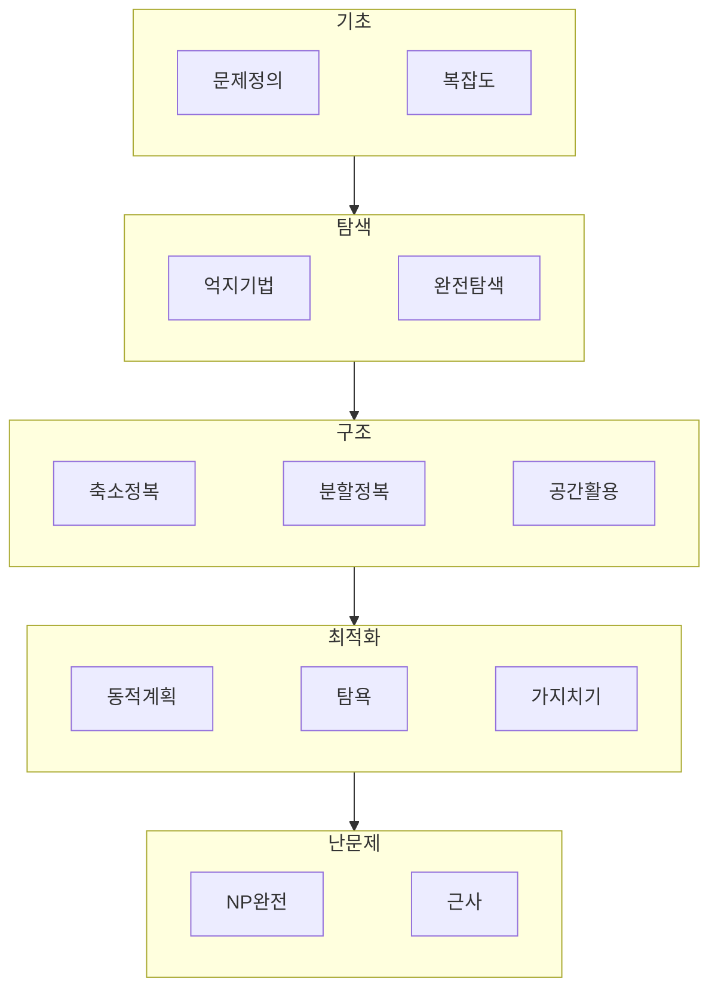
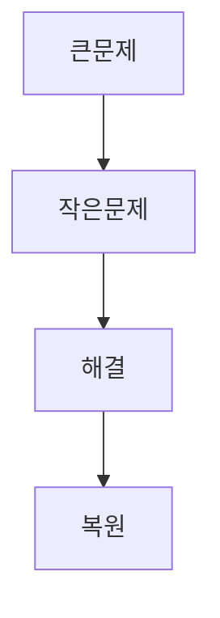
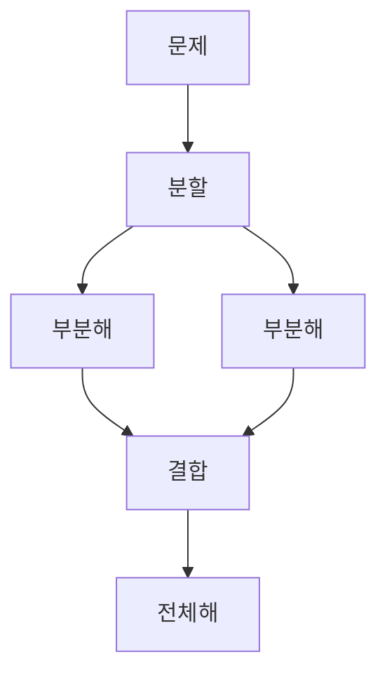
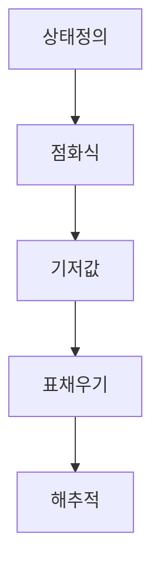
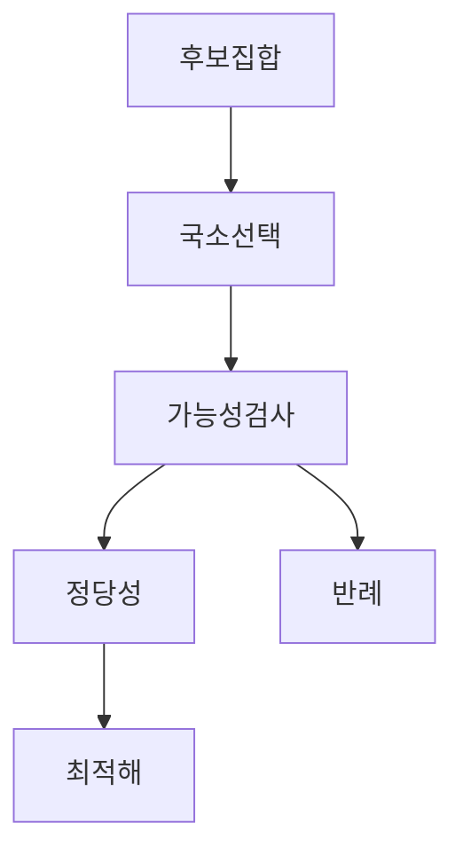
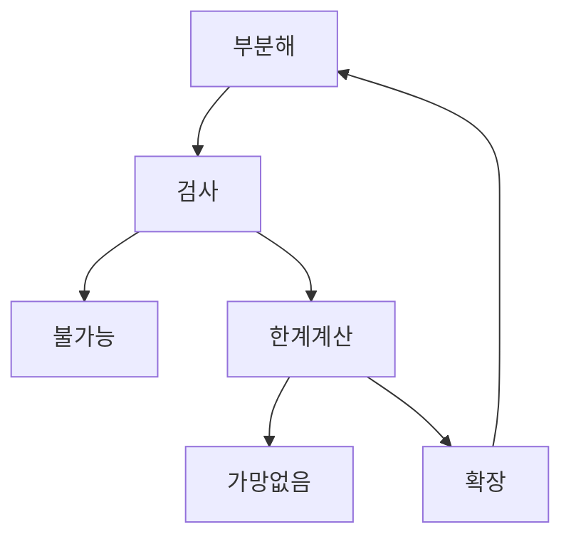
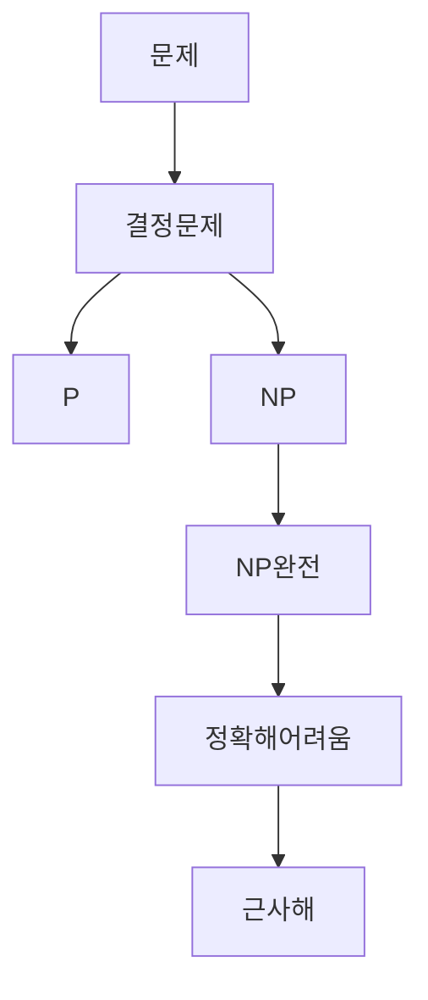
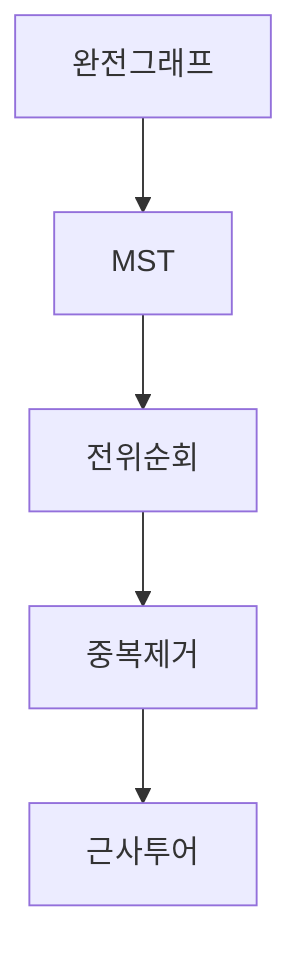

---
aliases:
  - 알고리즘 딥리서치 정리
  - 알고리즘 시각화 정리
course: algorithm
created: '2026-05-26'
date: '2026-05-26'
exam: 기말고사
range: 1장 개요 · 2장 효율성 · 3장 억지/완전탐색 · 4장 축소정복 · 5장 분할정복 · 6장 공간-시간 · 7장 동적계획법 · 8장 탐욕 · 9장 백트래킹/분기한정 · 10장 NP완전/근사
semester: 4-1
source: 'pdf/*.pdf, external algorithm visualization/courseware research'
status: seedling
tags:
  - algorithm
  - cs/algorithms
  - exam-summary
  - visual-summary
  - type/lecture
title: 알고리즘 딥리서치 시각화 정리 OBST 제외
type: lecture
updated: '2026-05-26'
---

up:: [[Algorithms MOC]]

# 알고리즘 딥리서치 시각화 정리 OBST 제외

> [!abstract] 핵심 관점
> 이 문서는 수업 PDF 전체를 확인하되, `Optimal Binary Search Tree / 최적 이진 검색 트리` 블록은 제외하고 정리한다. 기존처럼 장별 암기 노트로만 쓰지 않고, 딥리서치에서 확인한 좋은 알고리즘 정리 방식인 **문제 모델 -> 상태 표현 -> 선택 규칙 -> 정당성 근거 -> 실패 조건 -> 복잡도 -> 시각화 링크** 구조를 따른다. 여기에 시험 대비를 위해 **손풀이 형식 -> 표/트리 작성 루틴 -> 수업 슬라이드 예제 재현 -> 채점 포인트** 레이어를 추가한다.

> [!warning] 제외 범위
> `07-동적계획법-보충-수정판.pdf`의 `Optimal Binary Search Tree` 구간은 제외한다. 텍스트 추출 기준으로 51-63쪽에 해당하는 OBST 정의, 평균 검색시간, OBST DP 구성 예제는 이 문서의 본문 정리에서 제외했다.

---

## 0. 전체 전략 지도

알고리즘 수업의 흐름은 "무작정 해보기"에서 시작해서, 문제 구조를 이용하고, 마지막에는 풀기 어려운 문제를 분류하고 근사하는 방향으로 간다.



### 0-1. 좋은 정리 방식

딥리서치에서 가장 쓸 만한 구조는 알고리즘을 "이름"이 아니라 "증명해야 할 것"으로 묶는 방식이다.

| 알고리즘 계열 | 먼저 물어볼 질문 | 정당성의 핵심 | 실패 조건 |
|---|---|---|---|
| 억지기법 | 전부 보면 답이 있나? | 모든 후보 열거 | 후보 수 폭발 |
| 축소정복 | 더 작은 문제 하나로 줄어드나? | 작은 해에서 큰 해로 복원 | 축소가 답을 보존하지 않음 |
| 분할정복 | 독립 부분 문제로 나뉘나? | 분할 + 결합의 정확성 | 중복 계산, 결합 비용 과다 |
| 공간-시간 | 미리 저장하면 빨라지나? | 전처리 테이블의 의미 | 메모리 과다, 충돌 |
| 동적계획 | 같은 부분 문제가 반복되나? | 최적 부분 구조와 재사용 | 상태 정의 실패 |
| 탐욕 | 지금 최선이 전체 최선인가? | greedy choice property | 반례 존재 |
| 백트래킹 | 후보를 중간에 버릴 수 있나? | 불가능 조건 | 가지치기 약함 |
| 분기한정 | 앞으로 얻을 최대/최소 가능치를 계산할 수 있나? | bound가 안전한 상한/하한 | bound가 느슨함 |
| NP/근사 | 정확해가 현실적인가? | 감소와 근사비율 | P=NP급 난이도 |

### 0-2. 시험 대비 추가 레이어

시험 대비에서는 위 구조를 버리지 않는다. 다만 각 알고리즘 카드를 "이론 설명"에서 끝내지 않고, 실제 답안 작성 단위까지 확장한다.

| 리서치 구조 | 시험 문제풀이로 바꾸면 |
|---|---|
| 문제 모델 | 입력이 배열/그래프/문자열/표/상태공간트리 중 무엇인지 먼저 표시 |
| 상태 표현 | 답안에 그릴 표, 배열 상태, priority queue, 상태공간트리 노드 정의 |
| 선택 규칙 | 매 단계 무엇을 고르고, 고른 이유를 한 줄로 기록 |
| 정당성 근거 | 왜 이 선택/점화식/bound가 안전한지 채점 문장으로 압축 |
| 실패 조건 | 이 알고리즘이 쓰이면 안 되는 반례나 제한 조건 표시 |
| 복잡도 | 기본 연산 기준으로 계산식 또는 점화식까지 남김 |
| 시각화 링크 | 모르는 알고리즘을 직접 조작해 본 뒤 수업 예제로 다시 손풀이 |
| 슬라이드 예제 | 수업자료의 숫자 예제를 그대로 재현해 최종 답보다 풀이 과정을 확인 |

> [!important] 시험용 독해법
> 문제를 받으면 알고리즘 이름보다 먼저 **답안 형식**을 고른다. DP는 표, Greedy는 선택 순서, Backtracking은 상태공간트리, Branch and Bound는 bound 표, NP/Approx는 reduction 방향과 근사비율이 답안의 중심이다.

### 0-3. 확정 구조

이 문서의 구조는 여기서 확정한다. 이후 딥리서치로 추가되는 내용은 장별 순서를 바꾸지 않고, 각 알고리즘을 아래 8칸 카드로 채우는 방식으로 붙인다.

| 카드 슬롯 | 채울 내용 | 시험 산출물 |
|---|---|---|
| 문제 모델 | 입력, 출력, 제약, 최적화/결정 여부 | 문제를 어떤 계열로 분류했는지 |
| 상태 표현 | 배열, 표, 그래프, 트리, priority queue, bound 값 | 손으로 그릴 대상 |
| 선택 규칙 | 다음 원소/간선/정점/상태를 고르는 기준 | 단계별 선택표 |
| 정당성 근거 | 불변식, exchange argument, optimal substructure, bound 안전성 | 한 줄 증명 문장 |
| 실패 조건 | 알고리즘 적용 전제와 반례 | "이 경우에는 안 됨" 표시 |
| 복잡도 | 기본 연산, 점화식, 표 크기, 자료구조 영향 | Big-O와 계산 근거 |
| 시각화 자료 | 직접 조작할 외부 시각화 또는 로컬 SVG | 눈으로 확인할 단계 |
| 슬라이드 예제 | 수업 PDF 숫자 예제와 최종 답 | 시험 전 재현 문제 |

---

## 1. PDF 범위 점검표

| PDF | 핵심 내용 | 이 문서 반영 위치 |
|---|---|---|
| [[pdf/01장.알고리즘개요-파알.pdf]] | 알고리즘 정의, 문제 해결 과정, 자료구조 | [[#2. 알고리즘을 읽는 기본 문법]] |
| [[pdf/02장.알고리즘효율성분석-파알.pdf]] | 입력 크기, 기본 연산, 점근 표기, 반복/순환 분석 | [[#3. 복잡도 분석]] |
| [[pdf/03장-억지기법과완전탐색-파알.pdf]] | 선택 정렬, 순차 탐색, 문자열 매칭, TSP, 0-1 Knapsack, DFS/BFS | [[#4. 전부 보는 알고리즘]] |
| [[pdf/04장-축소정복기법-수정판.pdf]] | 삽입 정렬, 위상 정렬, 이진 탐색, 거듭제곱, Quick Select | [[#5. 문제를 줄이는 알고리즘]] |
| [[pdf/05장-분할정복기법-파알.pdf]] | 마스터 정리, 병합 정렬, 퀵 정렬, 트리, 최근접 쌍, Strassen, Fibonacci | [[#6. 나누고 합치는 알고리즘]] |
| [[pdf/06장-공간으로시간벌기-수정판.pdf]] | 기수 정렬, 카운팅 정렬, Horspool, Boyer-Moore, Hashing | [[#7. 공간으로 시간을 사는 알고리즘]] |
| [[pdf/07장-동적계획법-수정판.pdf]] | Fibonacci, 이항계수, 격자 경로, Coin Change, Knapsack, LCS, Floyd-Warshall, Edit Distance | [[#8. 표로 최적화를 푸는 알고리즘]] |
| [[pdf/07-동적계획법-보충-수정판.pdf]] | Matrix-chain, Floyd, LCS 보충, 최적의 원칙, OBST | [[#8. 표로 최적화를 푸는 알고리즘]] 단, OBST 제외 |
| [[pdf/08장-탐욕적기법-수정판.pdf]] | Coin, Fractional Knapsack, Prim, Kruskal, Dijkstra, Huffman | [[#9. 탐욕 알고리즘]] |
| [[pdf/09장-백트래킹과분기한정-수정판-v2.pdf]] | 순열, 부분집합, 미로, N-Queen, 그래프 색칠, Knapsack BnB, Job Assignment | [[#10. 상태공간트리와 가지치기]] |
| [[pdf/10장-NP완전과근사알고리즘-파알.pdf]] | 결정/최적화, P/NP/NP완전/NP하드, 변환, Bin Packing, Vertex Cover, TSP 근사 | [[#11. 어려운 문제와 근사 알고리즘]] |

---

## 2. 알고리즘을 읽는 기본 문법

알고리즘은 "코드"보다 넓은 개념이다. 같은 문제에도 여러 절차가 있을 수 있고, 좋은 알고리즘은 정확성, 효율성, 일반성을 함께 만족해야 한다.

> [!tip] 알고리즘 분석 6단계
> 1. 문제의 입력과 출력을 정확히 쓴다.
> 2. 입력 크기 $n$이 무엇인지 정한다.
> 3. 기본 연산을 고른다.
> 4. 연산 횟수를 함수로 센다.
> 5. 점근 표기로 단순화한다.
> 6. 어떤 입력에서 실패하거나 느려지는지 찾는다.

### 2-1. 자료구조는 알고리즘의 모양을 바꾼다

| 자료구조 | 수업에서 연결되는 알고리즘 |
|---|---|
| 리스트 | 선택 정렬, 삽입 정렬, 병합 정렬, 퀵 정렬 |
| 스택 | DFS, 백트래킹, 재귀 호출 |
| 큐 | BFS, 상태공간 레벨 탐색 |
| 우선순위 큐 | Prim, Dijkstra, Huffman, Best-First BnB |
| 그래프 | DFS/BFS, Topological Sort, MST, Shortest Path, Vertex Cover, TSP |
| 트리 | 이진트리 순회, 상태공간트리, Huffman Tree |
| 맵/딕셔너리 | 해싱, 빠른 탐색 |

---

## 3. 복잡도 분석

복잡도는 "내 컴퓨터에서 몇 초 걸렸는가"가 아니라, 입력이 커질 때 기본 연산이 얼마나 빠르게 늘어나는가를 보는 언어다.

| 표기 | 의미 | 시험장에서의 해석 |
|---|---|---|
| $O(g(n))$ | 상한 | 최악이어도 이 정도 안에 묶인다 |
| $\Omega(g(n))$ | 하한 | 아무리 좋아도 이 정도는 든다 |
| $\Theta(g(n))$ | 정확한 차수 | 위아래가 같은 등급이다 |

### 3-1. 복잡도 위계

$$
1 < \log \log n < \log n < n < n\log n < n^2 < n^3 < 2^n < n! < n^n
$$

> [!important] 핵심 감각
> 알고리즘 수업에서 "좋은 전략"은 대개 $n!$ 또는 $2^n$ 후보를 $n\log n$, $n^2$, $n^3$ 같은 다항식 시간으로 낮추려는 시도다. 하지만 10장의 NP-완전 문제는 이 전환이 항상 가능하다고 보장되지 않는다.

---

## 4. 전부 보는 알고리즘

### 4-1. 억지기법

억지기법은 문제 정의를 그대로 코드로 옮기는 전략이다. 느릴 수 있지만, 정답 기준선이 되고 반례를 찾기 쉽다.

| 문제 | 직접 전략 | 복잡도 감각 |
|---|---|---|
| 선택 정렬 | 남은 원소 중 최솟값 선택 | $\Theta(n^2)$ |
| 순차 탐색 | 앞에서부터 하나씩 비교 | 최악 $O(n)$ |
| 문자열 매칭 | 패턴을 한 칸씩 밀며 비교 | 최악 $O(nm)$ |
| 최근접 쌍 | 모든 점 쌍 거리 계산 | $O(n^2)$ |
| TSP | 모든 순열 확인 | $O(n!)$ |
| 0-1 Knapsack | 모든 부분집합 확인 | $O(2^n)$ |
| Job Assignment | 모든 배정 순열 확인 | $O(n!)$ |

### 4-2. DFS와 BFS

![[4-1_algorithm__dfs-bfs-graph.svg|700]]

| 구분 | DFS | BFS |
|---|---|---|
| 자료구조 | 스택/재귀 | 큐 |
| 탐색 모양 | 깊게 들어감 | 가까운 레벨부터 |
| 대표 사용 | 백트래킹, 위상 정렬 | 최단 간선 수, 레벨 탐색 |
| 복잡도 | $O(V+E)$ | $O(V+E)$ |

---

## 5. 문제를 줄이는 알고리즘

축소정복은 한 번에 더 작은 문제 하나로 줄인다.



| 축소 유형 | 예시 | 핵심 |
|---|---|---|
| 고정 크기 축소 | 삽입 정렬, 팩토리얼 | $n$에서 $n-1$로 |
| 고정 비율 축소 | 이진 탐색, 빠른 거듭제곱 | $n$에서 $n/2$로 |
| 가변 크기 축소 | 유클리드 알고리즘, Quick Select | 입력에 따라 축소량 변화 |

### 5-1. 대표 알고리즘

| 알고리즘 | 상태 | 선택 규칙 | 복잡도 |
|---|---|---|---|
| 삽입 정렬 | 정렬된 앞부분 | 새 원소 삽입 위치 찾기 | 최악 $O(n^2)$, 거의 정렬 $O(n)$ |
| 위상 정렬 | 진입차수 0 정점 | 선수 조건 없는 정점 제거 | $O(V+E)$ |
| 이진 탐색 | 정렬된 구간 | 중간값과 비교 | $O(\log n)$ |
| 빠른 거듭제곱 | 지수 | 짝수면 제곱, 홀수면 곱 | $O(\log n)$ |
| Quick Select | 피벗 위치 | 필요한 쪽만 재귀 | 평균 $O(n)$, 최악 $O(n^2)$ |

---

## 6. 나누고 합치는 알고리즘

분할정복은 문제를 여러 부분으로 나누고, 각 해를 합쳐서 전체 해를 만든다.



### 6-1. 대표 알고리즘

| 알고리즘 | 분할 | 결합 | 복잡도 |
|---|---|---|---|
| 병합 정렬 | 반으로 나눔 | 정렬된 두 리스트 병합 | $\Theta(n\log n)$ |
| 퀵 정렬 | 피벗보다 작음/큼 | 제자리 분할 | 평균 $\Theta(n\log n)$, 최악 $\Theta(n^2)$ |
| 이진트리 높이 | 왼쪽/오른쪽 서브트리 | 더 큰 높이 + 1 | $O(n)$ |
| 트리 순회 | 왼쪽/루트/오른쪽 | 방문 순서 | $O(n)$ |
| 최근접 쌍 | 좌우 점 집합 | 중앙 띠 검사 | $O(n\log n)$ |
| Strassen | 행렬 블록 | 곱셈 7회 조합 | $O(n^{2.807})$ |

> [!warning] Fibonacci 반례
> 피보나치 수열을 단순 분할정복 재귀로 풀면 같은 부분 문제가 계속 반복된다. 이 문제는 분할정복보다 동적계획법으로 보는 것이 낫다.

---

## 7. 공간으로 시간을 사는 알고리즘

공간-시간 트레이드오프는 메모리를 더 써서 시간을 줄인다.

| 알고리즘 | 추가 공간 | 빨라지는 이유 |
|---|---|---|
| 기수 정렬 | 자리별 버킷 | 비교 대신 자릿수 분류 |
| 카운팅 정렬 | 카운트 배열 | 값 범위가 작으면 직접 세기 |
| Horspool | shift table | 패턴 불일치 시 여러 칸 이동 |
| Boyer-Moore | bad symbol 등 | 뒤에서 비교하고 크게 점프 |
| 해싱 | 해시 테이블 | 키를 주소로 변환 |

### 7-1. Hashing에서 반드시 볼 것

| 항목 | 의미 |
|---|---|
| 해시 함수 | 키를 테이블 위치로 바꾸는 함수 |
| 충돌 | 서로 다른 키가 같은 위치로 가는 상황 |
| 선형 조사 | 다음 칸을 순서대로 검사 |
| 이차 조사 | 제곱 간격으로 검사 |
| 이중 해싱 | 두 번째 해시 함수로 이동폭 결정 |
| 체이닝 | 같은 위치에 리스트로 연결 |
| 적재율 $\alpha$ | $n/m$, 테이블이 얼마나 찼는지 |

---

## 8. 표로 최적화를 푸는 알고리즘

동적계획법은 "한 번 푼 부분 문제를 저장해 다시 쓰는 전략"이다. 핵심은 코드가 아니라 **상태 정의**다.



### 8-1. DP 판별 질문

| 질문 | Yes라면 |
|---|---|
| 부분 문제들이 반복되는가? | memoization 또는 tabulation |
| 부분 문제 최적해로 전체 최적해를 만들 수 있는가? | 최적 부분 구조 |
| 상태 수가 다항식으로 제한되는가? | 실용적인 DP 가능 |
| 결과값만 필요한가, 선택 경로도 필요한가? | 추적 배열 필요 |

### 8-2. 수업 DP 목록

| 문제 | 상태 | 점화식 감각 | 복잡도 |
|---|---|---|---|
| Fibonacci | $F(n)$ | 앞 두 값 합 | $O(n)$ |
| 이항계수 | $C(n,k)$ | 파스칼 삼각형 | $O(nk)$ |
| 격자 경로 | $D[i][j]$ | 위 + 왼쪽 | 격자 크기 |
| Coin Change | $D[v]$ | 마지막 동전 선택 | 금액과 동전 수 |
| 0-1 Knapsack | $K[i][w]$ | 넣기/안넣기 | $O(nW)$ |
| LCS | $L[i][j]$ | 같으면 대각선 +1 | $O(mn)$ |
| Floyd-Warshall | $D^{(k)}[i][j]$ | 정점 $k$ 경유 여부 | $O(n^3)$ |
| Edit Distance | $D[i][j]$ | 삽입/삭제/교체 | $O(mn)$ |
| Matrix-chain | $M[i][j]$ | 분할점 $k$ 선택 | $O(n^3)$ |

> [!danger] OBST 제외
> 보충자료의 OBST도 DP 문제지만, 이 문서에서는 사용자가 지정한 제외 조건에 따라 다루지 않는다.

---

## 9. 탐욕 알고리즘

탐욕 알고리즘은 매 순간 가장 좋아 보이는 선택을 한다. 하지만 "그 순간 좋아 보임"과 "전체 최적"은 다르다. 그래서 탐욕 알고리즘은 반드시 정당성 증명이 필요하다.



### 9-1. 탐욕 알고리즘의 증명 렌즈

| 렌즈 | 질문 |
|---|---|
| Greedy choice property | 지금 선택한 것을 포함하는 최적해가 항상 존재하는가? |
| Optimal substructure | 선택 후 남은 문제도 같은 구조인가? |
| Cut property | 어떤 절단을 가로지르는 최소 간선은 안전한가? |
| Exchange argument | 최적해의 일부를 내 선택으로 바꿔도 손해가 없는가? |
| Counterexample | 이 규칙이 깨지는 작은 입력이 있는가? |

### 9-2. 수업 알고리즘별 핵심

| 알고리즘 | 탐욕 선택 | 필요한 조건 | 복잡도 |
|---|---|---|---|
| 동전 최소화 | 큰 동전부터 사용 | 동전 체계가 canonical이어야 함 | 동전 종류 $m$ 기준 $O(m)$ |
| Fractional Knapsack | 단위 무게당 가치 높은 물건부터 | 물건 분할 가능 | 정렬 때문에 $O(n\log n)$ |
| Prim | 현재 트리에서 나가는 최소 간선 | 연결 무방향 가중 그래프 | 인접행렬 수업 기준 $O(n^2)$ |
| Kruskal | 전체 간선 중 사이클 없는 최소 간선 | Union-Find로 cycle 검사 | 보통 $O(E\log E)$ |
| Dijkstra | 미확정 정점 중 최단거리 추정 최소 | 음수 간선 없음 | 수업 기준 $O(n^2)$, PQ면 $O((V+E)\log V)$ |
| Huffman | 빈도 낮은 두 트리 병합 | prefix code 구성 | PQ면 $O(n\log n)$ |

### 9-3. Greedy가 실패하는 곳

| 문제 | 그럴듯한 탐욕 | 왜 실패하는가 |
|---|---|---|
| 0-1 Knapsack | 단위 가치 높은 것부터 | 물건을 쪼갤 수 없어 조합 효과가 생김 |
| 일반 동전 문제 | 큰 동전부터 | 동전 체계가 바뀌면 반례 가능 |
| TSP | 가장 가까운 도시부터 | 초반 선택이 후반 큰 비용을 강제할 수 있음 |
| Vertex Cover | 차수 높은 정점부터 | 지역적으로 좋아 보여도 최적 보장 없음 |

### 9-4. Prim, Kruskal, Dijkstra를 구분하는 법

| 질문 | 답 |
|---|---|
| 모든 정점을 최소 비용으로 연결? | MST -> Prim 또는 Kruskal |
| 시작점에서 각 정점까지 최단거리? | SSSP -> Dijkstra |
| 간선을 골라 연결망을 만드는가? | Prim/Kruskal |
| 거리 배열을 갱신하는가? | Dijkstra |
| 사이클을 피하는가? | MST |
| 음수 간선이 있으면 위험한가? | Dijkstra |

> [!example] 시각화 추천
> - MST 비교: [VisuAlgo MST](https://visualgo.net/en/mst)
> - Dijkstra: [VisuAlgo SSSP](https://visualgo.net/en/sssp)
> - 다양한 그래프 시각화: [USFCA Data Structure Visualizations](https://www.cs.usfca.edu/~galles/visualization/Algorithms)

---

## 10. 상태공간트리와 가지치기

백트래킹과 분기한정은 모두 상태공간트리를 전부 만들지 않으려는 전략이다. 차이는 "무엇을 근거로 버리는가"다.



### 10-1. 백트래킹

백트래킹은 DFS를 기본 골격으로 하되, 현재 부분해가 조건을 만족할 수 없으면 그 아래를 탐색하지 않는다.

| 문제 | 상태 | 가지치기 조건 |
|---|---|---|
| 순열 생성 | 현재까지 고른 순서 | 이미 사용한 원소 제외 |
| 합이 M인 부분집합 | 현재 합과 남은 원소 | 합 초과 또는 남은 합으로도 부족 |
| 미로 탐색 | 현재 위치와 방문 상태 | 벽, 범위 밖, 방문 위치 |
| N-Queen | 행별 queen 위치 | 같은 열, 대각선 충돌 |
| 그래프 색칠 | 정점별 색 | 인접 정점과 같은 색 금지 |

![[4-1_algorithm__backtracking-dfs.svg|700]]

### 10-2. Branch and Bound

분기한정은 "지금 이 부분해에서 앞으로 최대로 좋아져도 현재 최고해를 못 넘는다"는 식의 한계를 계산해 버린다.

| 구성요소 | 의미 |
|---|---|
| branch | 부분해에서 다음 선택지를 만든다 |
| bound | 그 선택지가 앞으로 얻을 수 있는 최고/최저 가능치를 계산한다 |
| incumbent | 현재까지 찾은 최고해 또는 최저해 |
| prune | bound가 incumbent보다 나쁘면 버린다 |
| DFS policy | 스택처럼 깊게 들어가며 빠르게 완성해를 얻는다 |
| Best-First policy | 우선순위 큐로 가장 promising한 노드부터 본다 |

### 10-3. 0-1 Knapsack에서의 차이

| 접근 | 보는 것 | 장점 | 한계 |
|---|---|---|---|
| 완전탐색 | 모든 부분집합 | 단순하고 정확 | $2^n$ |
| 백트래킹 | 용량 초과 가지 제거 | 불가능 후보 제거 | 가능하지만 나쁜 후보는 남음 |
| 분기한정 | fractional bound로 가능 최대 가치 계산 | 가망 없는 후보 제거 | bound 계산 품질에 의존 |
| DP | $K[i][w]$ 표 | pseudo-polynomial | $W$가 크면 부담 |

### 10-4. Job Assignment

일 배정 문제는 각 사람이 정확히 하나의 일을 맡는 순열 문제다. 완전탐색은 $n!$이지만, 분기한정은 부분 배정 상태에서 남은 각 행/열의 최소 비용을 이용해 하한을 계산하고, 현재 최고 비용보다 나쁜 노드를 버린다.

> [!tip] 상태공간 문제를 푸는 순서
> 1. 상태를 무엇으로 둘지 정한다.
> 2. 다음 후보를 어떻게 생성할지 정한다.
> 3. 불가능 조건을 먼저 쓴다.
> 4. 가능하지만 가망 없는 조건을 bound로 쓴다.
> 5. DFS로 빨리 incumbent를 만들지, Best-First로 유망 노드부터 볼지 선택한다.

---

## 11. 어려운 문제와 근사 알고리즘

10장은 "더 좋은 알고리즘을 찾는 장"이라기보다, 어떤 문제는 정확해를 빠르게 구하기 어렵다는 사실을 분류하고, 대신 근사해를 보장하는 방법을 배우는 장이다.



### 11-1. 결정 문제와 최적화 문제

| 구분 | 질문 형태 | 예시 |
|---|---|---|
| 결정 문제 | Yes/No | 길이 $B$ 이하의 TSP tour가 있는가? |
| 최적화 문제 | 최적값 요구 | 가장 짧은 TSP tour는 무엇인가? |

최적화 문제를 결정 문제로 바꾸면 난이도 비교가 쉬워진다. 결정 TSP가 어렵다면 최적화 TSP도 어렵다.

### 11-2. P, NP, NP-완전, NP-하드

| 분류 | 의미 |
|---|---|
| P | 다항식 시간에 풀 수 있는 결정 문제 |
| NP | 주어진 답이 맞는지 다항식 시간에 검증 가능한 결정 문제 |
| NP-hard | 모든 NP 문제가 다항식 시간에 이 문제로 변환 가능 |
| NP-complete | NP에 속하면서 NP-hard |

> [!important] 감소 reduction의 의미
> 문제 A를 문제 B로 다항식 시간에 바꿀 수 있다면, B를 빨리 푸는 알고리즘으로 A도 빨리 풀 수 있다. 그래서 이미 어려운 문제를 새 문제로 변환해 새 문제도 어렵다는 것을 보인다.

### 11-3. 수업의 대표 NP-완전 문제

| 문제 | 수업 연결 |
|---|---|
| Hamiltonian Cycle | TSP와 연결 |
| TSP | 완전탐색, DP, 근사 |
| 0-1 Knapsack | 완전탐색, DP, 분기한정 |
| Graph Coloring | 백트래킹 |
| Bin Packing | 근사 알고리즘 |
| Vertex Cover | 근사 알고리즘 |

### 11-4. 근사 알고리즘

근사 알고리즘은 빠르게 "좋은 해"를 주되, 최적해와 얼마나 차이나는지를 수학적으로 보장해야 한다.

| 문제 | 수업 전략 | 보장 감각 |
|---|---|---|
| Bin Packing | Next Fit, First Fit, Best Fit, Worst Fit | 하한값 대비 근사비율 분석 |
| Vertex Cover | 간선을 고르고 양끝점을 추가 | 2-approximation |
| Metric TSP | MST -> 전위순회 -> 중복 제거 | 2-approximation |

### 11-5. Metric TSP 근사 흐름



이 구조가 성립하려면 삼각부등식이 필요하다. 중복 정점을 shortcut으로 건너뛰어도 거리가 늘지 않는다는 근거가 필요하기 때문이다.

### 11-6. Exact, Heuristic, Approximation 구분

| 접근 | 정답 보장 | 시간 보장 | 품질 보장 |
|---|---|---|---|
| Exact | 최적해 보장 | 보통 비쌀 수 있음 | 100% |
| Heuristic | 보장 없음 | 빠른 경우 많음 | 경험적 |
| Approximation | 최적은 아닐 수 있음 | 다항식 시간 | 근사비율 보장 |

---

## 12. 시각화 리소스 지도

이 섹션은 "좋은 링크 모음"이 아니라, 위에서 확정한 8칸 카드의 살을 채우기 위한 자료 배치도다. 한 알고리즘을 공부할 때는 `수업 PDF -> 시각화 -> 구현/증명 자료 -> 다시 손풀이` 순서로 왕복한다.

### 12-1. 자료 선별 기준

| 기준 | 채택 이유 |
|---|---|
| 수업 PDF와 같은 문제 유형인가 | 시험은 수업자료의 문제를 직접 푸는 방식이므로 범위 일치가 최우선 |
| 단계별 상태가 보이는가 | 배열, 표, 그래프, 트리, bound가 눈에 보여야 손풀이로 옮길 수 있음 |
| 직접 입력을 넣을 수 있는가 | 슬라이드 예제 숫자를 넣어 같은 결과를 재현할 수 있음 |
| 증명/복잡도 근거가 있는가 | 최종 답뿐 아니라 정당성 문장을 만들 수 있음 |
| 구현이 공개되어 있는가 | 의사코드와 실제 자료구조 차이를 확인할 수 있음 |

### 12-2. 리소스별 역할

| 리소스 | 확인한 강점 | 이 문서에서의 역할 |
|---|---|---|
| [VisuAlgo](https://visualgo.net/en) | 24개 시각화 모듈, e-Lecture, training, 그래프 직접 입력 지원 | MST, SSSP, DFS/BFS, TSP, MVC를 수업 예제 그래프로 재현 |
| [USFCA Data Structure Visualizations](https://www.cs.usfca.edu/~galles/visualization/Algorithms) | 화면이 단순하고 단계가 명확함 | 정렬, 탐색, DP, N-Queen, 그래프 알고리즘을 손풀이 표로 옮기는 중간 다리 |
| [OpenDSA](https://opendsa-server.cs.vt.edu/OpenDSA/Books/Everything/html/index.html) | 교재형 설명과 상호작용 연습, DSA/NP 자료 | DP와 NP/Reduction 개념을 시험 문장으로 정리 |
| [MIT 6.046J Design and Analysis of Algorithms](https://ocw.mit.edu/courses/6-046j-design-and-analysis-of-algorithms-spring-2015/) | 강의노트, 문제풀이 영상, 시험/해설 자료 제공 | 증명형 문장과 알고리즘 설계 기법 보강 |
| [MIT 6.854J Approximation Algorithms](https://ocw.mit.edu/courses/6-854j-advanced-algorithms-fall-2008/resources/lec16/) | Metric TSP, Vertex Cover relaxation 등 근사 분석 | 10장 근사 알고리즘의 비율 증명 보강 |
| [MIT 6.891 Approximation Algorithms](https://courses.csail.mit.edu/6.891-s00/) | Bin Packing, Set Cover, TSP 등 근사 주제별 노트 | 근사 알고리즘 파트를 주제별로 분해 |
| [CP-Algorithms](https://cp-algorithms.com/) | 구현, 불변식, 복잡도, practice problem이 한 페이지에 있음 | Dijkstra, Kruskal, Floyd-Warshall의 정확한 갱신 규칙 확인 |
| [Algorithm Visualizer](https://github.com/algorithm-visualizer/algorithm-visualizer) | 코드에서 시각화 명령을 추출하는 오픈소스 생태계 | 코드 실행 흐름과 시각화가 어떻게 연결되는지 확인 |
| [The Algorithms](https://www.the-algorithms.com/) | 30개 이상 언어, 1000개 이상 알고리즘 구현을 모은 오픈소스 라이브러리 | 손풀이 후 구현 이름과 자료구조를 확인 |
| [GWU Branch and Bound](https://www2.seas.gwu.edu/~ayoussef/cs6212/branchandbound.html) | Job Assignment로 BnB의 live node, predictor, cost function 설명 | 9장 분기한정의 bound 개념 보강 |
| [Graph Coloring Solver](https://web-apps.thecoatlessprofessor.com/graph-algorithms/graph-coloring.html) | greedy와 backtracking coloring을 비교 시각화 | Graph Coloring의 backtracking/prune 감각 보강 |

### 12-3. 주제별 바로가기

| 공부할 내용 | 추천 링크 |
|---|---|
| 정렬 추적 | [USFCA Comparison Sort](https://www.cs.usfca.edu/~galles/visualization/ComparisonSort.html), [VisuAlgo Sorting](https://visualgo.net/en/sorting) |
| 이진 탐색 | [USFCA Binary and Linear Search](https://www.cs.usfca.edu/~galles/visualization/Search.html), [algoviz Binary Search](https://www.algoviz.xyz/) |
| Hashing | [USFCA Closed Hashing](https://www.cs.usfca.edu/~galles/visualization/ClosedHash.html), [VisuAlgo Hash Table](https://visualgo.net/en/hashtable) |
| Coin Change와 LCS | [USFCA Making Change](https://www.cs.usfca.edu/~galles/visualization/DPChange.html), [USFCA LCS](https://www.cs.usfca.edu/~galles/visualization/DPLCS.html), [OpenDSA Dynamic Programming](https://opendsa.cs.vt.edu/OpenDSA/Books/Everything/html/DynamicProgramming.html) |
| Floyd-Warshall | [USFCA Floyd-Warshall](https://www.cs.usfca.edu/~galles/visualization/Floyd.html), [CP-Algorithms Floyd-Warshall](https://cp-algorithms.com/graph/all-pair-shortest-path-floyd-warshall.html) |
| Prim vs Kruskal | [VisuAlgo MST](https://visualgo.net/en/mst), [USFCA Prim](https://www.cs.usfca.edu/~galles/visualization/Prim.html), [USFCA Kruskal](https://www.cs.usfca.edu/~galles/visualization/Kruskal.html), [CP-Algorithms Kruskal](https://cp-algorithms.com/graph/mst_kruskal.html) |
| Dijkstra | [VisuAlgo SSSP](https://visualgo.net/en/sssp), [USFCA Dijkstra](https://www.cs.usfca.edu/~galles/visualization/Dijkstra.html), [CP-Algorithms Dijkstra](https://cp-algorithms.com/graph/dijkstra.html) |
| DFS/BFS와 백트래킹 감각 | [VisuAlgo DFS/BFS](https://visualgo.net/en/dfsbfs), [USFCA N-Queens](https://www.cs.usfca.edu/~galles/visualization/RecQueens.html), [algoviz N-Queens](https://www.algoviz.xyz/) |
| Graph Coloring | [Graph Coloring Solver](https://web-apps.thecoatlessprofessor.com/graph-algorithms/graph-coloring.html) |
| Job Assignment BnB | [GWU Branch and Bound](https://www2.seas.gwu.edu/~ayoussef/cs6212/branchandbound.html), [GFG Job Assignment BnB](https://www.geeksforgeeks.org/dsa/job-assignment-problem-using-branch-and-bound/) |
| Vertex Cover 근사 | [VisuAlgo MVC](https://visualgo.net/en/mvc), [OpenDSA Vertex Cover reduction](https://opendsa-server.cs.vt.edu/OpenDSA/Books/Everything/html/independentSet_to_vertexCover.html) |
| TSP 근사 | [VisuAlgo TSP](https://visualgo.net/en/tsp), [MIT 6.046J Metric TSP recitation](https://ocw.mit.edu/courses/6-046j-design-and-analysis-of-algorithms-spring-2015/c42c33c495bf76b56e4056991bf2908c_zM5MW5NKZJg.pdf), [MIT 6.854J approximation lecture](https://ocw.mit.edu/courses/6-854j-advanced-algorithms-fall-2008/resources/lec16/) |
| 구현 확인 | [CP-Algorithms](https://cp-algorithms.com/), [The Algorithms](https://www.the-algorithms.com/) |

### 12-4. 스켈레톤 살붙이기 맵

| 문서 섹션 | 채울 내용 | 시각화 자료 | 구현/증명 자료 | 시험 산출물 |
|---|---|---|---|---|
| [[#3. 복잡도 분석]] | 반복문 합, 점화식, 성장률 비교 | 로컬 SVG `complexity-hierarchy` 계열 | MIT 6.046J 강의/시험 자료 | 기본 연산과 합 계산 |
| [[#4. 전부 보는 알고리즘]] | 선택 정렬, 순차 탐색, 문자열 매칭, TSP/Knapsack 후보 수 | USFCA Comparison Sort, VisuAlgo DFS/BFS | The Algorithms sorting/searching 구현 | pass 표, 후보 표 |
| [[#5. 문제를 줄이는 알고리즘]] | 삽입 정렬, 위상정렬, 이진 탐색, Quick Select | USFCA Search, VisuAlgo Graph Traversal | CP-Algorithms Binary Search/Topological Sorting | `low/high/mid`, 진입차수 표 |
| [[#6. 나누고 합치는 알고리즘]] | merge/partition, 재귀 트리, 최근접 쌍 | VisuAlgo Sorting, USFCA Comparison Sort | MIT 6.046J Divide and Conquer | 분할 트리와 병합/partition 표 |
| [[#7. 공간으로 시간을 사는 알고리즘]] | Counting/Radix, Hashing, Horspool/Boyer-Moore | USFCA Closed Hashing, VisuAlgo Hash Table | The Algorithms hash/string 구현 | count 배열, probe 순서, shift table |
| [[#8. 표로 최적화를 푸는 알고리즘]] | DP 상태 정의, 초기값, 점화식, 복원 | USFCA Change/LCS, OpenDSA DP | CP-Algorithms DP intro/Floyd | DP 표와 역추적 |
| [[#9. 탐욕 알고리즘]] | greedy choice, exchange, MST, Dijkstra, Huffman | VisuAlgo MST/SSSP, USFCA Prim/Kruskal/Dijkstra | CP-Algorithms Dijkstra/Kruskal | 선택 순서와 갱신표 |
| [[#10. 상태공간트리와 가지치기]] | promising, live/dead node, bound, incumbent | USFCA N-Queens, Graph Coloring Solver | GWU BnB, GFG Job Assignment BnB | 상태공간트리와 prune/bound 사유 |
| [[#11. 어려운 문제와 근사 알고리즘]] | decision 변환, NP membership, reduction, approximation ratio | VisuAlgo MVC/TSP | OpenDSA NP, MIT 6.854J/6.891 | reduction 방향과 비율 부등식 |

### 12-5. 자료를 공부로 바꾸는 방법

| 단계 | 할 일 | 결과물 |
|---:|---|---|
| 1 | 수업 PDF 예제의 입력 숫자를 옮겨 적는다 | 입력 표 |
| 2 | 시각화 자료에 같은 입력을 넣거나 가장 가까운 예제를 고른다 | 단계 흐름 |
| 3 | 각 단계에서 변한 칸/간선/노드만 따로 기록한다 | 손풀이 표 |
| 4 | CP-Algorithms, MIT, OpenDSA에서 정당성 문장을 확인한다 | 한 줄 증명 |
| 5 | The Algorithms 또는 Algorithm Visualizer에서 구현 자료구조를 확인한다 | 코드 연결 |
| 6 | PDF 예제를 보지 않고 처음부터 다시 푼다 | 시험형 재현 답안 |

---

## 13. 시험형 손풀이 루틴과 슬라이드 예제

이 섹션은 앞의 리서치 구조를 시험 문제풀이로 확장한 것이다. 목표는 "개념을 안다"가 아니라, 수업자료에 나온 숫자 예제를 다시 받았을 때 손으로 같은 표와 트리를 만들 수 있게 하는 것이다.

### 13-1. 공통 답안 템플릿

| 문제 유형 | 먼저 쓰는 것 | 중간 과정 | 마지막 답 |
|---|---|---|---|
| 복잡도 분석 | 입력 크기와 기본 연산 | 합, 반복 횟수, 점화식 | $O,\Omega,\Theta$ |
| 정렬 추적 | 초기 배열과 기준 원소 | pass별 배열 상태 | 정렬 결과와 비교 횟수 |
| 그래프 탐색 | 시작 정점과 인접 순서 | stack/queue 변화 | 방문 순서 |
| DP | 상태 정의와 초기값 | 점화식 적용 표 | 최적값과 선택 복원 |
| Greedy | 선택 기준 | 단계별 선택 목록 | 누적 비용/가치 |
| Backtracking | 상태공간트리 노드 의미 | promising/prune 표시 | 가능한 해 |
| Branch and Bound | bound 정의 | live node, bound, prune 사유 | 최적해와 비용 |
| NP/Approx | 결정문제 형태 | reduction 방향 또는 비율 부등식 | 분류 또는 근사비율 |

### 13-2. DP 문제는 표의 의미부터 쓴다

동적계획법은 표를 채우는 계산보다 **표의 각 칸이 무엇을 의미하는지**가 먼저다.

| 알고리즘 | 상태 정의 | 점화식의 핵심 | 답안에서 보여줄 것 |
|---|---|---|---|
| Coin Change | $D[i]$: 금액 $i$의 최소 동전 수 | 가능한 동전 $c$에 대해 $D[i-c]+1$ | 금액별 최소값 표 |
| 0-1 Knapsack | $K[i][w]$: 앞 $i$개, 용량 $w$ | 넣지 않음 vs 넣음 | 표와 선택 물건 역추적 |
| LCS | $L[i][j]$: 두 prefix의 LCS 길이 | 같으면 대각선+1, 다르면 위/왼쪽 max | 길이 표와 문자열 복원 |
| Floyd-Warshall | $D[i][j]$: 현재 허용된 중간 정점으로 최단거리 | $D[i][j] = \min(D[i][j], D[i][k]+D[k][j])$ | $k$ 단계별 행렬 변화 |
| Edit Distance | $E[i][j]$: prefix 변환 최소 비용 | 삽입/삭제/교체 minimum | 비용표와 선택 연산 |

> [!tip] DP 채점 문장
> "작은 상태의 해를 이미 알고 있다고 두고, 그 값을 이용해 큰 상태의 해를 계산한다. 따라서 계산 순서는 의존하는 칸이 먼저 채워지는 방향이어야 한다."

### 13-3. 탐욕 문제는 선택 순서가 답이다

탐욕 알고리즘은 최종값만 맞아도 과정 점수를 잃기 쉽다. 매 단계의 후보와 선택 이유를 표로 남긴다.

| 알고리즘 | 답안 형식 | 반드시 확인할 조건 |
|---|---|---|
| Coin Change | 큰 동전부터 선택한 목록 | 동전 체계가 greedy에 안전한지 |
| Fractional Knapsack | $value/weight$ 정렬표와 넣은 비율 | 물건을 쪼갤 수 있는지 |
| Prim | 현재 tree 밖으로 나가는 최소 간선 | tree 내부 간선 제외 |
| Kruskal | 비용순 간선 목록과 cycle 검사 | $n-1$개 간선 선택 |
| Dijkstra | 확정 정점 순서와 거리 갱신표 | 음수 간선 없음 |
| Huffman | 작은 빈도 두 개씩 merge한 트리 | prefix-free 코드 |

**Coin Change 슬라이드 예제 재현**

| 금액 | Greedy 풀이 | 동전 수 |
|---:|---|---:|
| 620 | 500 + 100 + 10 + 10 | 4 |
| 345 | 100 + 100 + 100 + 10 + 10 + 10 + 10 + 5 | 8 |
| 572 | 500 + 50 + 10 + 10 + 1 + 1 | 6 |
| 580 | 500 + 50 + 10 + 10 + 10 | 5 |

60원 동전이 추가된 체계에서는 120원을 `60 + 60`으로 만들 수 있으므로, `100 + 10 + 10`을 고르는 greedy가 실패한다. 시험에서는 이 반례가 "탐욕은 정당성 증명이 필요하다"는 근거다.

**Dijkstra 슬라이드 예제 재현**

시작 정점이 `A`인 예시의 최종 거리 행은 다음과 같다.

| 정점 | A | B | C | D | E | F | G |
|---|---:|---:|---:|---:|---:|---:|---:|
| 최단거리 | 0 | 5 | 9 | 11 | 3 | 10 | 8 |

답안 표는 다음 형식으로 쓴다.

| Step | 확정 정점 | 새로 갱신한 거리 | 거리 행 |
|---:|---|---|---|
| 0 | A | 초기화 | A=0, 나머지=∞ |
| 1 | E | E의 인접 정점 갱신 | |
| 2 | B | B의 인접 정점 갱신 | |
| 3 | G | G의 인접 정점 갱신 | |
| 4 | C | C의 인접 정점 갱신 | |
| 5 | F | F의 인접 정점 갱신 | |
| 6 | D | 종료 | A=0, B=5, C=9, D=11, E=3, F=10, G=8 |

**Huffman 슬라이드 예제 재현**

| 문자 | A | B | C | D | E | F | G | H |
|---|---:|---:|---:|---:|---:|---:|---:|---:|
| 빈도 | 24 | 3 | 8 | 10 | 33 | 6 | 4 | 12 |

| Step | 합친 노드 | 새 빈도 |
|---:|---|---:|
| 1 | B(3) + G(4) | 7 |
| 2 | F(6) + 7 | 13 |
| 3 | C(8) + D(10) | 18 |
| 4 | H(12) + 13 | 25 |
| 5 | A(24) + 18 | 42 |
| 6 | 25 + E(33) | 58 |
| 7 | 42 + 58 | 100 |

| 문자 | 코드 |
|---|---|
| A | 00 |
| B | 11110 |
| C | 011 |
| D | 010 |
| E | 10 |
| F | 1110 |
| G | 11111 |
| H | 110 |

코드는 좌우 0/1 배치에 따라 달라질 수 있다. 수업자료의 예제 재현이 목적이면 위 코드를 기준으로 기억하되, 시험장에서 새 트리가 주어지면 merge tree와 prefix-free 성질을 함께 보여준다.

### 13-4. Backtracking은 prune 사유가 답이다

| 문제 | 노드 의미 | promising 조건 | 답안 포인트 |
|---|---|---|---|
| Subset Sum | 원소 포함/미포함 결정 | 현재 합과 남은 합으로 목표 가능 | 해와 prune 사유 |
| N-Queen | 각 row의 column 선택 | 같은 열/대각선 충돌 없음 | row별 배치표 |
| Graph Coloring | 정점별 색 선택 | 인접 정점과 색이 다름 | 색 선택과 실패 가지 |
| Maze | 현재 위치와 방문 상태 | 벽/방문/범위 위반 없음 | DFS 경로와 backtrack |

N-Queen 답안에서는 다음 두 조건만 빠뜨리지 않으면 된다.

```text
같은 column이면 불가능
abs(row_i - row_j) == abs(col_i - col_j)이면 대각선 충돌
```

### 13-5. Branch and Bound는 bound 계산을 보여준다

**0-1 Knapsack 슬라이드 예제**

용량 $W=16$.

| item | profit | weight | profit/weight |
|---:|---:|---:|---:|
| 1 | 40 | 2 | 20 |
| 2 | 30 | 5 | 6 |
| 3 | 50 | 10 | 5 |
| 4 | 10 | 5 | 2 |

root bound는 fractional knapsack처럼 남은 용량을 채워 계산한다.

```text
root bound = 40 + 30 + 50 * (9 / 10) = 115
```

| 선택 상태 | profit | weight | bound | 판단 |
|---|---:|---:|---:|---|
| root | 0 | 0 | 115 | 시작 |
| include 1 | 40 | 2 | 115 | 계속 |
| include 1, include 2 | 70 | 7 | 115 | 계속 |
| include 1, include 2, include 3 | 120 | 17 | - | 용량 초과 |
| include 1, exclude 2, include 3 | 90 | 12 | 98 | 현재 최적 후보 |
| include 1, exclude 2, include 3, include 4 | 100 | 17 | - | 용량 초과 |

이 입력의 최적 feasible 해는 `item 1 + item 3`, profit `90`, weight `12`다.

**Job Assignment 슬라이드 예제**

| Worker \ Job | 1 | 2 | 3 | 4 |
|---|---:|---:|---:|---:|
| A | 9 | 2 | 6 | 8 |
| B | 6 | 4 | 3 | 7 |
| C | 5 | 7 | 1 | 9 |
| D | 7 | 6 | 8 | 4 |

root lower bound는 각 row의 최솟값을 더해 계산한다.

```text
A의 최소 2 + B의 최소 3 + C의 최소 1 + D의 최소 4 = 10
```

| Worker | Job | Cost |
|---|---:|---:|
| A | 2 | 2 |
| B | 1 | 6 |
| C | 3 | 1 |
| D | 4 | 4 |
| 합계 | | 13 |

최소화 문제에서는 lower bound가 현재 best cost 이상이면 그 노드는 확장해도 더 좋은 답을 만들 수 없다.

### 13-6. NP/Approx는 방향과 비율을 쓴다

| 주제 | 답안에서 먼저 쓸 것 | 채점 포인트 |
|---|---|---|
| Optimization -> Decision | 임계값 $K$ 또는 $P$를 둔 yes/no 문제 | 결정문제 형태가 명확한가 |
| NP membership | certificate와 검증 시간 | 다항시간 검증 가능성 |
| NP-complete proof | 알려진 NP-complete 문제에서의 reduction | reduction 방향 |
| Bin Packing | 알고리즘별 bin 상태 변화 | 사용 bin 수와 optimal 대비 |
| Vertex Cover 2-approx | 선택한 edge의 양 끝 정점 추가 | 해 크기 $\le 2OPT$ |
| Metric TSP 2-approx | MST, Euler tour, shortcut | triangle inequality 사용 |

**Bin Packing 슬라이드 예제**

```text
Bin capacity C = 10
Items = 5, 7, 4, 2, 5, 1, 6, 2, 5
```

| 방법 | 사용 bin 수 |
|---|---:|
| Optimal | 4 |
| Next Fit | 6 |
| First Fit | 5 |
| Best Fit | 4 |
| Worst Fit | 5 |

**reduction 방향 문장**

```text
A <=p B는 A의 입력을 다항시간에 B의 입력으로 바꾸어,
B를 푸는 알고리즘으로 A를 풀 수 있다는 뜻이다.
따라서 B가 어렵다는 것을 보이려면 이미 어려운 A를 B로 감소시킨다.
```

### 13-7. 시험 전 2시간 압축 루틴

| 시간 | 직접 풀 것 | 확인할 산출물 |
|---:|---|---|
| 0-30분 | Knapsack, LCS, Floyd-Warshall | DP 표와 역추적 |
| 30-60분 | Prim, Kruskal, Dijkstra, Huffman | 선택 순서와 최종 비용/코드 |
| 60-90분 | N-Queen, Knapsack BnB, Job Assignment | 상태공간트리와 prune/bound |
| 90-120분 | Bin Packing, Vertex Cover, TSP Approx | 배치표, reduction 방향, 근사비율 |

---

## 14. 시험장에서 쓰는 선택표

| 문제 단서 | 먼저 떠올릴 전략 |
|---|---|
| 모든 후보 수가 작다 | 완전탐색 |
| 후보를 만들다가 불가능을 알 수 있다 | 백트래킹 |
| 현재 부분해의 미래 최대/최소 가능치를 계산할 수 있다 | 분기한정 |
| 같은 부분 문제가 반복된다 | 동적계획법 |
| 지금 선택이 안전하다는 성질이 있다 | 탐욕 |
| 정렬된 배열에서 찾는다 | 이진 탐색 |
| 그래프 모든 정점 연결 최소 비용 | MST |
| 시작점에서 모든 정점까지 최단거리, 음수 없음 | Dijkstra |
| 모든 쌍 최단거리 | Floyd-Warshall |
| 문자열 패턴 검색에서 전처리 가능 | Horspool/Boyer-Moore |
| 해가 너무 어려워 정확해가 비현실적 | 근사 알고리즘 |

---

## 15. 혼동 방지 메모

> [!danger] MST와 shortest path는 다르다
> MST는 모든 정점을 연결하는 총 비용을 줄인다. Dijkstra는 한 시작점에서 각 정점까지의 거리만 줄인다. MST 경로가 각 정점까지의 최단경로라는 보장은 없다.

> [!danger] Greedy와 DP는 모두 최적 부분 구조를 말하지만 다르다
> DP는 여러 선택을 표에 남겨 비교한다. Greedy는 한 선택을 확정하고 돌아오지 않는다. 그래서 Greedy는 선택이 안전하다는 별도 증명이 필요하다.

> [!danger] Backtracking과 Branch and Bound는 가지치기 근거가 다르다
> Backtracking은 "조건 위반"을 버린다. Branch and Bound는 "아직 조건을 위반하지 않았지만 최적 가능성이 없음"을 버린다.

> [!danger] NP는 "못 푼다"가 아니다
> NP는 주어진 답을 빠르게 검증할 수 있는 결정 문제의 집합이다. NP-완전은 그중에서도 모든 NP 문제가 이 문제로 변환될 만큼 대표적으로 어려운 문제다.

---

## 16. 1페이지 압축

| 계열 | 핵심 문장 | 대표 |
|---|---|---|
| 복잡도 | 입력이 커질 때의 성장률 | $O,\Omega,\Theta$ |
| 억지 | 전부 본다 | 선택정렬, TSP 완전탐색 |
| 축소 | 하나 작은 문제로 줄인다 | 이진탐색, Quick Select |
| 분할 | 나눠 풀고 합친다 | 병합정렬, 퀵정렬 |
| 공간-시간 | 저장해서 빨라진다 | Hashing, Counting Sort |
| DP | 반복되는 부분문제를 표로 푼다 | Knapsack, LCS, Floyd |
| Greedy | 지금 선택을 확정한다 | Prim, Kruskal, Dijkstra, Huffman |
| Backtracking | 불가능한 후보를 버린다 | N-Queen, Graph Coloring |
| Branch and Bound | 가망 없는 후보를 버린다 | Knapsack, Job Assignment |
| NP/Approx | 어려운 문제를 분류하고 근사한다 | Vertex Cover, Bin Packing, TSP |
