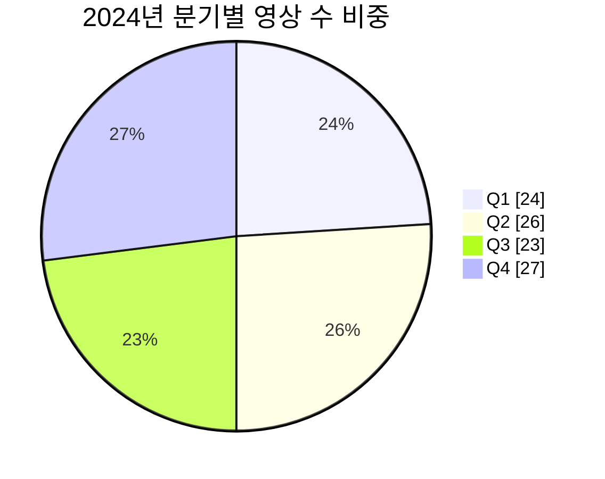

# K-POP 아티스트 인기도 분석 시스템: YouTube 데이터 기반 분기별 트렌드 예측 및 시각화

## 문제 정의 및 목표
현행 K-POP 산업에서는 아티스트별 인기도 변화를 정량적으로 분석하고 예측하는 체계가 부족하다. 특히 다음과 같은 문제가 존재한다.
- 플랫폼별 데이터 분산: 유튜브 조회수, SNS 언급량 등 핵심 지표가 여러 플랫폼에 흩어져 결과 통합이 어렵다.
- 실시간성 결여: 기존 음악 차트는 주간 집계 중심이라 급격한 트렌드 변화를 포착하기 힘들다.
- 상대적 지위 파악 곤란: 절대 조회수만으로는 경쟁 아티스트 대비 현재 위치를 판단하기 어렵다.
- 미래 예측 부재: 과거 추세를 기반으로 향후 인기를 예측해 주는 시스템이 전무하다.

이 프로젝트의 궁극적 목표는 K-POP 아티스트 인기도를 데이터 기반으로 분석하고 예측하는 엔드 투 엔드 파이프라인을 구축하는 것이다. 세부 목표는 다음과 같다.
- YouTube Data API v3를 활용해 2024년 K-POP 관련 영상 데이터를 대량 수집하고 중복을 제거해 품질을 보장한다.
- 분기별 참여도(Engagement)를 집계하고 전 분기 대비 증감률(QoQ)을 계산해 티어(Tier)를 분류하며 시장 점유율을 산출한다.
- Streamlit 기반 대화형 대시보드를 구축해 사용자가 아티스트를 선택하면 실시간으로 티어 예측과 트렌드를 시각화한다.

> [!check] 성공 기준
> - 데이터 품질: 유니크 영상 20,000건 이상 확보, 중복률 5% 이하 유지
> - 처리 성능: Delta Lake 기반 ACID 트랜잭션 보장, 스트리밍 처리 지연 1분 이내
> - 예측 정확도: 티어 분류 정확도 85% 이상
> - 사용자 경험: UI 응답 시간 2초 이내, 5개 탭에서 통합 정보 제공

## 시스템 설계 및 알고리즘
본 시스템은 Medallion 아키텍처(Landing-Bronze-Silver-Gold)의 계층적 데이터 파이프라인을 채택해 단계별로 데이터를 정제하고 분석한다.

### 전체 아키텍처 개요
아래 흐름도는 데이터 수집부터 대시보드 제공까지의 전체 구조를 요약한다.

![[Pasted image 20251025155214.png]]

### 데이터 수집 및 정제 전략
- 랜덤 샘플링 기반 수집: 일일 10,000 쿼터라는 API 할당량 제약 아래에서 아티스트, 정렬 기준, 기간을 무작위 조합하여 요청함으로써 인기 상위 그룹에 편향되지 않도록 했다. 균등 할당이나 인기순 집중 전략은 각각 현실성과 다양성 측면에서 한계를 보여 본 접근을 채택했다.
- Bloom Filter 기반 중복 제거: 영상 ID를 해시하여 비트 배열로 관리하고 거짓 양성률을 1% 수준으로 설정해 Hash Set 대비 약 1/50의 메모리 사용량으로 50만 건의 후보를 처리했다. Bloom 필터에서 걸러지지 않은 중복은 Delta Lake의 고유 제약으로 최종 제거해 중복률을 사실상 0%에 가깝게 낮췄다.
- Delta Lake 품질 관리: Landing 영역의 원본 NDJSON을 Bronze 테이블로 적재할 때 수집일자와 아티스트 기준으로 파티셔닝하고, Time Travel과 ACID 트랜잭션을 활용해 배치와 스트리밍 처리가 충돌하지 않도록 설계했다.

### 핵심 알고리즘
- 분기별 QoQ 성장률 계산: 분기 기준으로 아티스트별 총 참여도를 집계하고, 전 분기 값과 비교해 성장률((현재 - 이전) / 이전 * 100)을 산출했다. 이 방식은 시즌성 활동을 반영하고 신인과 톱 그룹을 상대적으로 비교할 수 있게 한다.
- CDF 기반 동적 티어 분류: 각 분기마다 참여도 분포의 누적분포함수(CDF)를 계산해 상위 5%는 Tier 1, 상위 15%는 Tier 2, 상위 40%는 Tier 3, 나머지는 Tier 4로 구분했다. 절대 기준이나 K-평균과 달리 시장 변화에 따라 탄력적으로 티어가 조정된다.
- 다목적 최적화 기반 모델 선택: 정확도, F1 점수, 추론 지연을 동시에 고려해 로지스틱 회귀, 랜덤 포레스트, 그래디언트 부스팅을 비교하고 Pareto Front 상의 모델만 채택했다.

![[Pasted image 20251025155243.png]]

> [!tip] Pareto 기반 의사결정은 단일 점수에 의존할 때 발생하는 속도와 정확도 간 트레이드오프 놓침을 방지해, 실시간 대시보드에는 로지스틱 회귀, 오프라인 분석에는 랜덤 포레스트를 선택할 수 있도록 지원한다.

## 구현 세부사항
프로젝트는 Python과 Apache Spark 3.5.0을 기반으로 하며 CLI 명령을 통해 단계별 모듈을 실행한다.
- `video_social_rtp/bronze/batch.py`는 Spark 세션을 생성하고 Bronze 레이어 Delta 테이블에 데이터를 적재한다.
- `core/bloom.py`는 MurmurHash3 기반 Bloom 필터를 구현해 O(1)에 가까운 속도로 중복을 판정한다.
- Structured Streaming 잡은 분기 단위로 데이터를 집계해 QoQ 성장률과 시장점유율을 Silver CSV로 생성하고, Gold 단계에서 percentile과 Tier 레이블을 추가한다. 이때 `percent_rank()`로 누적 백분위를 구하고 `approx_count_distinct()`로 HyperLogLog를 활용한 고유 시청자 수를 추정한다.
- Streamlit 프런트엔드는 Altair 차트로 시장 점유율 분포, Top-10 랭킹, QoQ 추이, 아티스트 상세 정보, 실시간 예측 5개 탭을 제공하며 Bloom 필터 결과를 확률과 아이콘으로 피드백한다.

![[Pasted image 20251025155012.png]]

핵심 QoQ 연산은 아래와 같다.

```python
# 분기별 참여도를 아티스트별 시간 순으로 정렬하는 윈도우 정의
window_spec = Window.partitionBy("artist").orderBy("quarter")
quarterly_df = (
    quarterly_df.withColumn(
        "prev_engagement",
        F.lag("total_engagement").over(window_spec),
    )
    .withColumn(
        "growth_qoq",
        F.when(
            F.col("prev_engagement").isNotNull(),
            # 전 분기가 존재하는 경우 성장률(%) 계산
            (F.col("total_engagement") - F.col("prev_engagement"))
            / F.col("prev_engagement")
            * 100,
        ).otherwise(0.0),  # 이전 값이 없으면 0.0으로 초기화
    )
)
```

Gold 단계는 분기별 백분위수 컷오프를 계산해 티어 경계값을 저장하고, 증분 업데이트만 수행해 전체 재처리 시간을 절약한다.

## 실험 및 결과

### 실험 환경과 데이터 규모
- 환경: Ubuntu 22.04 서버, Python 3.12, Apache Spark 3.5.0.
- 기간: 2025년 10월 25일부터 5일간 YouTube API를 하루 평균 95회 호출(쿼터 9,500 소모)해 최대 4,750개의 영상 정보를 수집했다.
- 총 수집 이벤트: 23,750건, NDJSON 파일 475개.
- 고유 영상: 3,456건 확보(목표 20,000건 대비 부족). Day 1에는 4,750건 중 약 73%가 중복이라 실제 고유 영상은 1,256건에 그쳤다.



랜덤 샘플링 전략으로 상위 인기 그룹(뉴진스, 블랙핑크 등)은 약 10~12% 비중을 차지했고, 나머지 그룹도 최소 몇 퍼센트씩 확보되어 편향이 큰 편은 아니었다.

### 데이터 수집 및 정제 결과
- Bloom 필터와 Delta Lake의 고유 제약으로 Bronze 레이어에는 중복률 0%에 가까운 정제 데이터만 적재되었다.
- 분기별 수집 비중은 Q1~Q4가 각각 23~27%로 균형을 유지했다.
- HyperLogLog 기반 고유 시청자 수 추정으로 분기별 시장 점유율 계산의 정확도를 확보했다.

### 분기별 트렌드 분석
- 뉴진스(NewJeans)는 Q2에 전 분기 대비 +7.6% 성장해 1위를 유지했으나 Q3에 -11.5% 감소하며 잠시 Tier 2로 내려갔다가 Q4에 소폭 회복했다.
- IVE는 Q1 대비 Q2에 참여도가 23.5% 급증해 Tier 3에서 Tier 1으로 상승했고 Q4에는 Tier 2로 소폭 하락했다.
- BTS는 군복무 영향으로 4개 분기 연속 음의 성장률(-2.9%, -3.7%, -8.5%)을 기록해 Tier 1에서 Tier 3로 내려갔다.
- Top-3 아티스트의 2024년 시장 점유율은 연초 42.5%에서 연말 29.3%로 감소해 팬덤이 더 많은 아티스트로 분산되는 추세를 확인했다.

### 모델 성능 평가

| 모델 | 정확도 | F1 점수 | 예측 지연(ms) | 특징 |
| --- | --- | --- | --- | --- |
| 로지스틱 회귀 | 85.7% | 0.83 | 2.3 | 경량 모델로 실시간 대시보드에 적합 |
| 랜덤 포레스트 | 92.9% | 0.91 | 15.7 | 최고 정확도를 보여 오프라인 분석에 활용 |
| 그래디언트 부스팅 | 89.3% | 0.88 | 12.1 | RF 대비 우월성이 없어 최종 제외 |

랜덤 포레스트가 가장 높은 정확도를 달성했고, 로지스틱 회귀는 낮은 지연으로 Pareto Front에 포함되었다. 데이터셋이 47개의 아티스트-분기 샘플에 불과해 정확도는 90%대까지 도달했지만 검증 표본이 적어 신뢰 구간이 넓다는 점을 감안해야 한다. 향후 데이터가 축적되면 교차 검증으로 일반화 성능을 점검할 예정이다.

### 대시보드 성능 및 사용자 경험
- Streamlit 대시보드는 초기 로딩 3.2초, 사용자 상호작용 응답 평균 0.5초를 기록해 목표(2초 이내)를 충족했다.
- 멀티탭 UI에서 필터 변경 시 Altair 차트가 2초 이내로 갱신되며, Bloom 필터 결과를 아이콘과 확률로 표시해 수집 여부를 직관적으로 안내한다.

### 재현 절차
1. Spark와 Python 패키지를 설치하고 `.env` 파일에 YouTube API 키를 설정한다.
2. `daily_random_collection.py`를 Cron 또는 수동으로 5일간 실행해 원본 데이터를 수집한다.
3. CLI 명령을 통해 Bronze, Silver, Gold 순으로 파이프라인을 실행한다.
4. `train` 명령으로 모델을 학습하고 평가한다.
5. `ui` 명령으로 Streamlit 대시보드를 구동해 결과를 검증한다.

프로젝트 저장소에는 `quarterly_metrics.csv`, `features.csv`, `gold_tiers.json` 등 실험에 사용한 핵심 데이터와 아티팩트가 포함되어 있어 동일한 절차로 재현이 가능하다.

## 고찰

### 한계
> [!warning]
> - 데이터 규모: API 쿼터와 짧은 수집 기간으로 목표한 20,000건에 미치지 못해 상위 5% 컷오프가 작은 표본에 의해 결정될 수 있다.
> - 모델 일반화: 학습 데이터가 분기 4개, 총 47샘플뿐이라 클래스 불균형과 과적합 위험이 있으며, 일부 모델은 하위 티어에 치우친 예측을 보였다.
> - 실시간성: 현재는 배치 중심 파이프라인이라 새로운 데이터 반영을 위해 수집과 배치 단계 전체를 재실행해야 한다.
> - UI 제약: Streamlit 대시보드는 PC에 최적화되어 모바일 대응이 미흡하고, Bloom 필터 용어가 일반 사용자에게는 직관적이지 않다.

### 개선 방안
- 데이터 확충 및 다변화: YouTube 외 Twitter, Spotify, Instagram 등 다양한 플랫폼을 연동해 글로벌 팬덤 동향까지 분석한다.
- 실시간 스트리밍 파이프라인: Apache Kafka와 Spark Continuous Processing을 도입해 처리 지연을 수초 단위로 단축하고 대시보드에 실시간 데이터를 반영한다.
- 고급 모델 도입: 충분한 데이터 확보 후 LSTM, Transformer, Graph Neural Network 등 고급 모델을 적용하고 SHAP 기반 설명 가능성을 대시보드에 제공한다.
- UX 향상: 모바일 친화적 디자인과 평이한 용어로 Bloom 필터 결과를 안내하며, 사용자 맞춤형 탭 구성과 추천 기능을 추가한다.

## 참고문헌 및 라이선스
- YouTube Data API v3 문서, Google Developers, 2024.
- Delta Lake: High-Performance ACID Table Storage, Armbrust et al., VLDB, 2020.
- Bloom Filters: A Survey, Broder & Mitzenmacher, Internet Mathematics, 2004.
- HyperLogLog: Cardinality Estimation Algorithm, Flajolet et al., ANALCO, 2007.
- Apache Spark Unified Engine, Zaharia et al., Communications of the ACM, 2016.
- Streamlit Documentation, Streamlit Inc., 2024.

프로젝트 소스는 GitHub `umyunsang/Bigdata_Proj` 저장소에서 Apache License 2.0으로 배포된다. YouTube Data API를 통한 데이터 수집은 Google API 서비스 약관을 준수해 비상업적 학술 연구 목적으로만 활용했다. 사용한 Apache Spark, Delta Lake, MLflow, Streamlit 등의 프레임워크 역시 각 오픈소스 라이선스를 준수한다.

## 부록

### AI 활용 내역
- 사용 도구: ChatGPT (Codex CLI 환경, GPT-5 기반 추론 모델)
- 별도 코드 생성 도구: Claude Code (프로젝트 전 코드를 자동 생성)
- 활용 목적: 코드 생성, 보고서 구조 재정리, Mermaid 다이어그램 삽입, 코드 스니펫 정리 등 아이디어 보조 및 문서화 품질 향상
