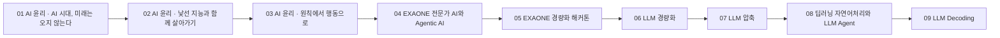

> [!abstract] 읽기 순서
> LG Aimers 8기의 강의자료 PDF를 파일명·주제·슬라이드 쪽수 기준으로 배열했습니다. 번호가 붙은 노트는 이 순서를 따라 원본 개념과 실습·정책 맥락을 연결합니다.

---

## 강의 흐름 지도



<Tabs>
  <Tab label="파일 순서">파일명과 강의 장·절을 먼저 읽고 해당 번호 노트로 이동합니다.</Tab>
  <Tab label="중복·기수">같은 제목의 8기·9기 자료는 기수별 원본을 분리해 읽으며 내용을 합치지 않습니다.</Tab>
  <Tab label="검증">쪽수는 탐색 단서입니다. 정의·수식·사례·수치는 각 원본 PDF에서 다시 확인합니다.</Tab>
</Tabs>

---

## 원본 강의자료 목록

| 순서 | 원본 PDF | 쪽수 | 학습 초점 |
| --- | --- | ---: | --- |
| 01 | 『AI윤리란 무엇인가_』 강의자료 /AI윤리_AI 시대, 미래는 오지 않는다.pdf | 12 | 기술·생산성·증강·거버넌스 |
| 02 | 『AI윤리란 무엇인가_』 강의자료 /AI윤리_'낯선 지능'과 함께 살아가기.pdf | 13 | 신경망의 낯섦·공감·윤리적 설계 |
| 03 | 『AI윤리란 무엇인가_』 강의자료 /AI윤리_원칙에서 행동으로.pdf | 14 | UNESCO·글로벌 거버넌스·생성형 AI 위험 |
| 04 | 『LG AI연구원 EXAONE 모델 소개』  강의자료 Download.pdf | 31 | EXAONE 여정·Agentic 기능·산업 사례 |
| 05 | 『LG AI연구원 해커톤 문제 소개』  강의자료 Download.pdf | 18 | 구조 분석·압축·vLLM·평가 |
| 06 | 『Lightweight LLM beyond Scaling From Business Cost Optimization to Frontier Research』 강의자료 Download.pdf | 138 | 비용·on-device·서빙·라우팅 |
| 07 | 『Compressing Large Language Models』 강의자료 Download.pdf | 48 | Pruning·Distillation·Quantization |
| 08 | 『딥러닝 자연어처리 기초와 LLM Agent』 강의자료 Download.pdf | 204 | ML·DL·NLP·Agent 기초 |
| 09 | 『LLM Application & Evaluation』 강의자료 Download.pdf | 196 | Decoding·고급 생성·RAG |

## 인터랙티브: 원본 단계 선택

```html preview
<div style="font-family:system-ui,sans-serif;padding:20px;color:var(--foreground)">
<label for="aimers8-flow" style="font-size:14px;font-weight:600">원본 강의자료 단계</label>
<div id="aimers8-flow-out" style="font-size:24px;font-weight:700;color:var(--chart-1);margin:6px 0"></div>
<input id="aimers8-flow" type="range" min="0" max="8" step="1" value="0" style="width:100%;accent-color:var(--primary)" />
<p id="aimers8-flow-hint" style="font-size:13px;color:var(--muted-foreground)">슬라이더를 움직여 각 원본의 학습 초점을 확인하세요.</p>
<script>
var c=document.getElementById('aimers8-flow');
var o=document.getElementById('aimers8-flow-out');
var h=document.getElementById('aimers8-flow-hint');
var labels=["AI 윤리 · AI 시대, 미래는 오지 않는다","AI 윤리 · 낯선 지능과 함께 살아가기","AI 윤리 · 원칙에서 행동으로","EXAONE 전문가 AI와 Agentic AI","EXAONE 경량화 해커톤","LLM 경량화","LLM 압축","딥러닝 자연어처리와 LLM Agent","LLM Decoding"];
var hints=["기술·생산성·증강·거버넌스","신경망의 낯섦·공감·윤리적 설계","UNESCO·글로벌 거버넌스·생성형 AI 위험","EXAONE 여정·Agentic 기능·산업 사례","구조 분석·압축·vLLM·평가","비용·on-device·서빙·라우팅","Pruning·Distillation·Quantization","ML·DL·NLP·Agent 기초","Decoding·고급 생성·RAG"];
function draw(){var i=Number(c.value);o.textContent=labels[i];h.textContent=hints[i];}
c.addEventListener('input',draw);draw();
</script>
</div>
```

> [!warning] 원본 범위
> 강의자료 PDF와 자격증·행사 문서는 구분했습니다. 여기에는 실제 수업용 강의자료만 포함했고, 인증서·해커톤 증빙 PDF는 강의 노트의 근거로 사용하지 않았습니다.
