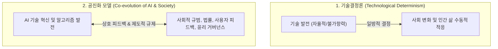

> [!abstract] 핵심 요약
> '미래는 정해진 채로 다가오는 것이 아니라, 사회적 선택과 기술의 상호작용을 통해 만들어지는 것이다.'
> **기술결정론**은 기술이 사회 구조와 미래를 일방적으로 결정한다고 가정하지만, 실제 역사 속 기술 혁신은 법, 제도, 문화와의 **공진화(Co-evolution)** 과정을 거친다. AI 기술의 발전 방향 또한 고정된 숙명이 아니며, 인간의 가치와 윤리적 통제를 반영하는 **가치 지향적 설계(Value-Sensitive Design)**가 필수적이다.

---

## 1. 기술결정론 vs 사회적 구성주의 vs 공진화 모델



---

## 2. 디지털 기술을 바라보는 패러다임 비교

| 관점 | 기술에 대한 전제 | 인간/사회의 역할 | 위험 요인 |
| :-- | :-- | :-- | :-- |
| **적극 수용론 (유토피아)** | 기술 발전은 무조건적 진보와 생산성 혁신을 보장함 | 기술에 맞추어 법과 제도를 신속히 완화해야 함 | 안전성 검증 결여, 사회적 양극화 및 부작용 간과 |
| **극단적 거부론 (러다이트)** | 기술은 인간 소외와 일자리 파괴의 주범임 | 기술 도입을 원천 봉쇄하거나 엄격 차단해야 함 | 기술 혁신의 편익 상실, 글로벌 경쟁력 도태 |
| **비판적 공진화론 (균형)** | 기술은 사회적 맥락 속에서 설계되고 유도되는 도구임 | 윤리적 가치와 안전 장치를 선제적으로 내재화(By Design) | 복잡한 이해관계 조정 및 규제 유연성 확보 난제 |

---

## 3. 실시간 AI 기술 수용 및 거버넌스 전략 시뮬레이터

```html preview
<div style="font-family:system-ui,-apple-system,sans-serif;padding:20px;background:var(--card);color:var(--card-foreground);border:1px solid var(--border);border-radius:var(--radius)">
  <div style="font-size:16px;font-weight:700;margin-bottom:14px;color:var(--primary);display:flex;align-items:center;gap:8px">
    <span>🧭 AI 기술 도입 정책 및 공진화 거버넌스 분석기</span>
  </div>

  <div style="margin-bottom:14px">
    <label style="font-size:11px;color:var(--muted-foreground)">조직의 AI 기술 수용 정책 기조:</label>
    <select id="selAiStance" style="width:100%;padding:6px;background:var(--background);color:var(--foreground);border:1px solid var(--border);border-radius:var(--radius);font-weight:700">
      <option value="balanced">1. 비판적 공진화론 (가치 지향적 설계 + 지속적 레드팀 감사)</option>
      <option value="utopia">2. 무조건적 적극 수용 (규제 완전 완화, 속도 최우선)</option>
      <option value="dystopia">3. 극단적 규제 및 도입 거부 (안전성 100% 입증 전 전면 중단)</option>
    </select>
  </div>

  <div style="padding:12px;background:var(--background);border:1px solid var(--border);border-radius:var(--radius)">
    <div style="font-size:11px;font-weight:700;color:var(--muted-foreground);margin-bottom:4px">사회적 파급력 및 위험성 평가</div>
    <div id="stanceDescOut" style="font-size:13px;line-height:1.6;color:var(--foreground)">
      <strong style="color:var(--primary)">비판적 공진화 모델:</strong> 기술 혁신의 이점을 극대화하면서도 사회적 가치와 안전 가이드라인을 동시 달성합니다.
    </div>
  </div>

  <script>
    document.getElementById('selAiStance').onchange = function() {
      var val = this.value;
      var out = document.getElementById('stanceDescOut');
      if (val === 'balanced') {
        out.innerHTML = "<strong style='color:var(--primary)'>⭐ 비판적 공진화 모델 (Best Practice):</strong><br/>• AI 기술 혁신 속도와 사회적 수용성 간의 최적 균형 달성<br/>• Value-Sensitive Design을 통해 모델 개발 초기부터 편향/안전성 제약 조건 내재화";
      } else if (val === 'utopia') {
        out.innerHTML = "<strong style='color:var(--destructive,#ef4444)'>⚠️ 무조건적 적극 수용 위험:</strong><br/>• 환각(Hallucination), 개인정보 유출, 알고리즘 차별 등 통제 불능 리스크 발생<br/>• 사회적 신뢰 상실로 인한 후속 규제 역풍 위험";
      } else {
        out.innerHTML = "<strong style='color:var(--chart-1)'>⚠️ 과도한 규제/거부 위험:</strong><br/>• 글로벌 AI 기술 경쟁력 상실 및 비효율적 레거시 시스템 고착화<br/>• 산업 전반의 생산성 혁신 기회 박탈";
      }
    };
  </script>
</div>
```
