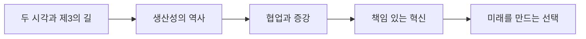

# 01. AI 윤리 — AI 시대, 미래는 오지 않는다

> [!abstract] 한 줄 요약
> 기술을 수용하거나 거부하는 이분법을 넘어 인간·기술의 공진화와 책임 있는 거버넌스로 AI의 미래를 만들어 가는 관점을 정리한다.

---

## 강의 흐름



<Tabs>
  <Tab label="핵심 개념">
- **공진화** — 인간의 욕구·생활 태도·제도가 기술 변화에 반응하고, 그 변화가 다시 기술 개발과 활용을 바꾼다.
- **증강** — 기계가 인간을 단순 대체하는 대신 상호보완하여 더 많은 가치를 만들고 개인의 성장을 돕는 관계다.
- **책임 있는 혁신** — 기술의 편익이 보편 복지로 이어지는지 권력과 제도를 함께 점검하는 접근이다.
  </Tab>
  <Tab label="적용 순서">
1. 기술 낙관·거부의 전제를 분리한다.
2. 역사적 생산성 사례에서 도입과 실제 효과의 간극을 찾는다.
3. 대체가 아닌 업무 증강 가능성을 설계한다.
4. 거버넌스로 비용·권력·복지의 분배를 조정한다.
  </Tab>
  <Tab label="점검 질문">
- 세탁기와 컴퓨터 사례가 ‘도입=혁신’ 공식을 왜 반박하는가?
- 업무 대체와 업무 증강을 구분할 때 관찰 단위는 무엇인가?
- AI의 미래를 사회가 설계하려면 어떤 제도적 선택이 필요한가?
  </Tab>
</Tabs>

---

## 단계별 정리

### 두 시각과 제3의 길

- 적극 수용론은 빠른 적응과 디지털-AI 활용 역량을 강조한다.
- 전통 가치 수호론은 문해력 같은 기존 가치를 지키는 교육을 강조한다.
- 강의는 기술과 교육을 수동적으로 보지 않는 제3의 길을 제안한다.

### 생산성의 역사

- 케인즈는 생산성 향상 뒤 주당 15시간 노동을 전망했지만 예언은 실현되지 않았다.
- 세탁기 보급은 가사노동을 줄였지만 소비·생활 방식이 함께 바뀌었다.
- 컴퓨터 보급 뒤에도 기업 생산성이 즉시 오르지 않았다는 사례는 도입만으로 혁신이 일어나지 않음을 보인다.

### 협업과 증강

- 자동화는 비숙련 육체·정신 노동에서 숙련 노동으로 확장되어 왔다.
- 바코드는 계산원의 업무를 보조한 증강 사례이며 AI도 업무 내용의 변화를 크게 만든다.
- 인간과 AI의 협업이 당분간 일반적인 운영 형태라는 전망을 제시한다.

### 책임 있는 혁신

- 파괴적 혁신이 항상 보편 복지를 높인다는 신화는 역사적으로 성립하지 않는다.
- 농업 기술과 수돗물 도입의 대비는 기술의 사회적 배치가 결과를 좌우함을 보여준다.
- 공정하고 적절한 글로벌 거버넌스가 혁신의 편익과 비용을 조정해야 한다.

### 미래를 만드는 선택

- future는 단순히 ‘오는 것’이 아니라 우리가 바람직하게 만들어 가는 것으로 해석된다.
- AI의 미래가 이미 정해졌다는 전제 대신 욕구·제도·기술이 서로 바뀌는 공진화를 본다.
- 낯선 지능의 등장을 인류가 우주적 미래를 준비하는 학습 기회로 볼 수 있다.

| 단계 | 원본에서 관찰할 신호 | 학습 산출물 |
| --- | --- | --- |
| 전망 | 적극 수용 / 전통 가치 수호 | 제3의 길로 공진화 조건을 설계 |
| 역사 사례 | 세탁기·컴퓨터·농업·수돗물 | 기술 도입과 복지 결과를 분리 |
| 노동 변화 | 자동화·바코드·협업 | 업무 단위 증강 시나리오 |
| 거버넌스 | 권력 통제와 비용 전가 | 책임 있는 혁신 원칙 |

> [!warning] 읽을 때의 주의점
> 강의는 AI의 잠재적 혜택이나 위험을 단정하지 않는다. 어떤 방향으로 사용할지에 따라 결과가 달라진다는 논지를 유지한다.

---

## 인터랙티브: 강의 단계 탐색

아래 슬라이더를 움직여 단계별 핵심 질문을 확인합니다. 범위와 단계명은 이 PDF의 강의 목차를 그대로 반영했습니다.

```html preview
<div style="font-family:system-ui,sans-serif;padding:20px;color:var(--foreground)">
<label for="a8ethicsfuture" style="font-size:14px;font-weight:600">강의 단계</label>
<div id="a8ethicsfuture-out" style="font-size:24px;font-weight:700;color:var(--chart-1);margin:6px 0"></div>
<input id="a8ethicsfuture" type="range" min="0" max="4" step="1" value="0" style="width:100%;accent-color:var(--primary)" />
<p id="a8ethicsfuture-hint" style="font-size:13px;color:var(--muted-foreground);margin-top:8px"></p>
<script>
var control = document.getElementById('a8ethicsfuture');
var out = document.getElementById('a8ethicsfuture-out');
var hint = document.getElementById('a8ethicsfuture-hint');
var labels = ["두 시각과 제3의 길","생산성의 역사","협업과 증강","책임 있는 혁신","미래를 만드는 선택"];
var hints = ["적극 수용론·전통 가치 수호론의 한계를 비교합니다.","케인즈의 예측과 세탁기·컴퓨터 사례를 연결합니다.","대체보다 업무(task) 변화에 초점을 둡니다.","보편 복지와 권력 통제의 관계를 점검합니다.","미래를 기다리는 태도에서 설계하는 태도로 전환합니다."];
function renderStage() {
  var index = Number(control.value);
  out.textContent = labels[index];
  hint.textContent = hints[index];
}
control.addEventListener('input', renderStage);
renderStage();
</script>
</div>
```

<details>
  <summary>복습 체크리스트</summary>

- [ ] 적극 수용론·전통 가치 수호론·제3의 길의 차이를 설명할 수 있다.
- [ ] 자동화와 증강의 차이를 업무 단위로 말할 수 있다.
- [ ] 기술과 보편 복지의 관계를 거버넌스 관점에서 평가할 수 있다.

</details>
