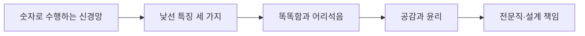

# 02. AI 윤리 — 낯선 지능과 함께 살아가기

> [!abstract] 한 줄 요약
> 인공 신경망의 숫자 기반 수행과 예측 불가능한 실패를 출발점으로, 인간과 다른 지능을 윤리적으로 설계하고 상호작용하는 법을 정리한다.

---

## 강의 흐름



<Tabs>
  <Tab label="핵심 개념">
- **낯선 지능** — AI의 능숙함·실패·공감이 인간의 이해 방식과 다르게 나타난다는 강의의 핵심 관점이다.
- **Ethics** — 개인의 도덕 판단을 넘어 특정 공동체·분야의 행위 원칙과 관습까지 포함한다.
- **윤리적 설계** — 사용 단계의 사후 대응이 아니라 시스템 설계·개발 과정에 책임과 가치를 내장한다.
  </Tab>
  <Tab label="적용 순서">
1. 숫자 계산 구조와 인간 의미 부여를 구분한다.
2. 세 가지 낯선 특징이 실제 상호작용에 미치는 위험을 찾는다.
3. 지적 성능과 공감 표현을 윤리적 책임과 분리해 평가한다.
4. 전문직 윤리와 설계 표준으로 실행 장치를 만든다.
  </Tab>
  <Tab label="점검 질문">
- 인공 신경망의 불투명성은 왜 단순한 설명 부족과 다른가?
- 똑똑한 답변과 이해를 갖춘 답변을 어떻게 구분할 수 있는가?
- 온라인 프로그램과 로봇의 윤리 기준이 달라야 하는 이유는 무엇인가?
  </Tab>
</Tabs>

---

## 단계별 정리

### 숫자로 수행하는 신경망

- 인공 신경망은 뇌 구조를 모방하지만 계산 단위는 의미를 직접 이해하지 못하는 숫자다.
- 학습과 예측이 숫자 계산으로 이루어져 설계 원리상 불투명성이 남는다.
- ‘자각 없는 수행’은 능숙한 결과와 의식적 경험을 분리한다.

### 낯선 특징 세 가지

- 자각 없는 수행: 의식적 경험이 없는데도 행동을 산출한다.
- 이해할 수 없는 실패: 진정한 이해 없이 특정 입력에서 무너질 수 있다.
- 계산과 실재의 간극: 몸이 없는 사이버 존재가 물리 세계를 다루는 한계가 있다.

### 똑똑함과 어리석음

- 단어의 역사적 의미를 설명하는 프롬프트처럼 언어적 추론은 매우 뛰어날 수 있다.
- 반대로 이미지 생성에서 요구 조건을 놓치는 등 당황스러운 실패도 나타난다.
- ARC Prize 사례는 인간과 다른 방식의 지능을 측정하려는 시도다.

### 공감과 윤리

- ELIZA와 대화형 AI 사례는 사람이 비인간 시스템에 내밀한 이야기를 할 수 있음을 보인다.
- 감정 표현과 현명한 공감은 다르며, AI의 탁월해 보이는 공감은 위험할 수 있다.
- 윤리는 바람직한 개발·활용을 위한 규범과 사회적 합의의 과정이다.

### 전문직·설계 책임

- 전문직 윤리는 사회적 영향력이 큰 집단의 책무성과 내부 규율을 다룬다.
- IEEE의 윤리적으로 정렬된 설계 노력처럼 설계 단계에서 가치와 책임을 반영해야 한다.
- 온라인 AI와 물리적 공간의 로봇은 다른 기술이므로 맥락별 안전 기준이 필요하다.

| 단계 | 원본에서 관찰할 신호 | 학습 산출물 |
| --- | --- | --- |
| 구조 | 숫자 노드·자각 없는 수행 | 의미·의식과 계산 결과를 구분 |
| 능력 | 언어적 탁월함과 이해할 수 없는 실패 | 성능 테스트에 실패 맥락 포함 |
| 상호작용 | ELIZA·감정 로봇·ChatGPT 위안 | 공감의 질과 사용자 취약성 점검 |
| 실행 | 전문직 윤리·IEEE 설계 | 윤리적 설계 요구사항으로 전환 |

> [!warning] 읽을 때의 주의점
> 강의는 AI를 인간처럼 이해한다고 가정하지 않는다. 공감처럼 보이는 출력도 사용자의 판단과 안전을 대신하지 않는다는 전제를 유지한다.

---

## 인터랙티브: 강의 단계 탐색

아래 슬라이더를 움직여 단계별 핵심 질문을 확인합니다. 범위와 단계명은 이 PDF의 강의 목차를 그대로 반영했습니다.

```html preview
<div style="font-family:system-ui,sans-serif;padding:20px;color:var(--foreground)">
<label for="a8ethicsstrange" style="font-size:14px;font-weight:600">낯선 지능의 단계</label>
<div id="a8ethicsstrange-out" style="font-size:24px;font-weight:700;color:var(--chart-1);margin:6px 0"></div>
<input id="a8ethicsstrange" type="range" min="0" max="4" step="1" value="0" style="width:100%;accent-color:var(--primary)" />
<p id="a8ethicsstrange-hint" style="font-size:13px;color:var(--muted-foreground);margin-top:8px"></p>
<script>
var control = document.getElementById('a8ethicsstrange');
var out = document.getElementById('a8ethicsstrange-out');
var hint = document.getElementById('a8ethicsstrange-hint');
var labels = ["숫자로 수행하는 신경망","낯선 특징 세 가지","똑똑함과 어리석음","공감과 윤리","전문직·설계 책임"];
var hints = ["노드 계산과 의미 불투명성을 확인합니다.","자각·실패·실재의 간극을 차례로 봅니다.","서로 다른 지적 패턴을 대비합니다.","공감의 의미와 인간의 책임을 분리합니다.","Ethics by Design으로 실행 단계를 연결합니다."];
function renderStage() {
  var index = Number(control.value);
  out.textContent = labels[index];
  hint.textContent = hints[index];
}
control.addEventListener('input', renderStage);
renderStage();
</script>
</div>
```

<details>
  <summary>복습 체크리스트</summary>

- [ ] 낯선 지능의 세 특징을 정확히 구분할 수 있다.
- [ ] AI의 성능·이해·공감을 같은 개념으로 취급하지 않는다.
- [ ] Ethics by Design을 개발 단계의 요구사항으로 설명할 수 있다.

</details>
