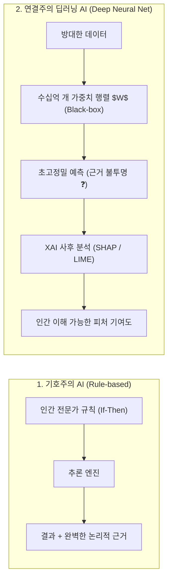

> [!abstract] 핵심 요약
> 현대 인공지능은 인간의 논리적 추론 체계와 달리 수십억 개의 매개변수 가중치 행렬 연산을 통해 패턴을 근사하는 **'낯선 지능(Alien Intelligence)'**이다.
> 초고차원 비선형 공간에서 도출되는 판단은 높은 정확도를 지니지만 **블랙박스 불투명성**을 수반하므로, 의료·금융·채용 등 고위험(High-risk) 의사결정 영역에서는 **XAI(설명가능 인공지능)** 기법과 인간 개입(Human-in-the-Loop)이 신뢰의 필수 전제조건이다.

---

## 1. 전통적 규칙 기반 AI vs 딥러닝 연결주의 AI 비교



---

## 2. AI 윤리적 위험 요인과 XAI 설명가능성 기술 비교

| 핵심 위험 요인 | 발생 메커니즘 | 완화 기술 (XAI & Fairness) | 실무 적용 방안 |
| :-- | :-- | :-- | :-- |
| **블랙박스 불투명성** | 다층 비선형 활성화 함수 및 초고차원 가중치 공간 | **SHAP (Shapley Values)**, **LIME** | 의사결정 기여 피처 시각화 리포트 생성 |
| **데이터 편향성 증폭** | 학습 데이터에 내재된 역사적/사회적 차별 반영 | **재가중(Re-weighing)**, **Adversarial Debiasing** | 보호 속성(성별, 인종 등) 간 동등 오차율 검증 |
| **환각 (Hallucination)** | 통계적 다음 토큰 확률 예측에 따른 허위 정보 생성 | **RAG (검색 증강 생성)**, **Grounding Fact-check** | 신뢰할 수 있는 지식 베이스 출처 인용 강제 |

---

## 3. 실시간 신용 평가 모델의 SHAP 피처 중요도 분석 시뮬레이터

```html preview
<div style="font-family:system-ui,-apple-system,sans-serif;padding:20px;background:var(--card);color:var(--card-foreground);border:1px solid var(--border);border-radius:var(--radius)">
  <div style="font-size:16px;font-weight:700;margin-bottom:14px;color:var(--primary);display:flex;align-items:center;gap:8px">
    <span>🔍 딥러닝 모델 의사결정 근거 (SHAP Value) 시뮬레이터</span>
  </div>

  <div style="display:grid;grid-template-columns:1fr 1fr;gap:12px;margin-bottom:14px">
    <div>
      <label style="font-size:11px;color:var(--muted-foreground)">연소득 수준:</label>
      <select id="selIncome" style="width:100%;padding:5px;background:var(--background);color:var(--foreground);border:1px solid var(--border);border-radius:var(--radius);font-weight:700">
        <option value="30">상 (8,000만 원 이상)</option>
        <option value="10">중 (4,000만 원 ~ 8,000만 원)</option>
        <option value="-20">하 (4,000만 원 미만)</option>
      </select>
    </div>
    <div>
      <label style="font-size:11px;color:var(--muted-foreground)">기존 대출 연체 이력:</label>
      <select id="selDelay" style="width:100%;padding:5px;background:var(--background);color:var(--foreground);border:1px solid var(--border);border-radius:var(--radius);font-weight:700">
        <option value="20">연체 이력 없음</option>
        <option value="-40">단기 연체 1회</option>
        <option value="-80">장기 연체 보유</option>
      </select>
    </div>
  </div>

  <div style="padding:12px;background:var(--background);border:1px solid var(--border);border-radius:var(--radius)">
    <div style="font-size:11px;font-weight:700;color:var(--muted-foreground);margin-bottom:4px">AI 대출 심사 최종 판정 및 XAI 기여도 분석</div>
    <div id="shapResultOut" style="font-size:14px;font-weight:800;color:var(--primary)">
      ✅ 승인 (최종 신용 점수: 75점 / 긍정 기여: 소득 +30, 무연체 +20)
    </div>
  </div>

  <script>
    function updateShap() {
      var inc = parseInt(document.getElementById('selIncome').value);
      var del = parseInt(document.getElementById('selDelay').value);
      var baseScore = 50;
      var totalScore = baseScore + inc + del;
      var out = document.getElementById('shapResultOut');

      if (totalScore >= 60) {
        out.innerHTML = "✅ <span style='color:var(--primary)'>대출 승인</span> (점수: " + totalScore + "점) | SHAP 기여: 소득(" + (inc>0?"+"+inc:inc) + "), 연체이력(" + (del>0?"+"+del:del) + ")";
      } else {
        out.innerHTML = "❌ <span style='color:var(--destructive,#ef4444)'>대출 거절</span> (점수: " + totalScore + "점) | 거절 주요 원인: 연체이력 기여도(" + del + "점 감점)";
      }
    }

    document.getElementById('selIncome').onchange = updateShap;
    document.getElementById('selDelay').onchange = updateShap;
  </script>
</div>
```
