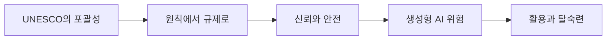

> [!abstract] 한 줄 요약
> UNESCO의 포괄적 AI 윤리에서 출발해 글로벌 거버넌스, 신뢰·안전, 환각·저작권·이중 사용과 탈숙련 문제를 행동 규칙으로 연결한다.

---

## 강의 흐름



<Tabs>
  <Tab label="핵심 개념">
- **거버넌스** — 혜택과 위험을 함께 고려해 국가·기관·표준기구가 관리 체계를 만드는 과정이다.
- **신뢰가능성·안전성** — AI 윤리 논의를 제품 신뢰와 사고 예방을 위한 평가·인증·표준으로 연결하는 축이다.
- **탈숙련** — 학습자가 능력을 얻기 전에 생성형 AI를 과다하게 의존해 전문성 형성이 약화되는 현상이다.
  </Tab>
  <Tab label="적용 순서">
1. 국제 원칙과 국가 규제의 관계를 맵으로 그린다.
2. 신뢰가능성과 안전성에 필요한 평가·표준을 나눈다.
3. 생성형 AI 위험을 데이터·모델·사용 단계로 분해한다.
4. 증강을 살리고 탈숙련을 막는 교육·운영 규칙을 만든다.
  </Tab>
  <Tab label="점검 질문">
- 원칙 선언이 행동·법·표준으로 변할 때 어떤 비용과 갈등이 생기는가?
- 환각을 버그가 아니라 특징으로 볼 때 평가 방식은 어떻게 달라지는가?
- AI 활용이 증강인지 탈숙련인지 판정할 관찰 지표는 무엇인가?
  </Tab>
</Tabs>

---

## 단계별 정리

### UNESCO의 포괄성

- UNESCO 논의는 다른 기관보다 포괄적이고 근본적이라는 특징을 가진다.
- 교육·과학·문화·정보통신·아프리카·젠더 영역의 권한이 AI 윤리 논의와 연결된다.
- COMEST가 과학기술 윤리를 주도할 이상적 기관으로 제시된다.

### 원칙에서 규제로

- OECD·UNESCO·IEEE와 여러 국가의 원칙 선언이 2023년 이후 규제 흐름으로 이어졌다.
- 유럽연합 AI 법과 미국 행정명령은 국가별 입법 활동을 촉진한다.
- 규제 비용이 무역장벽이나 사다리 걷어차기가 될 수 있다는 비판도 함께 다룬다.

### 신뢰와 안전

- 기존 거버넌스는 혁신과 윤리의 균형을 위한 trustworthy AI에 주목했다.
- 생성형 AI 위험이 커지며 safe AI를 위한 국제 협력이 강조된다.
- AI 안전 연구소 네트워크와 기술·윤리 표준이 경쟁의 장이 된다.

### 생성형 AI 위험

- 환각과 거짓·기만 정보는 쉽게 생산되지만 제도 대응은 느리다.
- 환각은 프로그램 버그가 아니라 모델의 기술적 특징으로 설명된다.
- 사전학습과 인간 피드백 강화학습의 가역성은 탈옥 가능성을 남긴다.
- 학습 데이터 보상·결과물 저작권·선한 목적의 이중 사용 문제가 이어진다.

### 활용과 탈숙련

- 이미 전문성을 가진 사람이 생성형 AI를 쓰면 작업 능력이 상승하는 증강이 일어날 수 있다.
- 전문성을 획득하기 전 과다 사용하면 탈숙련(deskill)이 발생할 수 있다.
- 원칙을 실제 교육·연구·제품 의사결정에 적용하는 절차가 필요하다.

| 단계 | 원본에서 관찰할 신호 | 학습 산출물 |
| --- | --- | --- |
| 국제 논의 | UNESCO·OECD·IEEE | 포괄 원칙과 실행 주체 |
| 정책 | EU AI 법·미국 행정명령·안전 연구소 | 위험 기반 규제·표준·인증 |
| 모델 위험 | 환각·탈옥·저작권·이중 사용 | 사전·사후 통제 지점 |
| 교육·연구 | 증강과 탈숙련 | 사용자 역량과 책임 분담 |

> [!warning] 읽을 때의 주의점
> 원본의 사례와 법·정책 명칭은 강의 시점의 자료다. 현행 법률이나 규정으로 일반화하지 말고, 여기서는 강의가 제시한 논리 구조를 학습한다.

---

## 인터랙티브: 강의 단계 탐색

아래 슬라이더를 움직여 단계별 핵심 질문을 확인합니다. 범위와 단계명은 이 PDF의 강의 목차를 그대로 반영했습니다.

```html preview
<div style="font-family:system-ui,sans-serif;padding:20px;color:var(--foreground)">
<label for="a8ethicsgovernance" style="font-size:14px;font-weight:600">원칙→행동 단계</label>
<div id="a8ethicsgovernance-out" style="font-size:24px;font-weight:700;color:var(--chart-1);margin:6px 0"></div>
<input id="a8ethicsgovernance" type="range" min="0" max="4" step="1" value="0" style="width:100%;accent-color:var(--primary)" />
<p id="a8ethicsgovernance-hint" style="font-size:13px;color:var(--muted-foreground);margin-top:8px"></p>
<script>
var control = document.getElementById('a8ethicsgovernance');
var out = document.getElementById('a8ethicsgovernance-out');
var hint = document.getElementById('a8ethicsgovernance-hint');
var labels = ["UNESCO의 포괄성","원칙에서 규제로","신뢰와 안전","생성형 AI 위험","활용과 탈숙련"];
var hints = ["교육·과학·문화·정보를 가로지르는 권한을 확인합니다.","선언에서 법·표준·인증으로 이동합니다.","trustworthy와 safe의 차이를 비교합니다.","환각·탈옥·저작권·이중 사용을 한 묶음으로 봅니다.","증강과 과다 사용의 경계를 점검합니다."];
function renderStage() {
  var index = Number(control.value);
  out.textContent = labels[index];
  hint.textContent = hints[index];
}
control.addEventListener('input', renderStage);
renderStage();
</script>
</div>
```

<details>
  <summary>복습 체크리스트</summary>

- [ ] UNESCO 논의의 포괄적 성격을 설명할 수 있다.
- [ ] trustworthy AI와 safe AI를 구분할 수 있다.
- [ ] 환각·탈옥·저작권·이중 사용의 대응 지점을 말할 수 있다.

</details>
