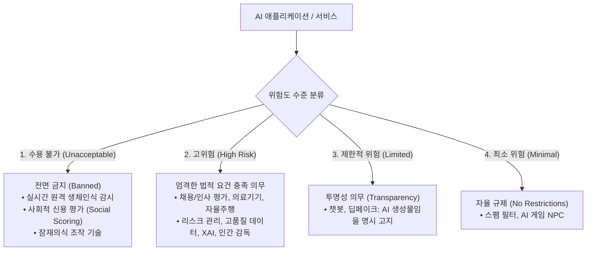

> [!abstract] 핵심 요약
> 선언적 윤리 원칙(Principles)을 넘어 법적 구속력과 실행 체계(Actions)를 갖춘 **글로벌 AI 규제**가 본격화되고 있다.
> **EU AI Act**는 위험도에 따라 AI 시스템을 4등급으로 분류하여 사회적 신용 평가 등은 전면 금지하고, 의료·인사 채용 등 **고위험(High Risk)** 시스템에는 데이터 품질 관리, 로깅, 투명성, 인간 감독을 법적으로 의무화한다.

---

## 1. EU AI Act 위험 기반 4단계 분류 체계



---

## 2. 유네스코(UNESCO) 4대 핵심 가치 및 10대 원칙

| UNESCO 4대 가치 | 10대 행동 원칙 요약 | 기업 거버넌스 실천 방안 |
| :-- | :-- | :-- |
| **인권과 인간 존엄성** | 인간의 기본권 보장 및 침해 방지 | 프라이버시 침해 방지 데이터 익명화 |
| **평화롭고 공정한 사회** | 차별 금지, 포용성, 다양성 존중 | 모델 공정성(Fairness) 지표 정량 감사 |
| **다양성과 포용성** | 소수자 배려 및 문화적 다원성 수용 | 다국어/다문화 데이터셋 균형 확보 |
| **환경과 생태계 번영** | 지속 가능성 및 탄소 발자국 감축 | 모델 경량화 및 에너지 효율적 인프라 |

---

## 3. 실시간 서비스별 EU AI Act 위험 등급 판별기

```html preview
<div style="font-family:system-ui,-apple-system,sans-serif;padding:20px;background:var(--card);color:var(--card-foreground);border:1px solid var(--border);border-radius:var(--radius)">
  <div style="font-size:16px;font-weight:700;margin-bottom:14px;color:var(--primary);display:flex;align-items:center;gap:8px">
    <span>⚖️ 서비스별 EU AI Act 규제 위험 등급 판별기</span>
  </div>

  <div style="margin-bottom:14px">
    <label style="font-size:11px;color:var(--muted-foreground)">AI 서비스 적용 분야 선택:</label>
    <select id="selRiskCategory" style="width:100%;padding:6px;background:var(--background);color:var(--foreground);border:1px solid var(--border);border-radius:var(--radius);font-weight:700">
      <option value="high">1. AI 기반 기업 채용 서류 자동 심사 및 면접 평가</option>
      <option value="unacceptable">2. 공공장소 실시간 안면인식 대중 감시 및 소셜 스코어링</option>
      <option value="limited">3. 고객센터 AI 챗봇 및 생성형 AI 이미지 제작</option>
      <option value="minimal">4. 이메일 스팸 필터링 및 게임 봇 AI</option>
    </select>
  </div>

  <div style="padding:12px;background:var(--background);border:1px solid var(--border);border-radius:var(--radius)">
    <div style="font-size:11px;font-weight:700;color:var(--muted-foreground);margin-bottom:4px">EU AI Act 규제 등급 및 법적 준수 요건</div>
    <div id="riskResultOut" style="font-size:13px;line-height:1.6;color:var(--foreground)">
      <strong style="color:var(--chart-1)">고위험 (High Risk) 등급:</strong> 데이터셋 편향 검증, 상세 기술 문서화, 로깅 기록 보관 및 인간 감독(Human-in-the-Loop) 체계 구축이 법적으로 의무화됩니다.
    </div>
  </div>

  <script>
    document.getElementById('selRiskCategory').onchange = function() {
      var val = this.value;
      var out = document.getElementById('riskResultOut');
      if (val === 'high') {
        out.innerHTML = "<strong style='color:var(--chart-1)'>⚠️ 고위험 (High Risk) 등급:</strong><br/>• 데이터셋 편향 검증, 상세 기술 문서화, 로깅 기록 보관 및 인간 감독(Human-in-the-loop) 체계 구축 의무화<br/>• 미준수 시 전 세계 매출의 최대 7% 또는 3,500만 유로 과징금 부과";
      } else if (val === 'unacceptable') {
        out.innerHTML = "<strong style='color:var(--destructive,#ef4444)'>🚫 수용 불가 위험 (Unacceptable Risk - 서비스 전면 금지):</strong><br/>• EU 역내 배포 및 출시가 법적으로 전면 금지됨";
      } else if (val === 'limited') {
        out.innerHTML = "<strong style='color:var(--primary)'>ℹ️ 제한적 위험 (Limited Risk):</strong><br/>• 사용자가 AI와 상호작용하고 있음을 인지할 수 있도록 투명성 고지 의무(Transparency Obligation)만 요구됨";
      } else {
        out.innerHTML = "<strong style='color:var(--primary)'>✅ 최소 위험 (Minimal Risk):</strong><br/>• 별도의 법적 규제 요건 없이 자유로운 개발 및 서비스 운영 가능";
      }
    };
  </script>
</div>
```
