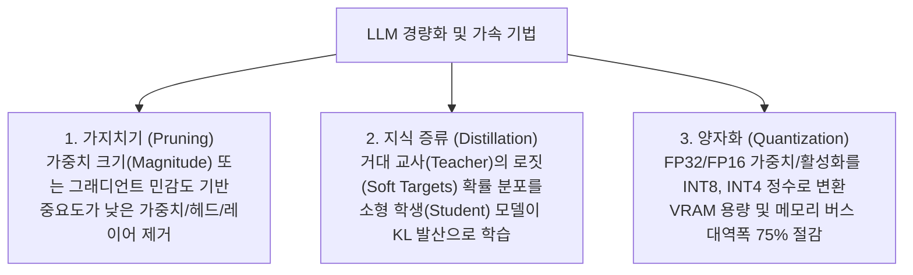

> [!abstract] 핵심 요약
> 70B 이상의 대규모 파라미터를 가진 LLM을 단일 GPU나 엣지 디바이스에서 실시간 서빙하기 위해서는 **VRAM 대역폭 병목을 극복하는 모델 압축(Compression)**이 필수적이다.
> **가지치기(Pruning)**를 통한 희소성(Sparsity) 확보, **지식 증류(Distillation)**에 의한 지능 전이, 그리고 부동소수점을 정수로 축소하면서 정확도 손실을 최소화하는 **최신 2세대 양자화(AWQ, GPTQ)**의 수학적 원리를 마스터한다.

---

## 1. LLM 3대 경량화 기법 체계 비교



---

## 2. 양자화(Quantization)의 수학적 원리와 역양자화

### 2.1. 균일 아핀 양자화 (Uniform Affine Quantization)
연속적인 부동소수점 가중치 $x \in [\alpha, \beta]$를 $b$-비트 정수 $q \in [0, 2^b - 1]$로 사상:
$$q = \text{clip}\left( \text{round}\left( \frac{x}{S} \right) + Z, \; 0, \; 2^b - 1 \right)$$
- **스케일 팩터 (Scale Factor $S$)**: $S = \frac{\beta - \alpha}{2^b - 1}$
- **영점 (Zero Point $Z$)**: $Z = \text{round}\left( -\frac{\alpha}{S} \right)$
- **역양자화 (Dequantization)**: $\hat{x} = S \cdot (q - Z)$

### 2.2. 최신 2세대 PTQ 기법: GPTQ vs AWQ
- **GPTQ (Generalized Post-Training Quantization)**: 2차 테일러 전개(헤시안 행렬 $H^{-1}$)를 활용하여 한 행의 가중치를 양자화할 때 발생하는 오차를 남은 가중치들에 즉각 역보상 $\implies$ 4-bit에서 완벽에 가까운 PPL 유지.
- **AWQ (Activation-aware Weight Quantization)**: 가중치 절대값이 아니라, **입력 활성화(Activation)의 크기가 상위 1%에 속하는 핵심 채널(Salient Channels)**을 식별하여 해당 가중치는 양자화 오차를 적극 보호.

---

## 3. 실시간 LLM 모델 크기별 GPU VRAM 소요량 계산기

```html preview
<div style="font-family:system-ui,-apple-system,sans-serif;padding:20px;background:var(--card);color:var(--card-foreground);border:1px solid var(--border);border-radius:var(--radius)">
  <div style="font-size:16px;font-weight:700;margin-bottom:12px;color:var(--primary)">
    ⚡ LLM 파라미터 및 양자화 정밀도별 VRAM 소요량 계산기
  </div>

  <div style="display:grid;grid-template-columns:1fr 1fr;gap:10px;margin-bottom:12px">
    <div>
      <label style="font-size:11px;color:var(--muted-foreground)">모델 파라미터 수 (Billion):</label>
      <select id="selModelSize" style="width:100%;padding:6px;background:var(--background);color:var(--foreground);border:1px solid var(--border);border-radius:var(--radius);font-weight:700">
        <option value="7">7B (Llama-3-8B / Mistral-7B)</option>
        <option value="14">14B (Qwen-2.5-14B)</option>
        <option value="32">32B (Qwen-2.5-32B)</option>
        <option value="70">70B (Llama-3-70B / EXAONE-3.0)</option>
      </select>
    </div>
    <div>
      <label style="font-size:11px;color:var(--muted-foreground)">양자화 정밀도:</label>
      <select id="selQuantBits" style="width:100%;padding:6px;background:var(--background);color:var(--foreground);border:1px solid var(--border);border-radius:var(--radius);font-weight:700">
        <option value="16">FP16 / BF16 (16-bit, 원본)</option>
        <option value="8">INT8 (8-bit, 50% 절감)</option>
        <option value="4">INT4 (AWQ/GPTQ, 75% 절감)</option>
      </select>
    </div>
  </div>

  <div style="padding:12px;background:var(--background);border:1px solid var(--border);border-radius:var(--radius)">
    <div style="display:flex;justify-content:space-between;margin-bottom:6px">
      <span style="font-size:12px;color:var(--muted-foreground)">순수 가중치 메모리 (Weights VRAM):</span>
      <strong id="outWeightVram" style="font-family:monospace;color:var(--primary);font-size:16px">14.0 GB</strong>
    </div>
    <div style="display:flex;justify-content:space-between">
      <span style="font-size:12px;color:var(--muted-foreground)">KV 캐시 및 서빙 권장 GPU:</span>
      <span id="outGpuReq" style="font-weight:700;color:var(--foreground)">RTX 4090 (24GB) 단일 장착 가능</span>
    </div>
  </div>

  <script>
    function calcVram() {
      var b = parseFloat(document.getElementById('selModelSize').value);
      var bits = parseFloat(document.getElementById('selQuantBits').value);

      var vram = b * (bits / 8) * 1.05; // 5% overhead
      var totalReq = vram + 4.0; // 4GB KV-cache/context

      document.getElementById('outWeightVram').textContent = vram.toFixed(1) + " GB (가중치)";

      var gpu = "";
      if (totalReq <= 16) gpu = "RTX 4080 (16GB) 또는 Mac 16GB";
      else if (totalReq <= 24) gpu = "RTX 3090 / 4090 (24GB) 단일 서빙";
      else if (totalReq <= 48) gpu = "A6000 (48GB) 또는 RTX 4090 2장";
      else if (totalReq <= 80) gpu = "A100 / H100 (80GB) 1장 필수";
      else gpu = "A100 (80GB) 2장 이상 텐서 병렬화 필요";

      document.getElementById('outGpuReq').textContent = gpu + " (총 " + totalReq.toFixed(1) + "GB 필요)";
    }

    document.getElementById('selModelSize').addEventListener('change', calcVram);
    document.getElementById('selQuantBits').addEventListener('change', calcVram);
    calcVram();
  </script>
</div>
