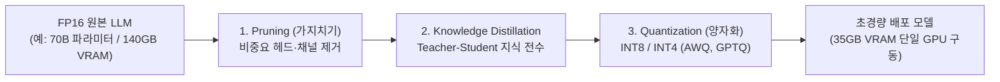

> [!abstract] 핵심 요약
> 거대 언어 모델의 서빙 병목은 단순 FLOPS 연산량이 아니라 고용량 가중치를 GPU SRAM으로 로드하는 **메모리 대역폭(Memory Bound)**에서 발생한다.
> **양자화(Quantization: FP16 $	o$ INT4)**는 모델 파라미터 메모리를 75% 절감하고, **구조화된 가지치기(Structured Pruning)** 및 **지식 증류(Distillation)**와 결합하여 성능 저하를 1% 미만으로 억제하면서 온디바이스(On-Device) 실시간 서빙을 달성한다.

---

## 1. LLM 3대 모델 압축 및 경량화 기술 파이프라인



---

## 2. 양자화(Quantization) 수식 및 매핑 원리

FP32/FP16 실수 가중치 $x$를 $b$-비트 정수 $q$로 사상하는 아핀 양자화 공식:

$$q = 	ext{round}\left(rac{x}{S}
ight) + Z, \quad S = rac{x_{\max} - x_{\min}}{2^b - 1}, \quad Z = -	ext{round}\left(rac{x_{\min}}{S}
ight)$$

| 양자화 기법 | 양자화 정밀도 | 보정 데이터셋 필요 | 메모리 압축률 | 서빙 가속 특성 |
| :-- | :-- | :--: | :--: | :-- |
| **FP16 (기본)** | 16-bit Float | ❌ 불필요 | $1	imes$ (기준) | 표준 Tensor Core 연산 |
| **W8A8 (PTQ)** | 가중치 8-bit, 활성화 8-bit | ✅ 수십 개 샘플 | **$2	imes$ 절감** | INT8 정수 연산 가속 |
| **W4A16 (AWQ / GPTQ)** | 가중치 4-bit, 활성화 16-bit | ✅ 수백 개 샘플 | **$4	imes$ 절감** | 가중치 로드 대역폭 $4	imes$ 단축 |

---

## 3. 실시간 LLM 파라미터 및 정밀도별 VRAM 요구량 계산기

```html preview
<div style="font-family:system-ui,-apple-system,sans-serif;padding:20px;background:var(--card);color:var(--card-foreground);border:1px solid var(--border);border-radius:var(--radius)">
  <div style="font-size:16px;font-weight:700;margin-bottom:14px;color:var(--primary);display:flex;align-items:center;gap:8px">
    <span>⚡ LLM 모델 크기 및 양자화별 VRAM 계산기</span>
  </div>

  <div style="display:grid;grid-template-columns:1fr 1fr;gap:12px;margin-bottom:14px">
    <div>
      <label style="font-size:11px;color:var(--muted-foreground)">모델 파라미터 수 (Billion):</label>
      <input id="inParamCount" type="number" value="7" min="1" max="100" style="width:100%;padding:4px;background:var(--background);color:var(--foreground);border:1px solid var(--border);border-radius:var(--radius);font-weight:700" />
    </div>
    <div>
      <label style="font-size:11px;color:var(--muted-foreground)">양자화 정밀도 (Bits per Weight):</label>
      <select id="selBitWidth" style="width:100%;padding:5px;background:var(--background);color:var(--foreground);border:1px solid var(--border);border-radius:var(--radius);font-weight:700">
        <option value="16">16-bit (FP16 / BF16 원본)</option>
        <option value="8">8-bit (INT8 양자화 - 50% 절감)</option>
        <option value="4">4-bit (AWQ / GPTQ INT4 - 75% 절감)</option>
      </select>
    </div>
  </div>

  <div style="display:grid;grid-template-columns:1fr 1fr;gap:12px;margin-bottom:12px">
    <div style="padding:10px;background:var(--background);border:1px solid var(--border);border-radius:var(--radius);text-align:center">
      <div style="font-size:10px;color:var(--muted-foreground)">모델 가중치 VRAM 크기</div>
      <div id="vramOut" style="font-family:monospace;font-size:18px;font-weight:800;color:var(--primary);margin-top:2px">14.0 GB</div>
    </div>
    <div style="padding:10px;background:var(--background);border:1px solid var(--border);border-radius:var(--radius);text-align:center">
      <div style="font-size:10px;color:var(--muted-foreground)">권장 배포 하드웨어</div>
      <div id="gpuRecOut" style="font-family:monospace;font-size:14px;font-weight:800;color:var(--chart-1);margin-top:4px">RTX 4090 (24GB) 단일</div>
    </div>
  </div>

  <script>
    function updateVram() {
      var p = parseFloat(document.getElementById('inParamCount').value) || 7;
      var b = parseFloat(document.getElementById('selBitWidth').value) || 16;
      var vram = (p * b) / 8;
      var totalReq = vram * 1.2;

      document.getElementById('vramOut').textContent = vram.toFixed(1) + " GB";
      var g = document.getElementById('gpuRecOut');
      if (totalReq <= 8) {
        g.textContent = "소비자용 GPU (8GB VRAM)";
      } else if (totalReq <= 16) {
        g.textContent = "중급 GPU (16GB VRAM)";
      } else if (totalReq <= 24) {
        g.textContent = "하이엔드 GPU (24GB VRAM)";
      } else {
        g.textContent = "서버용 A100/H100 (80GB VRAM) 필요";
      }
    }

    document.getElementById('inParamCount').addEventListener('input', updateVram);
    document.getElementById('selBitWidth').addEventListener('change', updateVram);
    updateVram();
  </script>
</div>
```
