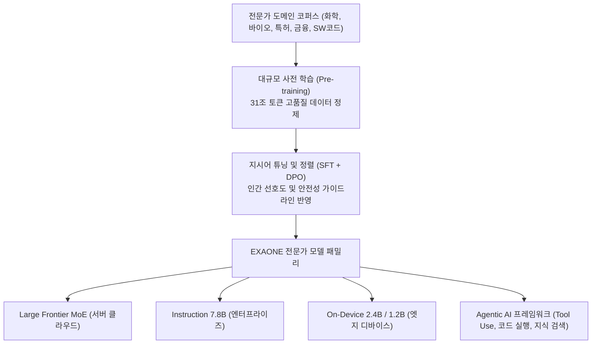

> [!abstract] 핵심 요약
> **EXAONE(엑사원)**은 LG AI연구원이 독자 개발한 글로벌 최상위 수준의 이중 언어(Bilingual) 및 전문가 특화 거대 언어 모델이다.
> 초거대 프론티어 모델뿐만 아니라 온디바이스와 엣지 환경에 즉시 배포 가능한 **경량 인스트럭션 모델(Instruction-tuned)** 라인업을 제공하며, 외부 API 및 전문 도구를 자율적으로 호출하는 **Agentic AI** 생태계로 확장하고 있다.

---

## 1. EXAONE 멀티스케일 아키텍처 및 도메인 특화 학습 파이프라인



---

## 2. EXAONE 모델 라인업 스펙 및 적용 영역 비교

| 모델 라인업 | 파라미터 규모 | 주요 대상 인프라 | 핵심 활용 분야 |
| :-- | :-- | :-- | :-- |
| **EXAONE Frontier MoE** | 수백 Billion (활성 파라미터 최적화) | 다중 노드 GPU 클러스터 (H100) | 복잡한 과학 연구, 신약 물질 발굴, 특허 분석 |
| **EXAONE 7.8B** | 7.8 Billion Dense | 단일 엔터프라이즈 GPU (A10G, L4) | 엔터프라이즈 RAG, 사내 비서, 코딩 보조 |
| **EXAONE 2.4B** | 2.4 Billion Dense | 엣지 서버 / 고성능 PC | 온프레미스 경량 자동화, 문서 요약 |
| **EXAONE 1.2B** | 1.2 Billion Dense | 스마트폰 / NPU 온디바이스 | 개인 맞춤형 모바일 AI 비서 |

---

## 3. 실시간 EXAONE 모델 라인업 추천기

```html preview
<div style="font-family:system-ui,-apple-system,sans-serif;padding:20px;background:var(--card);color:var(--card-foreground);border:1px solid var(--border);border-radius:var(--radius)">
  <div style="font-size:16px;font-weight:700;margin-bottom:14px;color:var(--primary);display:flex;align-items:center;gap:8px">
    <span>🧠 비즈니스 타깃별 EXAONE 모델 추천기</span>
  </div>

  <div style="margin-bottom:14px">
    <label style="font-size:11px;color:var(--muted-foreground)">배포 대상 환경 및 비즈니스 목적:</label>
    <select id="selExaoneTarget" style="width:100%;padding:6px;background:var(--background);color:var(--foreground);border:1px solid var(--border);border-radius:var(--radius);font-weight:700">
      <option value="enterprise">1. 사내 보안 구축형 RAG 챗봇 및 개발자 코드 생성 (단일 GPU)</option>
      <option value="ondevice">2. 인터넷 연결 없는 스마트폰/태블릿 온디바이스 AI 구동</option>
      <option value="frontier">3. 신약 개발, 화학 합성 경로 예측 등 초고난도 연구 분석</option>
    </select>
  </div>

  <div style="padding:12px;background:var(--background);border:1px solid var(--border);border-radius:var(--radius)">
    <div style="font-size:11px;font-weight:700;color:var(--muted-foreground);margin-bottom:4px">최적 추천 모델 및 스펙 분석</div>
    <div id="exaoneDescOut" style="font-size:13px;line-height:1.6;color:var(--foreground)">
      <strong style="color:var(--primary)">추천: EXAONE 7.8B Instruction</strong><br/>단일 24GB GPU에서 완벽 구동되며, 한국어/영어 고난도 문서 이해와 코딩 능력에서 글로벌 동급 최고 수준의 벤치마크 성능을 제공합니다.
    </div>
  </div>

  <script>
    document.getElementById('selExaoneTarget').onchange = function() {
      var val = this.value;
      var out = document.getElementById('exaoneDescOut');
      if (val === 'enterprise') {
        out.innerHTML = "<strong style='color:var(--primary)'>⭐ 추천: EXAONE 7.8B Instruction</strong><br/>• 단일 24GB GPU 환경에서 W4A16/INT8 양자화로 고속 서빙 가능<br/>• 사내 보안 문서 기반 RAG 및 API 툴 호출에 최적화";
      } else if (val === 'ondevice') {
        out.innerHTML = "<strong style='color:var(--chart-1)'>⭐ 추천: EXAONE 2.4B / 1.2B On-Device</strong><br/>• 스마트폰 NPU/모바일 메모리(2~4GB)에 적재 가능한 초경량 파라미터 구조<br/>• 네트워크 오프라인 상태에서도 지연 없는 실시간 음성/텍스트 응답";
      } else {
        out.innerHTML = "<strong style='color:var(--primary)'>⭐ 추천: EXAONE Frontier MoE</strong><br/>• 화학, 바이오, 특허 전문 지식에 특화된 초거대 사전학습 모델<br/>• 다단계 복합 논리 추론 및 가설 생성에 탁월";
      }
    };
  </script>
</div>
```
