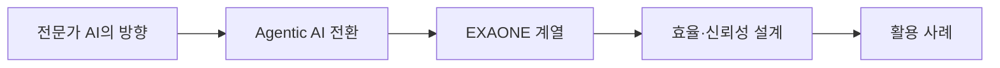

> [!abstract] 한 줄 요약
> LG AI연구원이 제시한 전문가 AI의 방향과 EXAONE 계열의 발전, Agentic AI 기능, 산업·연구 활용 사례를 강의 흐름대로 정리한다.

---

## 강의 흐름



<Tabs>
  <Tab label="핵심 개념">
- **Expert AI** — 전문가가 더 높은 수준의 결과를 만들도록 필요한 지식과 도구를 제공하는 모델 방향이다.
- **Agentic AI** — 답변 생성에서 벗어나 사람의 사고 과정을 모사하고 자율 판단·도구 호출로 행동하는 시스템이다.
- **신뢰성** — 데이터의 법적·품질 리스크를 탐지하고 성능·경제성과 함께 운영 가능한 결과를 만드는 축이다.
  </Tab>
  <Tab label="적용 순서">
1. General AI와 Expert AI의 사용자 가치를 구분한다.
2. Agentic AI에 필요한 판단·도구·행동 단계를 그린다.
3. EXAONE 계열을 성능·효율·문맥·기능 축으로 비교한다.
4. 산업 사례에서 모델 출력이 실제 업무에 닿는 지점을 찾는다.
  </Tab>
  <Tab label="점검 질문">
- 전문가 AI가 비전문가 대체가 아니라 역량 향상을 지향하는 이유는 무엇인가?
- Agentic AI에서 Function Calling·MCP가 맡는 역할은 무엇인가?
- 성능 수치와 신뢰성·경제성을 함께 평가하려면 어떤 지표가 필요한가?
  </Tab>
</Tabs>

---

## 단계별 정리

### 전문가 AI의 방향

- General AI는 초보자에게 초안·개념 이해 등 일정 수준의 결과를 빠르게 제공한다.
- Expert AI는 전문가에게 필요한 지식과 결과를 제공해 전문 역량을 높이는 것을 지향한다.
- 강의는 EXAONE을 산업 현장에 적용 가능한 전문가 AI로 위치시킨다.

### Agentic AI 전환

- Deep Learning→Generative AI→Agentic AI라는 기술 흐름을 제시한다.
- 생성형 AI가 사전학습 기반 답변·멀티모달 생성·단위 업무 자동화에 집중한다면 Agentic AI는 사고 과정과 자율 판단을 수행한다.
- 일상과 산업에서 실제 행동으로 연결하는 것이 전환의 기준이다.

### EXAONE 계열

- EXAONE 1.0(2021.12), 2.0(2023.7), 3.0(2024.8), 3.5(2024.12), Deep(2025.3), 4.0(2025.7)의 여정을 제시한다.
- EXAONE Deep은 수학·과학·코딩 추론에 특화된 고성능 모델로 소개된다.
- EXAONE 4.0은 Hybrid 추론, 전문 지식, MCP·Function Calling을 Agentic AI 기능과 결합한다.

### 효율·신뢰성 설계

- EXAONE 4.0 32B는 긴 문맥(128K 토큰)과 Agent 구현을, 1.2B는 On-device와 Function Calling을 겨냥한다.
- 학습 데이터 법적 리스크 분석 Agent처럼 데이터 신뢰성 확보를 기능으로 포함한다.
- 강의는 성능뿐 아니라 경제성과 신뢰성을 함께 확보하는 모델을 강조한다.

### 활용 사례

- On-device 통화 Agent, AI ETF, 병리 이미지 암 발생 인자 발굴, 신약 개발 등 사례가 제시된다.
- 디스플레이·화학·유플러스·이노텍·전자·에너지솔루션의 업무 분석·예측 적용을 소개한다.
- 마지막은 EXAONE 4.0 모델·기술 보고서로 직접 탐색하라는 학습 행동으로 끝난다.

| 단계 | 원본에서 관찰할 신호 | 학습 산출물 |
| --- | --- | --- |
| 방향 | General AI ↔ Expert AI | 사용자 역량의 수준 |
| 전환 | 생성형 답변 ↔ Agentic 행동 | 판단·도구·실행 |
| 계열 | EXAONE 1.0~4.0·Deep | 추론·문맥·효율 |
| 사례 | 통화·ETF·병리·신약·제조 | 현업 산출물과 책임 |

> [!warning] 읽을 때의 주의점
> EXAONE의 성능·수익률·생산성 수치는 강의 슬라이드가 제시한 특정 시점·사례의 값이다. 최신 모델 성능이나 일반적 효과로 확대 해석하지 않는다.

---

## 인터랙티브: 강의 단계 탐색

아래 슬라이더를 움직여 단계별 핵심 질문을 확인합니다. 범위와 단계명은 이 PDF의 강의 목차를 그대로 반영했습니다.

```html preview
<div style="font-family:system-ui,sans-serif;padding:20px;color:var(--foreground)">
<label for="a8exaone" style="font-size:14px;font-weight:600">EXAONE 강의 단계</label>
<div id="a8exaone-out" style="font-size:24px;font-weight:700;color:var(--chart-1);margin:6px 0"></div>
<input id="a8exaone" type="range" min="0" max="4" step="1" value="0" style="width:100%;accent-color:var(--primary)" />
<p id="a8exaone-hint" style="font-size:13px;color:var(--muted-foreground);margin-top:8px"></p>
<script>
var control = document.getElementById('a8exaone');
var out = document.getElementById('a8exaone-out');
var hint = document.getElementById('a8exaone-hint');
var labels = ["전문가 AI의 방향","Agentic AI 전환","EXAONE 계열","효율·신뢰성 설계","활용 사례"];
var hints = ["General AI와 Expert AI가 제공하는 역량을 비교합니다.","생성형 AI에서 자율적 행동으로 이동합니다.","1.0부터 4.0·Deep까지 발전 축을 확인합니다.","모델 크기와 기능의 균형을 살핍니다.","산업·의료·금융·연구 사례를 연결합니다."];
function renderStage() {
  var index = Number(control.value);
  out.textContent = labels[index];
  hint.textContent = hints[index];
}
control.addEventListener('input', renderStage);
renderStage();
</script>
</div>
```

<details>
  <summary>복습 체크리스트</summary>

- [ ] General AI와 Expert AI의 목적 차이를 말할 수 있다.
- [ ] Agentic AI의 자율 판단·도구 호출·행동 흐름을 설명할 수 있다.
- [ ] EXAONE 계열의 발전과 산업 적용 사례를 연결할 수 있다.

</details>
